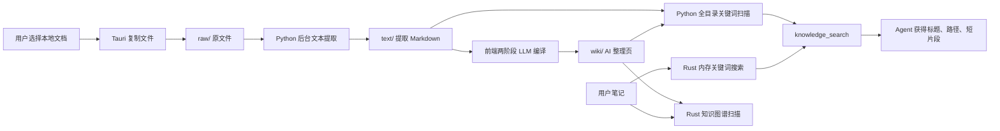
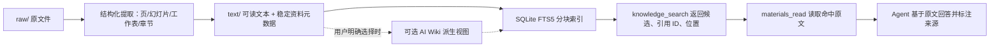

# 笔记—资料模块实现评估与改进计划

> 评估日期：2026-08-04  
> 评估对象：`master` 分支当前工作区（包含尚未提交的“笔记/资料”相关修改）  
> 原始目标：用户把不同类型文档直接作为资料库，AI 能查询原文并基于来源回答  
> 对照设计：`docs/design/2026-07-22-library-module-design.md`  
> 结论状态：**架构方向可保留，核心闭环尚未达到可可靠交付的知识库标准**

## 1. 执行结论

当前实现不是空壳，已经具备以下真实链路：

- 笔记页面内已有“资料”入口；
- Tauri 可把 PDF、DOCX、XLSX、PPTX 和文本文件复制到本地资料目录；
- Python 后台复用现有解析器，把原文件转换为 Markdown 文本；
- 原文件、提取文本、AI Wiki 分别保存在 `raw/`、`text/`、`wiki/`；
- `knowledge_search` 已统一查询笔记、资料正文和 AI Wiki；
- Wiki 已被加入知识图谱的扫描范围；
- 原文和 Office 文档已有预览界面。

总体方向是对的，尤其是以下三个决定应保留：

1. 资料跟随笔记 vault 保存，不增加第二套资料库路径配置；
2. 原始资料在完成文本提取后即可查询，不依赖 AI 先生成 Wiki；
3. MVP 不直接引入向量数据库和新的索引服务。

但当前系统更接近“本地文件柜 + 关键词片段搜索 + AI 摘要页”，还不是可靠的文档知识库。最关键的原因不是“没有 Embedding”，而是以下基础闭环没有成立：

```text
搜索命中候选资料
  -> AI 读取命中位置附近的原文
  -> AI 基于原文作答
  -> 回答携带可验证的文件、页码/幻灯片/工作表等来源
```

当前 `knowledge_search` 只能返回短片段，AI 没有读取资料全文或指定片段的工具，也没有强制引用规则。因此它可以“找到某个关键词”，但无法稳定完成“查证、综合、引用”。

此外，现有 Wiki 生成、文件同步、路径边界和本地 HTTP 安全存在可复现的高风险问题。在修复前，不建议把“生成 Wiki”宣传为可靠能力，也不建议扩大资料库使用范围。

## 2. 当前实际架构



存储布局与原始设计一致：

```text
<vault>/.mona/materials/
├── raw/    # 用户原文件
├── text/   # 可搜索的提取文本
└── wiki/   # AI 生成的派生内容
```

关键实现位置：

| 环节 | 当前实现 |
|---|---|
| 导入、目录和预览 | `src-tauri/src/materials.rs`、`MaterialsView.tsx` |
| 提取、状态和 HTTP API | `mona/materials/api.py` |
| 文档解析 | `mona/utils/document.py` |
| 资料搜索 | `mona/materials/search.py` |
| 统一 Agent 搜索 | `mona/agent/tools/knowledge_search.py` |
| AI Wiki 编译 | `webui/src/lib/materials-ingest.ts`、`webui/src/lib/ingest.ts` |
| 统一图谱 | `src-tauri/src/notes_links.rs`、`GraphViewDialog.tsx` |

## 3. 能力完成度

| 能力 | 状态 | 评估 |
|---|---|---|
| 笔记内统一入口 | 已实现 | `NotesView` 已提供资料视图，产品概念基本收敛。 |
| 多级目录浏览 | 部分实现 | 前端按需加载子目录；缺少重命名、面包屑和完整的跨层目标目录选择。 |
| 常见文档导入 | 已实现 | UI 支持 PDF、DOCX、XLSX、PPTX、TXT、MD、CSV、JSON、HTML。 |
| 文本提取 | MVP 可用 | 文本型 PDF 和常见 Office 文档可提取；扫描 PDF、图片 OCR 不支持。 |
| 不生成 Wiki 也可搜索 | 基础实现 | `text/**/*.md` 会被查询，但结果缺少可靠来源映射和后续原文读取能力。 |
| AI 查询资料 | 仅部分实现 | AI 能调用 `knowledge_search` 找片段，不能继续读取资料命中段落或全文。 |
| 回答带可验证引用 | 未实现 | 搜索结果无稳定引用 ID 和位置，Agent 提示词也没有强制引用契约。 |
| 多资料合并为 Wiki | 未正确实现 | 当前逐文件覆盖写入，没有读取现有页面或合并同批候选。 |
| 稳定来源追踪 | 未实现 | AI Wiki 只记录文件名，不记录完整 raw 路径、稳定资料 ID 或内容哈希。 |
| raw/text 一致性 | 未达标 | 移动、目录删除、外部文件变更均可能留下孤立或错位的提取文本。 |
| 知识图谱统一 | 后端部分接通 | Wiki 会被扫描，但 ID、缓存刷新、视觉区分和点击跳转链路不完整。 |
| 安全边界 | 未达标 | 本地私有 API 使用通配 CORS、无鉴权，并向前端返回模型 API Key。 |
| 专项测试 | 基本缺失 | 有通用文档解析测试，但没有 materials、knowledge_search 和图谱联调测试。 |

## 4. 关键问题与证据

严重级别定义：

- **P0**：可能泄露私密资料或密钥、破坏数据，或使模块核心承诺不成立；
- **P1**：常见工作流会失败、产生陈旧结果或明显降低答案可信度；
- **P2**：规模、体验或维护性问题，可在核心闭环稳定后处理。

### P0-1：本地资料 API 和模型密钥可被非预期来源访问

证据：

- services 进程只挂载了通用 CORS 中间件，没有资料 API 专属鉴权：`mona/services/server.py:141-160`；
- CORS 固定返回 `Access-Control-Allow-Origin: *`，并允许 GET、POST、PUT、DELETE：`mona/api/server.py:6954-6964`；
- `/api/materials/llm-config` 直接返回 `apiKey`：`mona/materials/api.py:673-692`；
- 资料文件列表、原文、二进制、写 Wiki 和删除路由都没有令牌校验：`mona/services/server.py:225-240`。

服务默认只绑定 `127.0.0.1`，降低了局域网暴露面，但不能代替鉴权。任意网页脚本仍可能尝试访问本机端口；通配 CORS 明确允许任意 Origin 读取非凭据响应。MDN 也明确指出，私有 API 不应使用 `Access-Control-Allow-Origin: *`：

- [MDN：CORS missing allow origin](https://developer.mozilla.org/en-US/docs/Web/HTTP/Guides/CORS/Errors/CORSMissingAllowOrigin)
- [MDN：CORS 安全配置](https://developer.mozilla.org/en-US/docs/Web/Security/Practical_implementation_guides/CORS)

当前未在真实浏览器中执行攻击验证，因此不能确认具体浏览器的 Private Network Access 策略是否会拦截某些请求；但服务端安全边界本身不成立，不应依赖浏览器策略兜底。

同一视图还把用户上传的 HTML 以以下方式加载：

```tsx
<iframe sandbox="allow-scripts allow-same-origin" ... />
```

位置：`MaterialsView.tsx:1076-1084`。MDN 明确不建议同源 iframe 同时开启 `allow-scripts` 和 `allow-same-origin`，因为嵌入内容可能移除 sandbox：

- [MDN：iframe sandbox](https://developer.mozilla.org/en-US/docs/Web/HTML/Reference/Elements/iframe)

结论：这是资料隐私、文件写删和模型密钥共同暴露的 P0 风险。

### P0-2：AI 不能完成“查原文后引用回答”

`knowledge_search` 对资料只输出标题、相对路径和约 300 字符片段：`mona/agent/tools/knowledge_search.py:202-217`。后续读取工具只有 `notes_read`，而它只接受笔记 ID：`mona/agent/tools/notes.py:168-230`。

Agent 身份提示还写着“资料 Wiki 的 snippet 通常足够”：`mona/templates/agent/identity.md:45-50`。这会鼓励模型在没有读取完整上下文的情况下回答。

资料正文搜索结果本身也没有正确来源：

- 提取文件 frontmatter 写入字段 `source`：`mona/materials/api.py:108-122`；
- 搜索器读取字段 `sources`：`mona/materials/search.py:194-212`；
- 因此原始资料命中通常返回空 `sources`。

最小复现的实际结果：

```python
{
  "title": "docs/report.pdf.md",
  "path": "docs/report.pdf.md",
  "kind": "material_source",
  "snippet": "Revenue grew by 12%.",
  "sources": []
}
```

这意味着 AI 不知道该命中对应哪个 `raw/` 文件，也没有页码、幻灯片、工作表或章节位置可引用。当前实现只能支持“关键词回忆”，不能支持可靠问答。

### P0-3：Wiki 写入会生成无效 frontmatter，稳定 ID 和图谱随之失效

`_ensure_wiki_frontmatter_id()` 在已有 frontmatter 但缺少 ID 时，拼接结果少了开头分隔符后的换行：`mona/materials/api.py:534-569`。

实际复现的首行是：

```text
---id: wiki-25087269-b64c-4098-aa29-de724a71f4be
```

而不是：

```text
---
id: wiki-25087269-b64c-4098-aa29-de724a71f4be
```

Rust frontmatter 解析器要求第一行严格等于 `---`：`src-tauri/src/notes.rs:659-691`。因此图谱读取这些 Wiki 时，会退化为以文件名作为 ID 和标题：`src-tauri/src/notes.rs:1092-1113`。

即使修复换行，当前写入逻辑在模型每次不输出 ID 时都会注入一个新 UUID，再覆盖原文件：`mona/materials/api.py:572-591`。这不满足原设计“重新生成保留 ID”的要求，也会使图谱布局、链接和跳转身份不稳定。

### P0-4：当前 Wiki 编译会覆盖共享页面，而不是真正合并知识

`materials-ingest.ts` 调用分析和生成提示词时，把现有 schema、purpose、index、overview 全部传为空：`webui/src/lib/materials-ingest.ts:181-229`。

但生成提示词同时要求模型：

- 更新 `wiki/index.md`；
- 追加 `wiki/log.md`；
- 更新代表“整个 Wiki”的 `wiki/overview.md`；
- 发现已有页面时建立关联或更新页面。

要求位置：`webui/src/lib/ingest.ts:274-330`。

模型没有收到任何现有 Wiki 内容，因此不可能正确“保留并更新”。每个文件又被顺序独立处理，FILE block 直接覆盖目标路径：`webui/src/lib/materials-ingest.ts:123-150,321-383`。结果是：

- `index.md`、`overview.md` 很可能只反映最后处理的文件；
- 同名 entity/concept 页面会直接覆盖旧内容；
- 两个目录下同名文件会产生相同 `sources/<basename>.md`；
- 所谓“一篇 Wiki 引用多份资料”没有真实合并步骤；
- 删除或更新原资料后，既有 Wiki 不会被标记为陈旧。

此外，“生成 Wiki”按钮只调用一次根目录列表，并只收集根目录文件：`MaterialsView.tsx:403-435`。放在二级目录中的资料不会进入编译流程。

这不是提示词微调问题，而是缺少现有状态、稳定身份、批次合并和事务写入。

### P0-5：raw/text 一致性存在确定性故障

#### 文件移动后提取文本不会移动

后端先执行 `shutil.move(src, dst)`，再判断 `src.is_file()`：`mona/materials/api.py:355-366`。移动后原路径已不存在，判断结果为 `False`，所以对应 `text/` 文件不会移动。

最小复现：

```text
src_is_file_after_move = False
dst_exists = True
```

#### 非空目录无法按 UI 承诺删除

目录删除逻辑只删除对应的 `text/` 文件，最后对原目录调用 `rmdir()`：`mona/materials/api.py:304-312`。它没有删除 raw 子文件和子目录，因此非空目录会失败；在失败前，部分 text 文件已经被删除，形成半完成状态。

#### 外部文件变化没有对账

原设计要求在进入资料页或刷新时进行轻量核对，清理孤立 text、补提取缺失 text：原设计 `5.1.1`。当前刷新只列目录和读取现有状态，没有 reconciliation。

这些问题会直接产生“原文件已经移动/删除，但 AI 仍能搜到旧正文”或相反情况。

### P0-6：路径校验只守住 materials 根，没有守住 raw/text/wiki 子域

Python 的 `_ensure_within_materials()` 只验证目标仍在 `<vault>/.mona/materials/`：`mona/materials/api.py:71-79`。例如：

```text
raw/../wiki/page.md -> wiki/page.md
```

该路径能通过当前校验。于是 raw 删除、移动、提取、读取端点可以跨到 `text/` 或 `wiki/`。Rust 侧也以整个 materials 根作为边界：`src-tauri/src/materials.rs:31-66,100-129`。

这不会逃出 vault 的 materials 目录，但破坏了三个数据域的隔离，可能绕过端点原本的业务约束。

### P1-1：50 MB 限制只声明，未实际执行

- `MAX_FILE_SIZE = 50 MB` 定义在 `mona/materials/api.py:22-29`，但没有被引用；
- Tauri 导入直接复制文件，没有大小或扩展名校验：`src-tauri/src/materials.rs:100-156`；
- 资料提取直接调用 `extract_text()`，没有使用通用附件路径中已有的 50 MB 防护：`mona/materials/api.py:140-152`；
- 二进制预览一次性 `read_bytes()`：`mona/materials/api.py:460-477`。

因此大文件可以被复制、整文件解析并整文件读入内存，和原设计及 UI 预期不一致。

### P1-2：提取能力有明确边界，但状态会制造“可搜索”假象

现有解析器的真实能力：

- PDF：`pypdf` 文本层；无 OCR；
- DOCX：只取段落，表格、页眉页脚等不在当前实现中；
- XLSX：按工作表输出单元格值；
- PPTX：按幻灯片输出文本并处理表格/组合形状；
- 图片：只返回 `[image: filename]` 占位符；
- 所有类型最终最多保留 200,000 字符。

证据：`mona/utils/document.py:11-40,43-206`。

图片占位符不是错误，资料提取会把它写成 `status=ok`，因此图片可能显示“可搜索”，但实际没有图像语义。扫描 PDF 提取为空时也缺少“可能是扫描件”的明确状态。

长文只保留开头 200,000 字符，尾部内容永久不进入检索。frontmatter 虽标记 `truncated`，AI 搜索结果没有把这个风险传递给模型。

### P1-3：搜索是全文件二值关键词匹配，质量和规模都有上限

当前搜索：

- 每次递归扫描全部 `text/**/*.md` 和 `wiki/**/*.md`；
- 每个 token 只判断“标题是否包含”和“全文是否包含”，不计算词频；
- 多 token 查询采用宽松 OR 效果；
- 中文连续文本拆为 bigram；
- 返回固定长度片段；
- 缓存完整页面，但删除文件后不会主动清理缓存项。

证据：`mona/materials/search.py:20-252`。

它适合作为小规模 MVP，但不适合作为长期检索层。重复的原始正文和 Wiki 也会互相挤占结果。

API 契约还有漂移：Python 返回 `material_source`，TypeScript 类型却声明 `material_text`：`mona/materials/search.py:225-243`、`webui/src/lib/materials-api.ts:66-73`。

Wiki 的 `sources: ["raw/a.pdf", "raw/b.pdf"]` 也会被轻量 frontmatter 解析器读成一个字符串，实际结果为：

```python
"sources": ['["raw/a.pdf", "raw/b.pdf"]']
```

### P1-4：图谱只完成了“扫描进来”，没有完成统一产品闭环

已完成：`notes_links.rs` 会递归扫描 `materials/wiki/`：`src-tauri/src/notes_links.rs:181-209`。

未完成：

- 图谱缓存失效只检查 vault 根笔记目录，不检查 `.mona/materials/wiki/`：`src-tauri/src/notes_links.rs:452-492`；
- Wiki 写入后没有主动刷新图谱缓存；
- 图谱节点只有 `noteType`，没有 note/material Wiki 来源类型：`src-tauri/src/notes_links.rs:20-26`；
- 前端只为 template 和 moc 使用特殊颜色，Wiki 与普通笔记无法区分：`GraphViewDialog.tsx:323-343`；
- 点击任何节点都调用 `onSelectNote(node.id)`：`GraphViewDialog.tsx:470-485`；
- Workspace 最终只在笔记集合中选择该 ID，不会切换到资料 Wiki：`Workspace.tsx:290-300`。

因此“Wiki 出现在扫描结果”不等于“统一图谱可用”。

### P1-5：后台任务没有持久化、取消和恢复

文本提取任务只保存在进程内 `_EXTRACT_TASKS` 字典：`mona/materials/api.py:31-33,125-165`。进程退出后任务状态丢失。

前端导入后只在 2 秒后额外刷新一次：`MaterialsView.tsx:250-289`。耗时更长的文档会一直显示“等待提取”，直到用户手动刷新。

Wiki 编译虽然函数接受 `AbortSignal`，UI 没有提供取消按钮，也没有 checkpoint、文件哈希缓存或恢复任务。它还会尝试编译尚未提取完成的根目录文件。

### P1-6：缺少模块专项测试，原设计验收项没有被自动守住

仓库当前没有搜索到以下测试：

- `mona/materials/api.py` 的路径、移动、删除、提取状态测试；
- `mona/materials/search.py` 的中英文查询、来源、排序测试；
- `knowledge_search` 的 scope、结果格式、资料读取测试；
- Wiki ID 保留、合并和来源追踪测试；
- 资料 Wiki 图谱缓存、节点类型和点击跳转测试；
- 二级目录上传到 AI 查询的端到端测试。

通用文档解析测试存在并通过，但不能覆盖资料模块的业务一致性。

## 5. 已执行验证

### 5.1 通过

- `python -m pytest tests/test_document_parsing.py -q`：**20 passed**；
- `python -m ruff check mona/materials mona/agent/tools/knowledge_search.py`：通过；
- `cargo check`：通过，产生 25 个仓库级 warning；
- 当前 Python 运行时 SQLite 版本为 `3.50.4`，已实际创建 FTS5 虚拟表，`FTS5_OK`；
- 已通过最小脚本复现：无效 Wiki frontmatter、移动后 `src.is_file() == False`、路径跨 raw/wiki、搜索结果来源丢失、inline sources 被读成单一字符串。

### 5.2 未通过或无法确认

- Web 前端完整构建失败。当前错误位于数学编辑、MarkdownEditor、Mermaid、ThreePreview 和视频阶段类型等文件，不在资料模块目标文件中；因此不能证明资料 UI 的完整构建可交付；
- 项目当前 ESLint 10 找不到 `eslint.config.*`，无法执行资料文件专项 lint；
- 未调用真实外部 LLM，未验证不同供应商下的 Wiki 生成质量和成本；
- 未读取用户真实 vault，未验证真实资料规模、数据分布或搜索召回；
- 未动态执行恶意网页访问本地端口，安全结论来自服务端路由、CORS 和响应内容审计；
- 未验证打包后的内置 Python 运行时是否同样启用 FTS5；当前只验证了本机执行本次测试的 Python 运行时。

## 6. 推荐目标架构

目标不是重建一套复杂 RAG 平台，而是补齐最短、可验证的可靠链路：



### 6.1 原始资料是事实源，Wiki 只是派生内容

- AI 回答优先读取 `text/` 对应的原始提取内容；
- Wiki 用于跨文档整理、主题导航和图谱，不替代原文证据；
- 搜索结果必须标明 `source` 或 `derived`；
- Wiki 内容必须记录完整来源路径、稳定资料 ID 和生成时对应的 source hash；
- 原资料变化时，Wiki 标记为 stale，不静默假装仍然最新。

### 6.2 使用稳定资料身份

每份资料至少需要以下元数据：

```yaml
id: material-<UUID v4>
source: raw/模型/precision.xlsx
sha256: <content hash>
size: <bytes>
mtimeNs: <filesystem timestamp>
extractorVersion: <version>
status: ok
truncated: false
```

ID 首次导入时生成，移动和重新提取时保留。路径用于展示，ID 用于引用和关联，hash 用于判断是否需要重新提取和让派生 Wiki 失效。

无需先增加独立 manifest 服务；首版可以把元数据保存在现有 `text/*.md` frontmatter，并用一次 reconciliation 从 raw 重建缺失状态。

### 6.3 用 SQLite FTS5 替代每次全目录扫描

当前运行时已验证支持 SQLite FTS5，不需要新增依赖或部署向量服务。FTS5 官方支持持久化全文索引、相关性排序、snippet/highlight、短语、前缀和 NEAR 查询：

- [SQLite FTS5 官方文档](https://www.sqlite.org/fts5.html)

建议：

- 索引单位改为结构化 chunk，而不是整份 Markdown；
- chunk 保存 `material_id`、raw path、页码/幻灯片/工作表/章节和文本；
- 中文使用已验证可创建的 FTS5 trigram tokenizer；对不足三个字符的查询保留小范围子串回退；
- Wiki 作为 `derived` chunk 进入同一索引，但默认降低优先级，避免重复摘要挤掉原文；
- 索引可删除重建，不作为唯一事实源。

### 6.4 增加最小的资料读取工具

保留 `knowledge_search`，新增一个只读工具即可：

```text
materials_read(ref, max_chars?)
```

其中 `ref` 由搜索结果返回，内部对应 `material_id + chunk/location`。工具返回：

- 原文件展示名和完整 vault 内相对路径；
- 命中页码、幻灯片、工作表/行范围或 Markdown 标题；
- 命中段落及相邻上下文；
- 是否截断、是否派生内容；
- 可直接用于回答的引用标签。

不要把 vault 绝对路径暴露给模型，也不需要让模型任意读本地文件。

### 6.5 Wiki 编译改为可选、服务端、可重复执行

Wiki 不是完成“AI 可查询资料”的前置条件。建议在 P0 修复前暂时隐藏或禁用“生成 Wiki”，先交付原文检索闭环。

若保留 Wiki：

- LLM 调用移到 services/gateway 后端，前端不接触 API Key；
- 用户明确选择单个、多份文件或目录，不默认扫描根目录全部文件；
- 同批资料先生成候选，再按稳定页面 ID 合并；
- 写入前读取现有目标页，保留 ID、路径、标题和人工内容；
- 候选先写临时目录，通过 frontmatter、路径、来源校验后再原子替换；
- 来源记录 `material_id + raw path + source hash`；
- 首版删除 `wiki/index.md`、`wiki/log.md`、`wiki/overview.md` 这三个共享可变热点，除非 UI 有明确消费者；现状没有证据表明它们是 AI 查询所必需；
- 不恢复旧 KB 的 Review、Lint、Dedup 项目系统，先只做同名页合并和稳定身份。

## 7. 分阶段改进计划

### 阶段 0：先阻止泄露、越界和数据破坏

目标：在不改变产品结构的前提下，使现有文件和密钥边界成立。

任务：

1. 为 services 本地 API 加每次启动生成的随机令牌；Tauri 本地桥自动附带，所有 materials 路由校验；
2. CORS 从 `*` 改为最小 Origin allowlist；非浏览器消费者使用令牌，不依赖 CORS；
3. 删除 `/api/materials/llm-config` 的 API Key 返回，Wiki 编译未迁移到后端前先禁用入口；
4. HTML 预览禁用脚本，移除 `allow-scripts allow-same-origin` 组合；
5. 把路径校验拆为 `raw_root`、`text_root`、`wiki_root` 各自边界，拒绝 `..`、绝对路径和非预期扩展；
6. 修复文件移动前类型判断、递归目录移动/删除和对应 text 同步，使用临时文件/目录保证失败不产生半完成状态；
7. 在 Tauri 复制前执行 50 MB、支持扩展名和目标冲突校验；禁止静默覆盖；
8. 修复 Wiki frontmatter 换行，并在覆盖时保留已有 `wiki-*` ID；
9. 为上述每个已复现问题增加一个最小回归测试。

验收：

- 任意 `../` 输入不能从 raw 端点访问 text/wiki；
- 无有效令牌不能读列表、原文、密钥，也不能写删；
- 恶意 HTML 预览不能执行脚本；
- 超过限制或不支持的文件在复制前给出明确错误；
- 移动/删除文件和非空目录后，raw/text 保持一一对应；
- 重复生成 Wiki 后 ID 不变，首行严格为 `---`。

### 阶段 1：建立可信的资料状态和结构化提取

目标：任何时刻都能回答“这份提取文本来自哪个原文件、是否最新、是否完整”。

任务：

1. 为资料增加稳定 `material-*` ID、sha256、size、mtime、extractorVersion；
2. 进入资料页和手动刷新时做一次轻量 reconciliation：
   - raw 存在、text 缺失或 hash 不一致 -> 重新入队；
   - text 存在、raw 缺失 -> 删除可再生 text，并把引用它的 Wiki 标记 stale；
3. 提取状态区分 `queued/running/ok/error/unsupported/stale`，不再用 pending 同时表达排队和执行；
4. 扩展现有解析器为结构化 segment 输出：PDF 页、PPT 幻灯片、XLSX 工作表/行范围、Markdown 标题、DOCX 段落/表格；
5. 聊天附件仍可沿用 200,000 字符上限；资料入库改为分段写入，不丢弃长文尾部；
6. 空文本 PDF 标记“可能是扫描件，需要 OCR”，图片标记 unsupported，不写“可搜索”假状态；
7. 提取写入使用临时文件后原子替换；进程重启时 reconciliation 恢复未完成任务。

验收：

- 同名但不同目录的文件拥有不同 material ID；
- 文件移动后 ID 不变、source path 更新；
- 修改原文件后旧索引不再作为最新结果；
- 长文末尾的固定测试词可被检索；
- 搜索结果可定位到页、幻灯片、工作表或章节。

### 阶段 2：完成“搜索—读取—引用”主闭环

目标：不生成 Wiki，AI 也能可靠查询资料原文。

任务：

1. 在 `.mona/materials/` 下建立可重建的 SQLite FTS5 chunk 索引；
2. raw/text 变化时增量更新对应 material 的 chunks；
3. `knowledge_search` 返回结构化 `kind/ref/title/rawPath/location/snippet/score/stale/truncated`；
4. 增加 `materials_read(ref)`，只允许读取搜索结果对应的受控片段；
5. Agent 规则改为：涉及个人资料的事实回答必须先搜索；命中后至少读取一个原文候选；最终答案标注资料名和位置；
6. 原始资料与 AI Wiki 结果去重，原文优先；
7. 建立固定的 `query -> expected source/location` 检索样本集，后续索引改动不得降低基线。

验收：

- 二级目录 PDF 不生成 Wiki，也能被 AI 查询；
- AI 回答能给出类似“资料：报告.pdf，第 12 页”的引用；
- 用户可以从引用打开原文件或资料预览对应位置；
- 删除或修改原文后，搜索不会返回旧 chunk；
- `scope=notes/materials/wiki/text/all` 都有自动化测试。

### 阶段 3：重做可选 Wiki 派生视图

目标：Wiki 提供跨资料整理价值，但不污染事实源或破坏已有页面。

任务：

1. 把 Wiki 编译迁移到后端；
2. 支持用户选择文件、多文件或目录，并等待提取状态全部 ready；
3. 同一批次先候选化、再按稳定 ID/标题合并，最后事务写入；
4. 保留现有页面 ID、路径、人工字段和未被新证据否定的来源；
5. 每页记录完整 `material_id/rawPath/sourceHash` 列表和生成模型信息；
6. source hash 变化时将页面标为 stale，由用户选择重新生成；
7. 提供取消；只有实际出现长任务中断需求后再增加 checkpoint，不先恢复整套旧 KB 工作流。

验收：

- 两份资料可合并到同一 Wiki，且 sources 是两个可打开的原始路径；
- 同名文件不会覆盖彼此的 source summary；
- 重复生成保留 Wiki ID、路径和已有链接；
- 任一 LLM 输出格式错误时，正式 Wiki 目录不发生部分覆盖；
- 前端和日志不出现模型 API Key。

### 阶段 4：补齐统一图谱与资料 UX

该阶段不阻塞 AI 查询主闭环，放在检索可靠之后。

任务：

1. 图谱节点增加 `sourceKind: note | material_wiki` 和稳定路径；
2. 缓存失效同时检查 notes 和 materials/wiki，Wiki 写入后主动刷新；
3. 点击 material Wiki 节点时切换到资料视图并打开对应页；
4. 笔记 `[[` 补全可查询 Wiki 标题，并处理同名选择；
5. Wiki 列表按目录展示来源和 stale 状态；
6. 增加资料搜索 UI、选择式重新生成和引用打开能力。

验收：

- Wiki 节点具有独立视觉标识；
- Wiki 新增、修改、删除后图谱立即一致；
- 点击 Wiki 节点能打开正确资料页；
- 同名笔记/Wiki 不会静默跳错。

### 阶段 5：只在数据证明需要时增加语义检索

首版不要引入向量数据库、Embedding 配置或新索引服务。

只有固定检索样本显示 FTS5 + trigram 对同义改写、概念查询的召回仍不能满足产品要求时，再增加 Embedding。届时仍应：

- 保留 FTS5 作为精确词、编号、姓名和错误码检索；
- 采用 lexical + semantic 混合排序；
- 版本化 embedding 模型和索引；
- 继续通过 `materials_read` 读取并引用原文，而不是把向量命中片段直接当事实。

## 8. 最小改动顺序

按机会成本和风险排序，推荐实际执行顺序：

1. **先做阶段 0**：安全、路径、移动/删除、50 MB、Wiki ID；
2. **再做阶段 1 + 2**：稳定资料身份、结构化提取、FTS5、`materials_read`、引用；
3. 到此即已经满足用户提出的核心目标；
4. 只有用户确实需要跨资料主题页时，再做阶段 3 Wiki；
5. 图谱和语义检索分别按实际使用价值延后。

这条路径不需要新服务、不需要向量数据库、不需要恢复旧 KB 项目系统。新增的核心持久化只有一个可重建的 SQLite 索引；新增的 Agent 能力只有一个受控资料读取工具。

## 9. 建议立即删除或暂停的复杂度

- 暂停当前客户端 Wiki 编译和 `/api/materials/llm-config`；
- 删除 Wiki prompt 中无消费者证据的全局 `index.md/log.md/overview.md` 强制生成；
- 不恢复旧 KB 的 project、review、lint、dedup、独立 graph；
- 不新增“多资料库”“索引提供商”“Embedding 提供商”等抽象；
- 不为了修复搜索而先上外部向量数据库；
- 不把拖拽、复杂目录 UI 或 Wiki 编辑器放在 AI 查询闭环之前。

## 10. 最终判断

当前实现的**产品方向正确，工程闭环不完整**。

可以保留：

- 笔记与资料统一入口；
- `raw/text/wiki` 三层本地文件结构；
- 复用现有文档解析器；
- `knowledge_search` 单一搜索入口；
- 不做对话前置全量 RAG 注入；
- MVP 不引入向量数据库。

必须先改：

- 本地 API 鉴权、CORS、HTML 预览和 API Key 暴露；
- raw/text 的移动、删除、对账和大小限制；
- 稳定资料 ID、hash、结构化位置和完整来源路径；
- `knowledge_search -> materials_read -> 引用回答`；
- Wiki frontmatter、稳定 ID、批次合并和事务写入；
- materials/knowledge/graph 的专项测试。

达到阶段 2 后，这个模块才可准确描述为“用户上传文档，AI 可以把它们当知识库查询”。阶段 3 的 AI Wiki 和阶段 4 的统一图谱是增值能力，不应继续阻塞或替代核心检索闭环。

## 11. 实施状态（2026-08-04）

### 已落地

- **阶段 0**：services 随机令牌鉴权（`X-Mona-Token`，Rust 桥自动附带）、CORS 收敛、`/api/materials/llm-config` 不再返回 API Key、raw/text/wiki 分域路径校验、移动/删除的 text 同步与原子写入、50 MB 限制、Wiki frontmatter 稳定 ID、HTML 预览 iframe 空 sandbox（禁用脚本 + 独立源）。
- **阶段 1**：稳定 `material-*` ID + sha256/size/mtimeNs/extractorVersion 元数据；`/api/materials/reconcile` 轻量对账（补缺重提取、孤儿 text 清理、Wiki stale 标记）；提取状态机 `queued/running/ok/error/unsupported/stale`；结构化 segment 提取（PDF 页/PPT 幻灯片/XLSX 工作表/MD 标题/DOCX 块），长文分段写入不截断；前端状态展示与进入资料页自动对账已对齐。
- **阶段 2**：`.mona/materials/index.db` SQLite FTS5 chunk 索引（trigram，可重建，WAL 多进程）；`knowledge_search` 走索引返回 `kind/ref/title/rawPath/location/snippet/score/stale`，搜索时增量同步保证不返回已删除旧 chunk；新增 `materials_read(ref, max_chars?)` 返回命中 chunk + 相邻上下文 + 引用标签；Agent 提示词契约更新（命中必读原文、回答标注资料名和位置、原文优先于 Wiki）；固定检索样本基线 `tests/materials/test_retrieval_baseline.py`。
- **阶段 2 引用跳转**：`materials_read` 输出携带 `mona:material?path=...&location=...` markdown 引用链接；聊天渲染层拦截该协议，经 zustand store 跨模块投递，切换到笔记-资料视图、选中目标文件并滚动定位（raw 强制走提取文本预览匹配 `## Page N` seg 标题，wiki 匹配渲染后 markdown 标题）；消费后即清除全局 pending，避免残留状态影响后续手动预览。
- **阶段 3（Wiki 后端编译）**：`mona/materials/compile.py` 任务化编译（选择文件/目录 → 等待提取 ready → LLM 候选化 → 按路径合并 → 事务写入），支持进度轮询与取消；覆盖写保留已有页面 ID/created/人工字段并合并 sources 并集；每页记录 materialIds/rawPaths/sourceHashes 与生成模型信息；services 注册 `/api/materials/wiki/compile*` 路由；前端编译流程整体切换到后端任务 API，删除旧前端 ingest 三件套（`materials-ingest.ts`/`ingest.ts`/`llm-client.ts`）。
- **阶段 4（统一图谱与资料 UX）**：Rust 图谱 `LinkNode.sourceKind` 区分 note/wiki（缓存版本升至 5），缓存失效递归覆盖 wiki 目录；图谱 wiki 节点翡翠绿配色 + 图例，点击经 materials-open-store 跳转资料页；`[[` 补全并入 Wiki 页面标题，`openNoteByTitle` 命中 Wiki 标题时跳资料库而非新建笔记；Wiki 列表接口改用 `_parse_frontmatter` 正确解析 sources 并返回 stale；资料页 Wiki 分组/来源/stale 徽标与搜索 UI 已落地。

### 待做

- 阶段 5（语义检索）：按本计划前提，仅在数据证明 FTS5 不够用时才启动，当前无启动条件。

### 测试

- `tests/materials/`（8 个文件，含 API/鉴权/CORS/提取/索引/结构化搜索/读取/基线/Wiki 编译）98 项全部通过；
- `cargo check`、`tsc -p tsconfig.build.json`、`ruff check` 全部通过；
- 仓库级存量失败与本计划无关：`tests/tools/test_web_*`、`test_image_generation_tool`、`test_nanobot_facade` 等模块在 HEAD 即因 `mona.config.schema` 的 web 工具配置重构中状态而失败。
