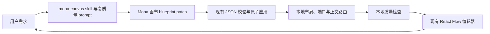

# Mona AI 流程图高质量生成能力复刻方案

> 日期：2026-09-07
> 状态：上一阶段方案记录，已被[官方 Demo 质量优化方案](ai-canvas-official-demo-development.md)取代。
> 后续审计确认布局、局部编辑、分区关系和 AI 反馈仍有代码缺口，不能再以“仅待模型凭据”描述当前完成状态。下文保留历史设计记录。
> 目标：在 Mona 现有流程图编辑器中复刻 `next-ai-draw-io` 的 AI 高质量成图能力。
> 执行入口：[实施计划](../plans/2026-09-07-ai-canvas-quality-replication-plan.md)

## 1. 范围结论

本方案复刻的是 AI 的构图质量，不替换 Mona 的画布底座。

继续使用：

- React Flow 编辑器、Mona JSON 文档、现有形状库、主题、分组、泳道、撤销与保存。
- 当前主会话和笔记侧栏的 AI 入口。
- 现有原子 patch、稳定 ID、Dagre 布局和人工编辑优先原则。

本次不做：

- 不嵌入 draw.io，不引入 mxGraph/XML 作为新文档格式。
- 不新增云端服务、远程编辑器、账号、模型配置或 MCP 服务。
- 不新增多人协作、CRDT、画布后端 session 或跨设备同步。
- 不扩展 PPT、Word、Excel 联动。
- 不重构思维导图，不处理未发布产品的历史格式兼容。

此前方案中的 draw.io 内核替换、Services 画布会话、XML 迁移、Office 往返、正式大规模基准评测均超出目标，已经删除。

## 2. 对 next-ai-draw-io 的能力拆解

本地参考目录为 `D:\liuzhe\Desktop\code\next-ai-draw-io`，根包版本 `0.4.16`。该目录没有 `.git`，审计以本地文件为准。

高质量能力实际来自以下组合：

| 能力 | 参考实现 | Mona 中的复刻方式 |
| --- | --- | --- |
| 先规划分区、层级、阅读方向与间距 | `lib/system-prompts.ts` | 进入 `mona-canvas` skill 与生成 prompt |
| 根据语义选择形状、配色和视觉层级 | 同上及 `docs/shape-libraries/` | 开放 Mona 已有形状、主题、节点/边样式和图标给 AI |
| 正交线、自然端口、反馈线绕行、同源多边分流 | `lib/system-prompts.ts` | 由本地布局和路由代码确定性完成，AI 可覆盖个别边 |
| 按稳定 ID 局部修改 | 网页 `lib/utils.ts` 与 MCP `diagram-operations.ts` | 扩展现有原子 patch，继续用 Mona ID 和 expected 前置条件 |
| 完整 XML/结构校验 | `lib/utils.ts` | 继续使用 Mona JSON schema 和 patch dry-run，不引入 XML |
| 渲染后检查遮挡、穿线、文字和布局 | `validation-*` 与 `use-diagram-tool-handlers.ts` | 新增本地确定性质量检查，把问题和对象 ID 写入结果 |
| 视觉模型复核 | 上游可选且默认关闭，只在首次 display 触发 | 不作为基础依赖；Mona 本地检查必须独立成立 |

上游没有一套可直接搬走的自动布局求解器。其分区、间距和避障主要依靠提示词、draw.io 表现力与可选视觉检查。因此，在 Mona 底座上复刻质量需要同时增强协议、布局、路由和设计知识，仅改提示词不够。

## 3. 当前根因

Mona 编辑器已经能手动设置样式、尺寸、基础装饰形状、分组、泳道和边控制点，但当前 AI 协议主动隐藏了大部分能力：

- `FLOWCHART_PATCH_CONTRACT` 禁止 AI 输出 `position`、`size`、`style`、`theme`，也禁止基础形状、文本、图片与容器。
- `replaceGraph` 应用时只保留 `id/kind/label`，随后使用统一主题和 Dagre 排版。
- `addEdge`、`updateEdge` 没有保留 AI 提供的端口、路由、样式或控制点。
- AI 上下文主要是语义投影，无法准确看到当前视觉状态；视觉改动也不进入现有 base hash。
- 应用完成后没有确定性质量报告，遮挡、文字溢出或不良连线不能反馈到 UI。

结果是模型最多能生成结构正确的普通流程图，很难生成有设计层次的复杂流程图和架构图。

## 4. 目标架构

所有步骤留在现有前端画布链路中。没有新服务，没有远程画布，没有第二套文档真相。

## 5. AI patch 扩展

### 5.1 完整创建

扩展 `replaceGraph` 为可携带视觉 blueprint 的完整图：

- 图级：`direction`、`theme`、可选页面背景。
- 节点：现有 `id/kind/label`，加可选 `size`、`style`、`icon`、`position`。
- 边：现有端点和标签，加可选 `style`、`sourceHandle`、`targetHandle`、`controlPoints`。
- 布局：默认 `auto`，由本地算法排版；只有用户明确要求固定构图或模型需要特殊分区时使用 `manual` 并提供坐标。

创建普通流程图时，AI 负责结构、形状、强调层级和风格意图，本地负责最终坐标和大部分连线路由。这样避免让模型承担所有像素计算，同时保留高级构图的表达空间。

### 5.2 局部修改

保留现有操作并扩展：

- `setTheme`：更新整图配色和视觉预设。
- `addNode` / `updateNode`：允许节点样式、尺寸和图标。
- `addEdge` / `updateEdge`：允许线型、箭头、端口与控制点。
- `reflow`：对整图重新布局，支持 `TB/LR`。
- 现有泳池、泳道与归属操作继续使用。

样式字段只能使用 schema 中列出的值和安全颜色格式。图片仍走人工已有路径，不让模型凭空填写本地文件路径。

### 5.3 并发保护

现有语义哈希继续用于内容比较，新增完整文档哈希用于 AI patch 前置条件。完整哈希包含位置、尺寸、样式、图标、主题、边端口与控制点，不包含视口缩放。

AI patch 同时携带 `baseHash` 和 `baseDocumentHash`。如果用户在生成期间改了内容或视觉，patch 均拒绝应用，避免高质量编辑能力覆盖人工调整。

## 6. 本地布局与连线路由

继续使用 Dagre 计算层级，但增强输出处理：

- 节点尺寸根据文本长度、图标和形状默认尺寸确定，中文不再统一使用 140×48。
- 同层和层间间距设置明确下限，保留清楚的连线通道。
- 判断节点分支按边标签稳定排序，主路径保持直线，反馈路径走外侧。
- 端口按方向选择，避免角点连接；同一侧多条边使用不同路径。
- 正交边在直线路径穿过无关节点时生成控制点绕开包围盒，并保留安全间距。
- 重复运行相同输入必须得到相同位置和控制点。
- AI 提供的手动位置或控制点只有通过有限数值、画幅和引用校验后才采用。

架构图的 AI `groups` 根据成员包围盒生成锁定的根级视觉区域，成员保持根级坐标，避免跨父容器连线失真；用户手工“组合”仍沿用原行为。泳道继续使用现有容器，并在典型方向上先计算全图主轴层级，再把节点放回所属泳道。本次不建设云厂商全量 stencil 库。

## 7. 通用图标

在现有节点数据中增加一个小型、稳定的 `icon` 字段，使用项目已经依赖的 Lucide 图标。首批覆盖流程图和软件架构常用语义：用户、团队、浏览器、移动端、服务、数据库、文件、云、网络、消息、搜索、锁、检查、告警、设置、代码和 AI。

图标和文字共同参与节点尺寸计算。图标缺失或未知时明确拒绝 patch，不使用任意 HTML、URL 或本地路径。它用于提升视觉层级，不替代节点真实 `kind`。

## 8. 本地质量检查

新增纯函数质量检查，输入当前 `FlowchartDocument`，输出带对象 ID 的问题：

- 同一容器内普通节点重叠。
- 文本按字号、行高和可用宽高估算后溢出。
- 正交线穿越非端点节点的包围盒。
- 页面模式下节点越界。
- 同一对端点的多条边使用同一路由。
- 整图适应常用视口后的比例过低，导致概览文字难读。

布局应用后先运行检查。编辑器等待字体和 SVG 完成渲染后，再读取标签实际边界、滚动尺寸与连线路径，合并成同一问题列表。可确定性修复的问题由本地重新计算一次；剩余问题作为 warning 写入 patch 结果和 UI。检查失败显示“质检未完成”，不冒充通过，也不进行无限重试。

基础质量不依赖视觉模型或云端调用。未来若已有模型支持看图，可将截图复核作为额外步骤，但不属于本次完成条件。

## 9. mona-canvas skill

新增 `mona/skills/mona-canvas/`，只沉淀影响成图决策的知识：

- `SKILL.md`：任务路由、生成/局部修改选择、最小检查和交付规则。
- `references/design-method.md`：信息层级、布局、密度、配色和图标。
- `references/flowchart-and-architecture.md`：流程图、泳道图、系统架构图的具体构图规则。
- `references/visual-review.md`：遮挡、文字、连线与完整性检查。

入口保持简短，按任务读取相应参考。Skill 不复制上游整份提示词或图形库手册，不声称 Mona 没有的能力。

## 10. 完成标准

1. AI 可以通过一个完整 patch 创建带主题、差异化样式、图标、判断分支和正交连线的可编辑流程图。
2. AI 可以只修改指定节点或边的文字、颜色、图标和线型，其他对象保持不变。
3. 普通流程、复杂决策回路、四角色泳道和三层软件架构四类固定样例通过结构与本地质量检查。
4. 同一输入重复布局结果一致；人工编辑后旧 patch 被拒绝。
5. 主会话和笔记侧栏均能使用新协议，现有手工编辑、保存、导出和思维导图没有回归。
6. `mona-canvas` skill 校验通过，内容与实际协议一致。

同模型真实生成的主观视觉质量需要在 dev 环境运行后记录。代码与确定性检查通过并不等于已经证明所有模型都能达到相同审美水平；测试发现的通用问题继续回到 skill、布局或协议修正，不针对单个示例写死坐标。
