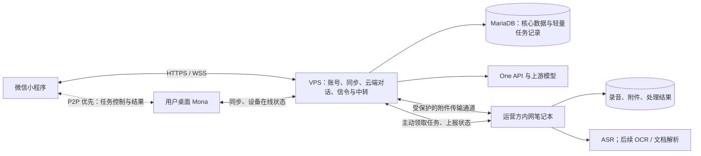
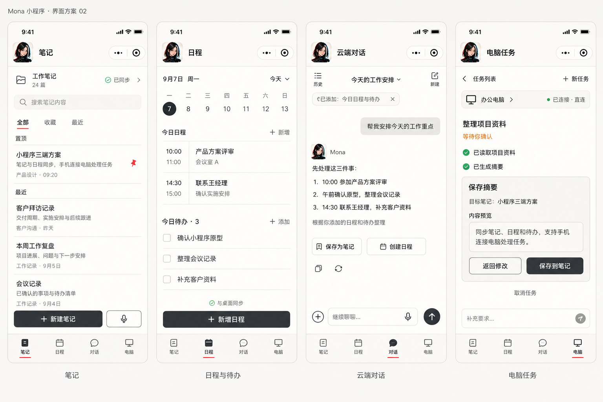

# Mona 小程序与三端互通设计方案

> 版本：v0.1  
> 日期：2026-09-07  
> 状态：方案草案，待实施；不表示下述能力已经上线  
> 范围：Mona 桌面端、微信小程序、云端服务；云端服务由 VPS 和运营方的常开内网笔记本共同提供  
> 依据：本次产品与架构讨论、现有代码、2026-09-07 的 VPS 检查结果

## 1. 设计结论

Mona 小程序提供随时可用的笔记、日程和普通对话；用户自己的电脑在线时，通过 P2P 优先的连接远程控制桌面 Mona。运营方的常开笔记本提供 ASR 和附件处理、存储能力。

本方案固定以下边界：

1. 笔记、日程、待办同步优先建设，开启同步后可在小程序独立查看和编辑。
2. 云端普通对话使用同一 Mona 账号、同一份 API 余额，手机和桌面可继续同一段对话。
3. 小程序不运行桌面 Agent 引擎，但必须能在电脑在线时发起、查看和控制桌面 Agent 任务。
4. P2P 是桌面远控的明确交付目标。直连失败时提供 VPS 中转；中转可用不等于 P2P 已完成。
5. 云端普通对话和桌面 Agent 任务是两类会话。桌面任务的完整执行历史保留在用户电脑，按需读取。
6. 用户、支付、余额、授权、笔记正文、日程主数据及云端文字聊天历史留在 VPS。
7. 录音、图片、文档等大附件及 ASR 计算优先放在运营方笔记本；VPS 保存归属、状态和引用。
8. 第一版继续使用现有 MariaDB、Mona Auth 和 One API，不因增加同步功能引入第二套核心账本或分布式数据库。
9. 运营方笔记本与用户桌面电脑是不同角色。前者离线影响 ASR 和附件服务；后者离线影响该用户的桌面任务。
10. 第一版远控按“控制桌面 Mona 的任务和受控工具”设计。实时屏幕流、鼠标键盘遥控是否需要另行确认，不把它们默认为已经包含或已经排除的最终需求。

## 2. 基线与已知现状

### 2.1 工程基线

本方案遵守以下长期文档；后续实现若需要变更其中的边界，应同步更新对应架构基线：

- [工程与安全边界](../architecture/engineering-boundaries.md)
- [Gateway / Services 进程所有权](../architecture/services-split-design.md)
- [模块关键不变量](../architecture/module-invariants.md)
- [笔记与资料检索架构](../architecture/retrieval-architecture.md)
- [统一运行时管理](../architecture/runtime-component-management.md)
- [浏览器能力边界](../architecture/browser-development-framework.md)
- [全局 UI 规范](mona-ui-design-system.md)

### 2.2 当前实现与新增工作

| 领域 | 已有实现事实 | 本方案需要新增 |
|---|---|---|
| 笔记 | 桌面以 Markdown 文件仓库保存，由 Tauri 管理 | 云端数据模型、版本协议、桌面同步适配、小程序编辑 |
| 日程 / 待办 | 本地 JSON 文件；个人提醒由本地定时器触发；AI 定时任务交给 CronService | 云端同步、提醒归属、任务执行节点归属 |
| 桌面会话 | 本地 JSONL 会话文件与 Agent 运行态 | 授权后的移动接入、远程任务控制、历史按需读取 |
| 模型服务 | Mona Auth 签发模型访问令牌，经 One API 调用模型并结算 | 小程序账号绑定、云端对话管理与历史同步 |
| 请求账本 | ModelRequest 保存请求、额度、用量和结算状态 | 独立聊天消息存储，不把账本表当聊天历史表 |
| 媒体生成 | VPS 向上游提交图片 / 视频任务、轮询结算并转发素材 | 无需迁移模型计算；关注文件传输带宽 |
| 内网接入 | VPS 已有 frps | 接入配置审核、笔记本服务部署与健康检查 |
| ASR | 仓库已有受管 ASR 运行时接入 | 面向多用户的任务服务与小程序语音入口 |

代码入口见第 12 节。现有本地桌面接口不是可直接公开给多用户的小程序后端。

### 2.3 VPS 容量依据

VPS 为 2 核、标称 2 GB、40 GB 磁盘。2026-09-07 已停止博客后端、移除 BigRicher、取消 kdump 预留并精简 MariaDB 缓存。重启后观察到：系统可见内存约 1,869 MiB、可用约 1,243 MiB、MariaDB PSS 约 103 MiB，Swap 使用为零。

这些是当日优化后的快照，不是持续余量或并发能力承诺。本方案不依赖空闲内存始终保持该数值。

2026-09-07 已只读检查运营方笔记本：Ubuntu 24.04、Ryzen 7 4800H（8 核 16 线程）、32 GB 内存、RTX 2060 6 GB、NVMe 主分区约 283 GB 可用，已安装 Docker、Python 3.12、Node.js 22 和 FFmpeg。GPU 重置后已验证裸机和容器均可读取 RTX 2060。该机器的 Snap Docker 使用 NVIDIA Runtime 时要求 `--runtime=nvidia`，不能使用 `--gpus all`；后续 `mona-asr` Compose 配置使用前者。内网上行带宽、持续温度与实际 ASR / OCR 吞吐仍待测试。

## 3. 用户场景与产品入口

| 场景 | 用户得到的结果 | 对设备在线的要求 |
|---|---|---|
| 手机记下一条信息，回到电脑继续整理 | 同一篇笔记跨端编辑 | 文字云同步只依赖 VPS；桌面离线修改稍后同步 |
| 手机上新增安排或勾选待办 | 桌面同步显示新的安排与状态 | 不依赖运营方笔记本 |
| 在手机提问，回到桌面继续聊 | 同账号、同余额、同一云端聊天历史 | 不依赖任一笔记本或桌面在线 |
| 出门后让电脑中的 Mona 处理资料 | 桌面执行，小程序查看进度和确认关键动作 | 用户桌面在线且能力就绪 |
| 口述一段记录 | 获得可编辑转写，可存笔记或作为对话输入 | 依赖运营方笔记本 ASR 可用 |

小程序提供“笔记”“日程 / 待办”“云端对话”“电脑任务”的逻辑入口；具体导航组合留给 UI 设计。用户可见状态使用“已同步”“等待同步”“电脑离线”“等待电脑接收”“正在处理”“需要确认”等表述。

“云端对话”按会话类型区分，不按创建于手机还是桌面区分。既有桌面 Agent 会话不会自动上传到云端聊天列表；电脑任务入口可在授权连接后按需读取桌面任务。

“把讨论存成笔记，再安排周五跟进”分两种交付路径：P2 的云端普通聊天提供“保存为笔记”“创建日程”的显式操作，用户检查内容和时间并确认后，写入同一份同步数据；P3 允许用户在电脑任务中通过自然语言交给桌面 Agent 执行。云端 chatbot 自主调用写入工具不属于本版完成条件，第一版不默认增加运营方笔记本上的通用多用户 Agent 引擎。

## 4. 部署与服务职责



### 4.1 VPS

- Nginx 继续作为固定域名、HTTPS 和网站入口。
- 保留 Mona Auth 的账号、设备授权、支付回调、充值、钱包、账本、模型计费和管理能力。
- 增加同步、云端聊天、设备连接协商、远程命令投递和 ASR 任务管理模块。
- 新数据可以逻辑分库、分账号，初期复用一个 MariaDB 实例；逻辑分库不等于 CPU、内存或 I/O 隔离。
- 给同步、聊天、中转设置独立的请求与容量边界，使它们不能无限挤占支付和授权资源。

### 4.2 运营方内网笔记本

- 所有服务、镜像定义、模型、状态和业务数据位于 `/opt/mona-worker`，不再创建功能专用的顶层资源目录。
- 使用 Docker Compose 部署独立 Worker 和受控文件服务，不复用运营者的日常 Mona 会话或个人工作区。
- 通过主动出站连接领取有用户归属的任务，执行 ASR；后续复用该边界增加 OCR 和文档解析。
- 保存附件原件与可重建的处理数据，按用户和任务隔离；文件索引与任务元数据回报 VPS。
- 不持有可修改核心账本的数据库连接，不执行充值、退款或余额结算。
- 不默认常驻大模型；模型与原生工具使用统一运行时仓库，首版按任务加载、结束后释放进程资源。

初始目录约定如下：

```text
/opt/mona-worker/
  compose.yaml                 唯一 Compose 入口
  app/                         Worker API 与队列代码
  docker/
    bin/docker-compose         固定校验的独立 Compose 客户端
    Dockerfile.*               各容器 Dockerfile 与启动脚本
  config/                      非敏感配置；凭据由独立安全来源提供
  models/
    asr/                       固定 revision 的 ASR、VAD、标点与 CAM++ 模型
    ocr/                       固定 revision 的 OCR 与结构化文档模型
  data/
    uploads/                   校验后发布的原始附件
    outputs/                   转写、OCR 和后续派生结果
    temporary/                 任务临时文件，完成后清理
  state/                       Worker 本地运行状态，不作为云端任务真源
  logs/                        脱敏、限量、轮换日志
```

Compose 项目名固定为 `mona-worker`，容器名固定为：

| 容器 | 职责 | 初始资源边界 |
|---|---|---|
| `mona-worker-api` | 内部 API、任务队列与状态查询 | 不使用 GPU；唯一允许绑定宿主机端口的容器 |
| `mona-asr` | quick ASR、会议转写与说话人聚类 | 使用 GPU；任务并发 1 |
| `mona-ocr` | PP-OCRv5 普通图片与 PDF 页面识别 | 使用 CPU；任务并发 2 |
| `mona-structure-ocr` | PP-StructureV3 表格与复杂版面识别 | 使用 CPU；任务并发 1，模型按需加载 |

`mona-worker-api` 只绑定 `127.0.0.1`，其余容器不映射宿主机端口，只通过 Compose 内部网络通信。容器使用固定的非 root UID / GID 访问 bind mount，不能挂载 Docker Socket。当前主机使用 `/opt/mona-worker/docker/bin/docker-compose` 管理项目；该客户端经现有 Docker socket 工作，避免 Snap Docker 自带 Compose 无法读取 `/opt` 的限制。

模型、`data` 与 `state` 位于宿主机持久目录，不打入业务镜像；`temporary` 和日志不作为迁移必需数据。镜像固定版本及 digest，模型固定 revision、大小、SHA、入口和许可证。迁移时停止 Compose，复制 `compose.yaml`、`config`、`models`、`data` 和 `state`，在已安装兼容 NVIDIA 驱动与 Container Runtime 的新主机恢复；Docker 不负责迁移宿主机 GPU 驱动。

### 4.3 用户桌面 Mona

- 保留本地笔记仓库、日程与待办存储、会话记录和离线工作能力。
- 增加云同步和远程接入能力；远程请求复用现有 Agent 与工具权限。
- Agent 会话、任务执行、权限确认由 Gateway 所有；Office、文件等业务仍由 Services 按既有契约提供。
- “在线”须同时满足连接有效与目标能力就绪；操作系统未睡眠不代表所有 Office / 浏览器会话都可用。

## 5. 数据归属与保存位置

| 数据 | 持久归属 | 其他端保留什么 |
|---|---|---|
| 用户、支付、授权、钱包、模型请求账本 | VPS | 短期登录状态及所需展示数据 |
| 开启同步的笔记正文、标签、目录关系 | VPS 保存已提交同步版本 | 桌面本地文件及离线修改，小程序本地缓存及待提交修改 |
| 日程、待办、云端提醒记录 | VPS 保存已提交同步版本 | 两端缓存；明确归属的本地提醒状态 |
| 云端普通聊天的消息、状态和会话目录 | VPS | 两端按需缓存 |
| 桌面 Agent 完整执行历史、工具输出 | 用户桌面 | 手机连接后按需读取；VPS 只留必要状态摘要与命令投递记录 |
| 用户选择同步的桌面成果 | 按内容类型进入笔记、附件等数据域 | 保留成果来源引用，不上传整段执行历史 |
| 录音、图片、PDF 等大附件原件 | 运营方笔记本，另做独立备份 | VPS 保存归属、大小、校验和、位置与状态；客户端按需缓存 |
| ASR 临时文件与后续派生索引 | 运营方笔记本 | 已完成转写按用户动作进入笔记 / 聊天 |

云端同步版本是跨端交换的主线，本地未提交修改不会因此失去所有权。首次启用同步须明确仓库 / 数据范围；发现云端和本地均有内容时合并识别并展示冲突，不以任一端整库覆盖另一端。

Notes 与每个 Agent 的 Knowledge 继续保持独立。开启笔记同步不自动上传 Agent 私有记忆、Knowledge、邮箱、Cookie 或完整桌面工作区；后续检索也必须按授权范围读取。

VPS 数据库不保存附件 Base64。笔记本上的附件不等于已经备份，生产使用前必须明确独立备份、恢复和删除策略。

## 6. 笔记、日程与待办同步

### 6.1 最小同步协议

采用“本地可编辑 + 变更队列 + 云端版本提交 + 增量拉取”。不直接同步数据库文件或整份日程 JSON。

每个同步对象至少有：用户归属、数据空间、稳定 ID、对象类型、云端版本、修改来源、内容和删除标记。写入携带唯一操作 ID 与基准版本；用户身份由服务端登录态确定，不信任请求体中的用户 ID。

1. 本地编辑先落本地存储与待同步记录，成功后显示本地已保存。
2. 网络可用时提交变更；云端校验归属、基准版本并生成新版本。
3. 相同操作 ID 的重试返回同一结果，避免重复创建笔记或日程。
4. 其他端按变更游标拉取新增、修改和删除；游标在变更成功持久化后才推进。
5. 推送仅提示“有变更”，真实内容通过增量读取补齐；连接中断后可继续恢复。

正文自动保存应合并短时间编辑，避免每次按键触发云端写入。列表分页、正文按需加载，不周期性上传整个仓库。

文字同步与附件就绪分别记录。带附件笔记的正文提交成功后，若附件仍待上传或不可用，应明确提示附件状态，不能把正文同步成功显示为整篇内容已完整上传。

### 6.2 冲突与删除

- 重命名和目录移动不改变笔记 ID；跨仓库复制与重复 ID 必须区分，不能错误合并。
- 基准版本过期时返回冲突，保留本地修改和云版本供用户处理；第一版不实现多人实时协同编辑或静默覆盖。
- 删除作为可同步的版本事件保存。旧设备重新上线不能把已删除对象自动复活。
- 删除标记或变更日志超过保留期后，旧游标明确失效；客户端保留本地待提交内容，重新获取快照并解决冲突。
- 关闭同步停止新的云端交换，保留本地内容；删除云端副本作为独立用户动作，不能由“关闭同步”隐式触发。
- 删除笔记不立即删除仍被其他内容引用的附件，附件回收遵循归属、引用与保留规则。

### 6.3 日程与执行归属

同步日程定义及待办状态，不把现有计时器内部状态当作可跨端复制的数据。

- 云端日程保存明确的时区、重复规则和版本；本地时区变化不静默改变既定发生时间。
- 开启云同步的提醒由 VPS 管理云端触发与去重；本地系统提醒、微信通知是可配置的送达渠道。
- “日程定义”“通知送达”“AI 自动任务”分别记录。通知允许按渠道送达，AI 动作不能因多端在线重复执行。
- 每个 AI 定时任务有明确的执行设备及发生实例标识；第一版由用户桌面执行，不自动迁到运营方笔记本。
- 执行设备离线时记录等待 / 错过状态，按明确有效期处理；已过时的发送邮件等动作不得上线后无条件执行。
- 微信通知依赖订阅授权和可用模板，日程同步成功不等于通知必达。小程序内的日程列表仍是可靠入口。

## 7. 云端普通对话与 API 余额

### 7.1 账号与请求链路

小程序微信身份绑定既有 Mona 用户；服务端完成微信登录凭证校验，绑定已有账号须验证该账号所有权。不能只凭客户端提供的 OpenID、邮箱或用户 ID 绑定余额。

云端对话沿用既有账户余额与模型计费规则：

```text
小程序 / 桌面云端对话入口
  → Mona Auth 校验账号、模型权限与额度
  → One API / 上游模型
  → VPS 保存对话状态并按用量结算
  → 两端读取消息与余额
```

API 余额与桌面 License 是不同权限，不能要求用户为同一余额再次购买，也不能让微信登录绕过已有授权规则。小程序内新增充值渠道的产品规则与平台接入单独确认；本方案先复用已购买余额。

### 7.2 会话与存储

- 新增云端会话和消息存储，模型请求账本继续独立；会话 / 消息引用计费请求 ID 以供追踪。
- 会话创建于手机或桌面都属于同一云端类型；既有 Agent 会话不自动转换为普通聊天。
- 服务端保存用户输入、回答和消息状态，不能只依赖客户端在回答结束后上传历史。
- 历史按会话内顺序和版本分页读取；新增、编辑、删除、生成进度均可补同步。
- 流式输出即时发往客户端，按时间或数据量批量持久化；正常结束 / 中断保存状态，异常退出仅承诺恢复最近持久化内容。
- 模型等待与流式传输期间不持有数据库长事务。上游请求生命周期与数据库连接生命周期分开。
- 每轮只追加新增消息，不把每轮完整模型上下文再存为一份历史；上下文构建有预算，持久历史可按需继续读取。
- 同一会话首版串行生成；重复提交按请求 ID 去重，多端同时续聊时返回明确的忙碌状态。

小程序进入后台或连接中断不表示用户取消。VPS 应在既定时间和输出额度内完成已接收的普通对话请求，保存结果供重连读取；用户显式取消时终止并记录状态。若 VPS 或上游异常导致扣费结果不明，沿用账本的“不确定”状态，不盲目退款或重新发起付费请求。

## 8. P2P 与移动端控制桌面 Mona

### 8.1 远控范围

第一版必须支持：绑定自己的电脑、选择目标桌面任务、发起任务、补充要求、读取进度与可见结果、回复澄清、确认待确认操作、取消任务。续跑只针对桌面运行时明确支持恢复的任务。

远程权限不得大于本地权限。禁止动作仍然禁止；风险操作仍需对应确认。现有 Office 编辑状态、页面检查、浏览器窗口就绪等约束继续有效。

P2P 传输的是受控的 Mona 命令与事件，不直接公开本地 Gateway、Services、数据库、CDP、Shell 或任意 Tauri IPC。屏幕流与鼠标键盘控制见第 14 节的待确认范围。

### 8.2 连接与认证

1. 用户在桌面开启远程访问，经一次性配对流程，将小程序账号与该设备绑定。
2. 桌面主动向 VPS 建立控制连接，报告在线状态及可用能力；小程序通过 VPS 请求连接目标设备。
3. VPS 校验用户与设备绑定，签发短期、限定设备与会话范围的连接凭证，交换直连协商信息。
4. 在真实小程序支持的传输能力下尝试加密直连。成功则任务指令与结果走 P2P，VPS 保留必要在线状态和轻量摘要。
5. 直连失败或中途断开时，经鉴权切到 VPS 中转；两条路径使用同一业务消息语义与去重机制。
6. 撤销绑定或关闭远程访问后终止既有会话，并拒绝新命令；凭证不能无限离线续用。

绑定、撤销、限额与身份判断以 VPS 为准。第一版不承诺 VPS 故障时还能新建远控连接；已建立直连是否继续存在，受连接凭证有效期约束。

### 8.3 P2P 可行性验证门槛

微信小程序公开网络 API 有 TCP / UDP，但不能据此宣称已具备普通浏览器的 WebRTC DataChannel。当前未完成可用于本产品的真机 P2P 验证，底层直连协议尚未选定。

实施前必须完成独立验证：

- 普通微信小程序的真实运行环境，不以浏览器、小游戏、其他厂商小程序容器或仅开发者工具结果替代。
- Android / iOS，与至少一种目标桌面系统互通；关闭开发工具中的域名校验绕过选项。
- 同局域网、家庭宽带与手机蜂窝网、不同 NAT、UDP 受限网络、切网、后台再回前台等场景。
- 验证可传任意业务数据的双向通道、加密认证、失败回退和重连后的命令去重。
- 通过两端抓包和 VPS 流量证明确实存在直连数据路径；所有业务数据经 VPS 不能标记成 P2P。

STUN / TURN / WebRTC 仅作为候选技术，必须先证明小程序端可接入。TURN 回退属于中继，同样消耗中继服务器带宽。

如果验证无法获得合规可用的直连路径，应报告限制并重新讨论产品范围或客户端形态。同步和聊天可先交付，但不能将仅有中转的版本宣称为“P2P 远控已完成”。

### 8.4 可靠命令与历史

- 命令包含唯一命令 ID、目标设备 / 会话、动作、预期版本与有效期；不携带任意本地文件路径作为访问授权。
- 桌面持久记录接收与处理回执。状态区分“已提交”“电脑已接收”“执行中”“等待确认”“已完成 / 失败 / 已取消”。
- 经 P2P 发出后回执丢失，转中转重试仍使用同一命令 ID；桌面返回已有回执，不重复产生副作用。
- 第一版同一桌面会话串行接收新执行请求。取消、回复确认绑定当前任务及操作版本；过期确认作废。
- 传输失联单独记录为连接状态，不把“失联”推断成任务失败、取消或成功；重连后读取桌面权威状态。
- 用户手机退出不自动终止桌面任务。桌面退出 / 重启则按现有执行状态恢复能力处理，不承诺任意任务自动续跑。
- 桌面离线时，用户可明确选择保存有有效期的待提交任务描述；危险操作确认不能离线提前授权、上线后直接重放。
- VPS 只保留投递队列和必要状态；可见任务历史由桌面按需提供，原始工具输出不进入云端聊天表。

P2P 负责省去部分中转流量，并不负责模型计费。桌面使用 Mona 托管模型时继续经过 VPS 的鉴权与账本；使用用户自行配置的其他模型时按既有桌面规则执行。

## 9. 笔记本 ASR 与附件服务

### 9.1 语音入口

ASR 首批服务于“语音写笔记”“语音建日程 / 待办”“语音聊天输入”。转写结果可编辑，涉及日期、人物和待办的结构化结果由用户确认后提交同步；ASR 不等于理解模型，也不等于说话人分离。

小程序录音接口当前公开定义中单次上限为 10 分钟。首版以短录音和音频文件导入为入口，不承诺微信通话录制、自动读取聊天语音或无限后台连续录音。长录音切分、说话人分离和时间对齐分别验收。

### 9.2 ASR 模型与说话人区分

首版固定采用 FunASR 组合管线：

```text
FFmpeg 解码为单声道 16 kHz 音频
  → FSMN-VAD 切分有效语音
  → SenseVoiceSmall 转写并输出时间信息
  → CT-Punc 恢复标点
  → CAM++ 说话人特征与聚类
  → 按句输出 speaker 标签、时间段和文字
```

选择理由：SenseVoiceSmall 对中文和粤语友好、非自回归推理速度快；FSMN-VAD、标点与 CAM++ 均属于 FunASR 可组合能力，避免同时部署 WhisperX、对齐模型和 pyannote 整套重管线。`mona-asr` 使用 NVIDIA Container Runtime，RTX 2060 6 GB 首版只允许一个 ASR 推理任务占用 GPU；CAM++ 聚类和音频预处理优先走 CPU。实际显存、内存、实时率和准确率以目标笔记本实测为准。

服务提供两个任务模式：`quick_asr` 面向语音聊天、语音笔记和语音建日程，只执行 VAD、转写与标点；`meeting_diarize` 面向会议和访谈，增加 CAM++ 说话人特征与聚类。两者使用同一份受管模型组件，不维护两套识别引擎。

| 候选 | 资源与依赖 | 会议角色 | 本版结论 |
|---|---|---|---|
| SenseVoiceSmall + FunASR 组合 | 非自回归中文模型；VAD、标点、CAM++ 可组合 | 匿名说话人聚类 | 默认生产方案 |
| WhisperX + pyannote | 还需 Whisper、对齐与 diarization 管线，部分模型有访问条件 | 匿名说话人聚类 | 只用于离线质量对照 |
| MOSS-Transcribe-Diarize | 一体化 0.9B 模型，RTX 2060 6 GB 与数据类型兼容性缺少官方结果 | 原生匿名 speaker 标签 | 暂不进入生产队列 |

“说话人区分”首版只承诺同一段会议中使用匿名 `speaker_1`、`speaker_2` 等稳定标签。它不能仅凭会议录音知道真实姓名。用户可以在转写结果中把匿名标签映射为姓名；自动识别姓名需要另行建立经用户授权的声纹登记与匹配能力。

多人同时说话、距离过远、回声和背景噪声会降低区分质量。结果必须保留时间位置和原音频引用，并允许用户合并、拆分或重新命名说话人，不能把聚类标签显示为确定身份。

### 9.3 请求队列与模型生命周期

VPS 的 MariaDB 是任务队列和状态真源；不为首版增加 Redis 或消息中间件。笔记本 Worker 通过 HTTPS 长轮询主动领取任务，报告自身能力和空闲槽位。任务领取设置租约，续期与完成回报绑定本次领取标识，旧执行者的迟到结果不能覆盖新执行结果。

初始调度参数按当前硬件固定为：ASR GPU 并发 1，OCR CPU 并发 2；参数进入配置并经过压测后才能提高。队列容量同时按任务数和待处理音频总秒数限制，避免少量超长会议占满队列。

短语音和长会议使用同一模型池、两个队列优先级。会议任务分段处理并保存阶段结果，每完成一段重新参与调度，使新进入的短语音不必等待整场会议结束；短语音优先但按权重为会议任务保留执行机会，避免任一队列永久饥饿。VPS 同时设置用户级待处理任务数、待处理音频总时长、单文件时长和附件容量上限。

任务状态使用 `queued`、`leased`、`running`、`completed`、`failed`、`cancelled`。创建、领取和完成均使用唯一任务 ID 保证幂等；连接断开不立即创建重复任务，租约过期后才允许其他执行者重新领取。用户取消后停止未开始任务；运行中取消由 Worker 在分段边界响应并清理临时文件。

ASR 不直接修改笔记或钱包。它返回转写与关联附件 ID，业务操作通过受保护的同步 API 提交。失败、取消、超时均有持久状态；重复完成回报不重复创建内容。

模型下载、校验和安装遵循统一运行时的版本与校验规则，但服务依赖封装在各自镜像中，避免 ASR 的 PyTorch 与 OCR 的 PaddlePaddle 依赖冲突。`mona-asr` 在首次任务时加载模型；队列清空并超过配置的空闲时间后释放 GPU 模型，容器继续存活。首版空闲释放时间为 10 分钟，避免低频使用时长期占用资源。吞吐和常驻策略根据压测更新，不以理论速度作为容量承诺。

### 9.4 PaddleOCR

OCR 与 ASR 共用 Worker、任务状态、租约、附件存储和资源清理，不新增第二套任务系统。

- 普通图片文字识别采用 PP-OCRv5 mobile 检测与识别模型，首版在 CPU 上运行并允许两个并发任务。
- 表格、版面、公式和多栏阅读顺序属于结构化文档任务，按需加载 PP-StructureV3；结构化任务初始并发 1。
- API 接收内部附件 ID、识别选项和任务 ID，不接收可读取任意本机文件的路径。
- 输出保存文字、区域坐标、页码、置信度和原附件引用；低置信度内容明确标记，不能静默修正后当作原文。
- PaddleOCR 可以直接在笔记本部署，但生产入口仍须经过 VPS 鉴权、配额、任务队列和用户隔离，不能把模型服务端口暴露给小程序。

OCR 首版支持图片和 PDF 页面文字提取。表格还原与复杂版面作为同一部署中的按需能力分别验收，不能用普通 OCR 成功替代结构恢复完成。

### 9.5 文件传输与持久性

- VPS 先创建有归属的上传记录；文件通过受保护通道流式写入笔记本临时文件，校验完成后原子发布。
- 只有笔记本确认文件已持久化并回报校验结果，才将附件标记为可用。元数据先创建不等于附件已保存成功。
- 笔记本离线时，第一版不接受无法持久化的大附件为成功上传；客户端显示等待 / 失败并允许重试，文字草稿仍可保存。
- Nginx / frp 转发若使用 VPS 临时缓冲，必须设置独立大小与磁盘上限；不能因代理大文件填满核心服务磁盘。
- 下载按附件 ID 校验用户权限，不公开笔记本目录。附件转发与模型流式消息使用独立限额，避免相互阻塞。
- frp 是 VPS 与运营方笔记本之间的部署隧道，与小程序和用户桌面的 P2P 是两件事；不能用前者代替后者验收。
- 大文件即使最终放笔记本，只要经 VPS 转发，仍占 VPS 带宽；速度受内网上行、隧道链路及 VPS 出口共同限制。

已有 frps 在本次检查时未强制 TLS，管理监听范围较宽。接入前应核验实际生效配置、安全组与认证，限制管理入口和反向代理绑定，不能据“已安装”直接认定可安全上线。

## 10. 故障与离线体验

下表假定客户端自身可联网；“可用”仍受账号、额度与各服务健康状态约束。

| 状态 | 文字笔记 / 日程同步 | 云端普通聊天及历史 | 桌面任务 | ASR / 附件 |
|---|---|---|---|---|
| VPS、笔记本、用户桌面均在线 | 可用 | 可用 | P2P 优先，中转回退 | 可用 |
| 用户桌面离线 | 小程序可用；桌面下次上线同步 | 可用 | 显示最后状态；可明确保存待提交任务 | 运营方笔记本在线则可用 |
| 运营方笔记本离线 | 文字可用，未缓存附件不可读 | 文字聊天与历史可用；需要附件解析的请求不可完成 | 不受其离线影响 | 新处理不可执行，未缓存原件不可读 |
| P2P 失败但 VPS 正常 | 可用 | 可用 | 走中转，权限规则一致 | 按各自服务状态 |
| 小程序进入后台或断连 | 本地待提交变更稍后恢复 | 服务端保存结果，重连补取 | 桌面继续，重连读取状态 | 已接收任务继续 |
| VPS 不可用 | 客户端缓存与本地编辑可用，云同步等待 | 缓存历史可读，新云端请求不可用 | 不依赖 VPS 的本地任务可继续，托管模型调用受阻；新远控不可建立，已有连接受凭证期限约束 | 新任务不可领取；已领取任务按有效期执行并暂存结果 |

用户桌面与运营方笔记本不能互相冒充故障回退节点。设备离线不会自动把用户本地任务和私有文件复制到运营方笔记本执行。

## 11. 容量、成本与验证目标

### 11.1 第一版资源策略

- VPS 保存小型业务数据；正文、聊天记录、同步日志和备份设置可观察的容量与保留策略，不能无限增长。
- 不引入 Redis、消息中间件、向量数据库或通用任务编排平台。云端任务使用现有 MariaDB，笔记本本地恢复状态使用 SQLite。
- 列表使用索引和游标分页，同步走增量；消息分批持久化，不按每个输出片段写库。
- 笔记本保存附件和派生内容；原件做独立备份，派生索引可重建。
- P2P / 中转、附件流量、模型连接数与核心数据库资源分别观测；用户在线人数不等于数据库连接数。
- 钱包预留、扣费、退款和不确定请求仍由 VPS 唯一执行，不因网络超时在笔记本侧补扣 / 补退。

### 11.2 估算口径

以下仅用于制定验证负载，不是容量承诺：

- 100 / 300 位同时活跃用户，若平均每人 10 秒一次有效同步操作，分别约 10 / 30 次业务请求每秒。
- 100 位聊天用户每分钟一轮问答，约 1.7 轮每秒、3.3 条新增消息每秒；另有状态更新和计费事务。
- 1,000 位日活用户、每人每天 20 轮、每轮问答合计 10 KB，约 200 MB 原文每天、6 GB 每 30 天；索引、附件和备份另计。

初始验收目标可采用：代表性数据量下 95% 文字同步请求在 500 ms 内完成；高峰期间支付、授权和账本仍满足既有行为要求。模型响应延迟和大附件传输不混入该同步延迟指标。

上线容量必须在隔离环境或明确安排的测试窗口，结合真实数据规模、首次同步、读写比例、并发聊天、磁盘和内网上行验证。不得以空库查询或重启后的空闲内存推导最大用户数。

## 12. 建议修改边界

下表是实施落点，不表示已有对应新接口。具体接口命名和目录在实施时匹配现有风格。

| 位置 | 修改范围 |
|---|---|
| [mona-auth/app/main.py](../../mona-auth/app/main.py)、[routers/](../../mona-auth/app/routers/) | 注册账号绑定、同步、云端会话、设备连接与任务接口；保留现有支付和模型入口 |
| [mona-auth/app/models.py](../../mona-auth/app/models.py)、[alembic/](../../mona-auth/alembic/) | 增加同步对象 / 变更记录、云会话 / 消息、附件 / 处理任务等必要持久记录；不复制账本 |
| [mona-auth/app/config.py](../../mona-auth/app/config.py) | 声明服务端容量、期限、并发和功能开关；生产凭据沿用既有安全来源 |
| [src-tauri/src/notes.rs](../../src-tauri/src/notes.rs) | 接入笔记同步适配；保留文件仓库、稳定 ID 和本地编辑行为 |
| [mona/schedule/](../../mona/schedule/) | 同步日程与待办定义、区分提醒送达与 AI 执行归属 |
| [mona/channels/](../../mona/channels/)、[mona/session/manager.py](../../mona/session/manager.py) | 增加受控远程接入与桌面命令回执，复用现有会话运行态 |
| [mona/config/schema.py](../../mona/config/schema.py) | 显式声明桌面同步、远程访问和 Worker 配置 |
| [mona/runtime/](../../mona/runtime/) | 为 Worker 复用模型与工具安装、校验、生命周期；不新增业务专用下载器 |
| [webui/src/](../../webui/src/) | 云端对话入口、同步状态、设备配对与远控开关，复用组件与语义 Token |
| `/opt/mona-worker` 对应的 Docker Compose 工程 | `mona-worker-api`、`mona-asr`、`mona-ocr`、`mona-structure-ocr`，提供任务队列、ASR / OCR 与受控文件服务；不持有核心账本写权限 |

不将桌面 `Services` 进程整体搬到 VPS，也不因远控修改原有 Gateway / Services 的路由所有权。现有 `/v1/chat/completions` 是模型代理接口，云端聊天管理是新增业务，不与所有桌面 Agent 会话合并存储。

## 13. 实施顺序与验收

| 阶段 | 交付内容 | 必须通过的验收 |
|---|---|---|
| P0：前置验证 | 账号绑定边界、同步对象映射、P2P 真机验证、笔记本硬件与链路测量 | 输出真实直连 / 回退证据与未通过项；P2P 不确定性提前暴露 |
| P1：基础同步 | 笔记、日程、待办在桌面与小程序查看和编辑 | 双向修改、改名移动、离线冲突、删除传播、时区重复规则、权限隔离 |
| P2：云端对话 | 同账号、同余额、流式聊天、历史同步及显式转存笔记 / 日程 | 两端续聊、消息去重、后台重连、部分回答恢复、正常 / 失败 / 不确定计费；用户确认后写入同一同步数据 |
| P3：桌面远控 | P2P 优先、中转回退、任务发起 / 进度 / 确认 / 取消 | Android / iOS 真机、直连流量证据、切网、凭证撤销、双通道去重、过期确认、桌面能力未就绪 |
| P4：ASR、OCR 与附件 | 笔记本 SenseVoice / 说话人聚类、PaddleOCR、录音与图片导入、语音转笔记 / 日程 / 聊天输入 | 转写与说话人实测、OCR 低置信度、附件持久化、断传恢复、任务租约、并发限制、资源回收、不同用户隔离、笔记本离线降级 |

P1 与 P2 可先行内部验证，P0 不应等到 P3 才启动。P3 是完整方案的必需交付，不是可因中转先上线而永久省略的优化。P4 首批接 ASR 和普通 OCR；复杂版面、跨资料语义问答、TTS 与视频处理不捆绑首版完成条件。

全链路验收还应覆盖：

- 关闭用户桌面：笔记、日程和普通云端对话继续可用。
- 关闭运营方笔记本：文字功能和桌面远控仍可用，ASR / 附件状态明确。
- 中断 P2P 后切中转：任务只执行一次，进度可补取。
- VPS / 桌面 / Worker 分别重启：按各自持久记录恢复，不伪造完成状态。
- 移除设备授权：已建立连接无法继续操作；不能通过更换会话 ID 访问其他用户数据。
- 充值回调重放、聊天请求重试与结果回报重试均不重复入账或扣费。
- 客户端本地未同步内容、删除标记过期和附件引用回收均能正确处理。

## 14. 待确认与待验证事项

| 事项 | 本版处理 |
|---|---|
| “控制桌面端”是否包含实时屏幕、鼠标键盘 | 已纳入任务级远控；屏幕级远控仍待用户明确，不提前承诺带宽或兼容性 |
| 微信小程序公网直连路径 | P0 真机验证前不指定为 WebRTC，也不宣称必然可用；不能通过绕过域名校验验收 |
| 笔记本宽带上行、合盖 / 休眠、GPU 恢复及长期运行温度 | 硬件规格已确认；生产部署前重启验证 GPU，并实测吞吐、温度与持续在线条件 |
| 云同步范围、附件配额、历史与备份保留期 | 上线前确定并通过配置声明；不以无限保存为默认承诺 |
| 小程序工程框架、支持的基础库与最低系统版本 | P0 根据接口与真机结果确定 |
| 小程序通知模板及新增支付入口 | 核验微信主体、类目和实际可用能力；既有购买余额先复用 |
| 后续云端 chatbot 自主改笔记 / 日程 | P2 显式保存操作和 P3 桌面 Agent 路径属于本版；云端自主工具执行另行设计 |

## 15. UI 原型



当前视觉方案为 v2，Mona 头像使用用户指定的人像。笔记页采用统一的标题、摘要和时间层级，提供分类与新建入口；日程采用议程列表，避免不等比例时间轴，并提供日程和待办创建入口；云端对话补齐历史、新建、已添加上下文、语音和发送入口；电脑任务明确显示“等待你确认”，提供内容预览、返回修改、保存到笔记、取消任务和补充要求。

语音按钮代表 ASR 输入，空闲文本输入区不展示录音波形。“已连接 · 直连”是 P2P 验证通过后才可显示的示例状态，实际使用中必须根据连接结果显示直连、中转或离线。头像、布局与交互入口供后续 UI 实施参考；示例任务和状态不表示功能已上线，原型图不能替代真机交互验收。

[v1 对照图](assets/mona-miniapp-v1/miniapp-overview-v1.png)保留供回顾；[v2 生成说明与完整提示词](assets/mona-miniapp-v2/generation-notes.md)记录本轮视觉来源和生成约束。

## 16. 外部依据

以下资料用于说明能力边界，查看日期为 2026-09-07；实现前仍需核对实际平台版本：

- [微信官方小程序 API 类型定义](https://github.com/wechat-miniprogram/api-typings/blob/master/types/wx/lib.wx.api.d.ts)：TCP / UDP、录音等公开接口；不能用接口存在推导公网直连已可用。
- [WebRTC TURN 说明](https://webrtc.org/getting-started/turn-server)：直连失败时的中继机制与流量路径。
- [frp 官方概览](https://gofrp.org/en/docs/overview/)：公网节点与内网服务的反向代理能力。
- [微信小程序订阅消息说明](https://docs.cloudbase.net/recipes/add-subscribe-message-cloud-function)：用户授权、一次性订阅额度与发送限制。
- [SenseVoice 官方说明](https://github.com/QwenAudio/SenseVoice)：ASR 与额外说话人分离管线的区别；吞吐依硬件与模型组合实测。
- [FunASR 官方仓库](https://github.com/modelscope/FunASR)：FSMN-VAD、标点、CAM++ 和说话人相关组合能力。
- [PaddleOCR 官方文档](https://paddlepaddle.github.io/PaddleOCR/main/en/index.html)：PP-OCRv5 与 PP-StructureV3 的模型和部署边界。
- [MariaDB 分页优化](https://mariadb.com/docs/server/ha-and-performance/optimization-and-tuning/query-optimizations/pagination-optimization)：历史与列表的游标分页设计依据。
