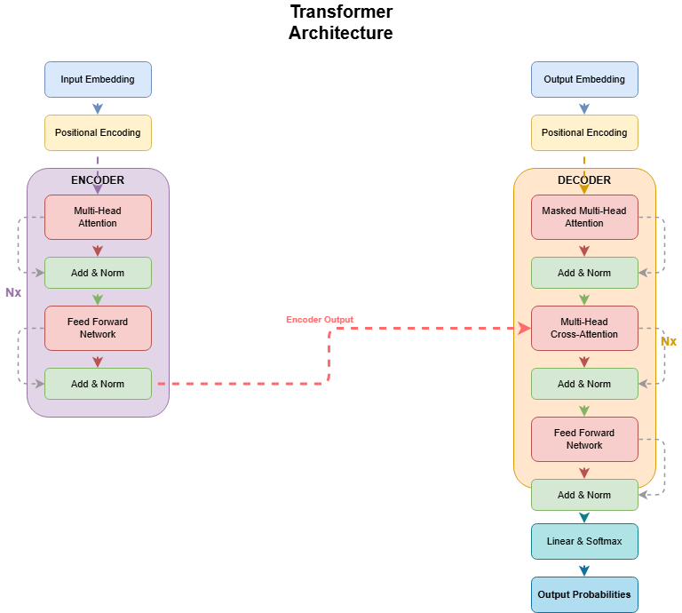
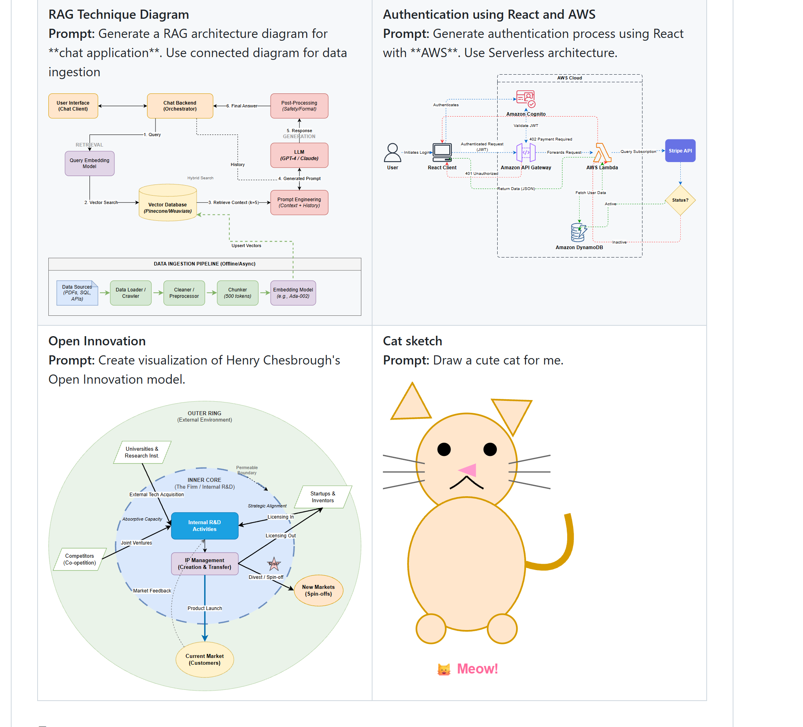
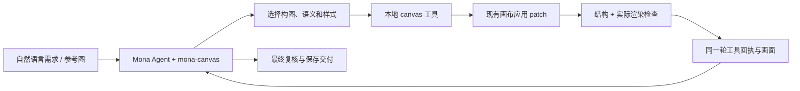

# Mona AI 画布官方 Demo 质量优化方案

> 日期：2026-09-07
> 状态：执行中；本轮扩展官方 Demo 基准、任务矩阵与抽象构图标准。
> 实施入口：[开发计划与验收清单](../plans/ai-canvas-official-demo-implementation.md)。
> 本文取代此前[初版方案](2026-09-07-ai-canvas-quality-replication-design.md)作为后续开发依据。当前能力未达到官方 Demo 标准，剩余工作包括产品代码缺口，不只是模型凭据问题。

## 1. 交付目标

**Mona AI 从用户的自然语言需求出发，在现有画布中生成达到官方 Demo 设计水平的可编辑图，读取实际检查结果，并完成必要修正。** 用户不需要编写 JSON、计算坐标或逐项指挥改图。这里的“官方 Demo 标准”指可迁移的构图、层次、视觉语义和连线质量，不指某一张固定模板。

用户提供的官方 Demo 拼图包含四种互补能力：RAG 的连接数据流、React/AWS 的边界拓扑、Open Innovation 的同心圆/径向关系，以及 Cat sketch 的自由形状组合。Transformer Architecture 仍是其中一个重要的技术架构参考。要求学习这些 Demo 背后的构图语法、模块层次、颜色语义、文字和连线组织，并迁移到未见过的内容。手工写出同一张图、在产品中放入预制截图、只验证渲染器，均不能算完成。

参考资产说明：

- Transformer 图是用户提供的原图副本，768×690，未修改像素；SHA-256：`BFB1CAB5375B127BC36C0CEAAE56327F04282106E25DBB1A69901F61A2F686A0`。
- 官方 Demo 拼图是用户提供的原图副本，2009×1821，未修改像素；SHA-256：`F8ECA23A3AFC429F20B3B60CD6697FC083AB72E9DA4C12DDD3ACF57F2F649A40`。它只作为四类能力的视觉验收参照，不作为任何一个任务的坐标模板。
- Mona AI 的低饱和自由图形实测图为 `freeform-cat-live.png`，877×688，SHA-256：`223C317C9C91D40E8403F20120B505A9335419532036249DF0884283EFDECF2C`。它由 23 个独立可编辑图元生成，用于证明自由组合和细小装饰图元的表达能力；该次 AI 回合内视觉检查因桌面窗口最小化未完成，因此只作阶段证据，不作 D5 完整通过证明。
- 本地参考项目 `D:\liuzhe\Desktop\code\next-ai-draw-io` 根包为 `0.4.16`，没有 `.git`。对应上游示例位于 `public/animated_connectors.svg`，本次读取的 SHA-256：`BA42A2FD315B12AF2A877D7060F7187271A7A57C09F4A36BA84460C3A5BB9F72`。
- 视觉验收以上述两张图为依据；上游 SVG 用于提取形状、分区和连线设计信息。动画不是本期完成条件。Demo 中的具体文案、坐标、尺寸、颜色数值和图标排列不能直接复制到生产生成逻辑。
- 标准是同等清晰度、构图和可编辑性，不要求复制抗锯齿或字体环境差异。明显遮挡、容器不足以容纳内容等缺陷也不应照搬。

### 1.1 四类 Demo 的抽象边界

| Demo 家族 | 需要学习的视觉语法 | 适合表达的内容 | 生成时必须重新决定的部分 |
| --- | --- | --- | --- |
| connected-dataflow | 主链、分支、回路、离线/在线子流程、跨区域连线 | RAG、事件流、数据处理、发布流水线 | 节点顺序、主/次关系、通道位置、标签和分区范围 |
| boundary-topology | 系统边界、外部参与者、边界内服务、回调/状态路线 | AWS/云服务、部署边界、组织或信任域 | 边界层级、参与者位置、进入/离开方向、异常路径 |
| concentric-radial | 外环/内核、径向关系、反馈和输出环、层级中心 | 能力模型、生态图、战略关系、影响范围 | 环数量、中心语义、关系方向、环与节点的间距 |
| freeform-composition | 基本几何形状组合、旋转、曲线/装饰线、前后景层次 | 草图、概念插图、轻量说明图、图标化表达 | 形状分解、比例、层级、装饰与语义元素的边界 |

四类语法可以组合：例如架构图可以同时使用边界拓扑和连接数据流，业务图可以在分区中嵌入同心圆或自由形状。模型先从内容关系选择语法，再生成对象和几何；不能用用户是否说了“RAG”“AWS”“猫”等关键词直接选择一份固定图源。

## 2. 范围与已有基础

保留 React Flow、现有 `.mona-canvas`/FlowchartDocument JSON、形状渲染、编辑器入口、工作区保存与 Mona Agent/模型配置。新增字段和操作进入现有模型及校验器，不建立第二套图源。

核心范围：生成策略与示例、版式表达、可靠连线、局部编辑、实际渲染检查、AI 工具回执闭环、主会话和重新打开后的 AI 上下文、真实模型验收。

不增加 draw.io 内核、云端画布、多人协作、同步服务、CRDT、独立画布后端会话系统、账户或模型下载器。不顺带重构思维导图，也不增加旧格式转换工程。

Word/PPT 根据需求使用画布的设计见第 11 节，作为后续接入项；它不计入本期 Demo 质量里程碑，不恢复此前已排除的整套 Office 联动开发范围。

当前已实现主题、图标、节点与边样式、auto/manual 布局、泳道、原子 patch、两个哈希和 DOM 质检。这些是继续开发的基础，不能将其重新列为未实现，也不能以字段存在证明成图质量已经达标。

## 3. 官方 Demo 对应的生成要求

官方 Demo 展示的是一组可迁移的质量约束。AI 必须先理解内容，再选择最小且合适的构图语法；程序负责把 AI 的结构和视觉意图稳定地落到可编辑对象上。

| 质量要素 | 四类 Demo 中的共同表现 | AI 应作出的决定 | 程序负责保证 |
| --- | --- | --- | --- |
| 内容模型 | 对象有角色，关系有方向/类型，边界和注释各自有语义 | 识别主体、动作、分组、输入/输出、反馈和例外 | 所有用户要求都有可追踪的可编辑对象，不用装饰线代替业务关系 |
| 构图语法 | 连接数据流、边界拓扑、同心/径向、自由组合各有不同空间组织 | 选择一种主语法，必要时组合次语法，并解释选择依据 | 按语法提供区域、环、层、泳道、控制点和 z-order 能力 |
| 层次与画幅 | 标题、分区、主要对象、辅助对象和注释有稳定阅读层级 | 决定信息优先级、画幅方向、密度与留白 | 实际字体测量、可读字号、边距、边界包含和导出尺寸可验证 |
| 视觉语义 | 同类对象颜色/形状/线型一致，重点关系有少量强调 | 为角色而非关键词选择颜色、形状和线型 | 样式在保存、重开、局部修改和导出中保持一致 |
| 关系路径 | 主链清晰，回路/跨区/状态路径不与无关对象混淆 | 选择端口、通道、折点、线型、标签和方向 | 端点可靠、逐段避障、标签可读、不同关系保持可区分 |
| 空间层级 | 边界、环、背景形状与语义节点有明确前后关系 | 判断哪些对象是容器/背景/装饰，哪些对象参与语义图 | 支持 z-order、透明度、旋转和装饰对象；装饰对象不成为路由障碍 |
| 可编辑性 | 图形由文字、节点、边、形状和图标组成，而非单张图片 | 对每个视觉元素选择最合适的可编辑对象 | 保存、重开、选中、局部修改和导出都保留对象身份 |

四类语法的最低质量门槛如下：

- connected-dataflow：主流程/分支/反馈可沿箭头读出；在线与离线、同步与异步等不同关系有独立视觉编码；必要时用分区承载辅助管道。
- boundary-topology：外部参与者、系统边界、边界内服务和跨界关系层次明确；异常或状态回路不与正常调用混在同一条线上。
- concentric-radial：中心、环层和外围对象的语义对应清晰；径向边不拥挤，环与标签有足够间距，反馈关系能回到正确层级。
- freeform-composition：基本形状、旋转、曲线和装饰可以组合成识别度高的对象；语义文字仍是独立可编辑对象，装饰不能遮挡或替代文字。

Transformer 图只是 connected-dataflow + boundary/双列组织的参考案例。禁止在生产生成逻辑中按“Transformer”“Encoder”“RAG”“AWS”或“猫”等文本匹配写死节点、坐标、配色、连线或整张图。官方示例资产只能用于 L0 表达性回归和人工视觉对照，不能作为生成时的默认复制源。

## 4. 实施前缺口与修复映射

以下缺口来自实施前基线。G1、G2、G3、G5、G6、G7 和 G8 已在本轮代码、Skill 或入口中修复并有近场回归；G4 所指的最终产品视觉等级仍必须由 D5 多次真实运行证明，不能用单元测试替代。

| 编号 | 缺口 | 当前证据与最近修改位置 |
| --- | --- | --- |
| G1 | 反馈线外绕仍穿过邻近节点 | TB 图：目标 `(0,0)`、来源 `(0,240)`、障碍 `(240,240)`，均 `160×64`。来源到目标回边先向右伸到 `x=448`，首段穿过障碍。[路由实现](../../webui/src/components/notes/flowchart/flowchart-patch.ts) |
| G2 | 只改色也改动无关边 | `updateNode.style.color` 后，`applyFlowchartPatch` 无条件调用整图 `routeFlowchartEdges`，已有边字段改变。局部修改不满足最小影响范围 |
| G3 | 分区与成员关系在创建后丢失 | `groups` 只生成锁定矩形，成员 ID 未保存在文档中。`reflow` 后成员移出原框，框留在原位，质量检查仍可能返回空列表 |
| G4 | 几何检查不等于设计完成 | [现有 Agent 成图](../../output/ai-canvas-quality/independent-agent/refund-flow.png)在概览中标签偏小；[验证结果](../../output/ai-canvas-quality/independent-agent/validation.json)仍有 `overview-too-small`。已有测试不能证明官方 Demo 同级构图 |
| G5 | AI 拿不到应用后的完整反馈 | [主会话 hook](../../webui/src/components/canvas/useConversationCanvases.ts)等待回复结束后应用 patch，只更新本地 UI。[编辑器](../../webui/src/components/notes/flowchart/FlowchartDocumentEditor.tsx)的 DOM 检查也仅保存在组件状态，未返回同一轮 Agent |
| G6 | Skill 与运行时提示矛盾 | `mona-canvas` 和校验器支持 `replaceGraph.pools`；[notes-ai.ts](../../webui/src/components/notes/notes-ai.ts)仍含“已有泳道不能 replaceGraph”的过时说明 |
| G7 | 生成入口与重开上下文不完整 | 当前创建正则不覆盖单独的架构图/泳道图请求；重新打开走 `CanvasFileView`，未接同一个 AI 编辑反馈入口 |
| G8 | 缺少可学习的完整设计样例 | [mona-canvas](../../mona/skills/mona-canvas/SKILL.md)有设计原则和字段说明，但没有官方 Demo 风格的完整图源、效果图、构图解释与修复例 |

之前的测试结果保留为历史证据，不将其覆盖范围扩展为上述问题已经通过。

## 5. AI 创作与执行闭环

### 5.0 学习上游创作方法，并建立 Mona 默认标准

用户只给内容需求时，成图质量也必须成立。不能把“请指定布局、颜色、字号、连线方式”作为默认前置步骤，也不能因为用户没说“高级”，就只生成无设计的节点列表。

**上游真实做法（代码事实）**：

| 环节 | 实际逻辑与来源 | 借鉴方式 |
| --- | --- | --- |
| 先理解并规划 | `lib/system-prompts.ts:16` 要求先用最多 2–3 句规划布局与结构，再调用生成工具 | 模型先决定构图与层次，不能把默认 Dagre 输出当作设计方案 |
| 默认启用样式 | `components/chat-panel.tsx:178` 的 minimalStyle 默认 false；`system-prompts.ts:399-406` 默认追加颜色、圆角、字体和箭头语法 | 用户未给样式时仍主动做视觉设计 |
| 在可读画幅内安排 | `system-prompts.ts:77-85` 要求紧凑构图、分区、边距，避免横向无限铺开 | 保留有界画幅和概览可读目标；不照抄其固定 800×600 数字 |
| 模型表达几何与外观 | `app/api/chat/route.ts:616-652` 接收模型生成的 mxCell/mxGeometry，包含坐标、尺寸和样式 | AI 应能表达区域、位置关系、端口与精细布局；程序检查和实现，不替模型做全部设计判断 |
| 专用形状按需查库 | `system-prompts.ts:53-64,95` 与 `route.ts:716` | 使用实际可用的形状目录，不猜图标或接口；普通图无需读全库 |
| 生成前思考连线路径 | `system-prompts.ts:140-186` 的端口、多边、避障和折点规则 | 把连线通道纳入构图，避免节点摆完后再任意拉线 |
| 编辑当前图 | `route.ts:469-474` 强调当前 XML，`edit_diagram` 按 ID 修改 | 使用实际文档与稳定 ID，保留已经正确的局部设计 |
| 可选视觉检查 | VLM 默认关闭；打开后对初次 display 截图并返回问题 | 学习反馈修图方法；Mona 补齐可靠反馈，不能将上游可选检查宣称为默认稳定保证 |

上游的高质量包含模型自身的设计能力。它没有在这些代码中实现一套完整的“自动选图型、自动配色、自动评分通过”的规则引擎。因此下面的标准是 **Mona 为稳定达到相同质量而补充的默认规范**，不能说成上游已有的隐藏模板系统。

**默认创作决策顺序**：

1. 判断图要说明的主关系：步骤流转、系统组成/调用、角色交接、层级关系还是对比。保持用户语言，确定主体与信息边界。
2. 形成节点、关系、分区、必要注释的内容清单。给定业务事实必须保留；未提供的金额、审批权限、接口等不能当作事实补写。概念示意可作最少假设并简短说明，只有影响内容正确性的关键缺项才需要追问。
3. 选择构图：单主链使用顺序流；并行模块使用分列；组成/调用使用分层；角色交接使用泳道。没有语义上的双列关系就不套 Transformer 双列。
4. 按当前画幅、节点数和最长标签决定密度、分区比例与连接通道。先确定区域与路线，再计算节点几何；不要默认把所有节点排成单条横向长链。
5. 选择视觉角色：标题、分区标题、主要节点、辅助节点、注释、主线和次线。颜色按角色一致分配，形状按语义选择。
6. 生成可编辑对象，经工具应用取得实际测量、图像与问题；依据反馈调整对应对象，直至达到标准或明确报告未完成项。

该决策摘要保留在本次创作上下文/工具记录中，通常一小段就足够。不增加新的规划产品页面、长期状态机或每图一份必须由用户确认的设计说明。

**无样式要求时的默认设计基线**：

| 项目 | 默认选择 | 根据内容主动调整 |
| --- | --- | --- |
| 风格 | 清晰、克制、适合说明与汇报的技术图；浅背景、清楚边界 | 用户给品牌、手绘或其它参考时优先遵循，不强套配色 |
| 画幅 | 已有画布使用当前画幅；参考图任务使用参考比例；全新普通图先按 4:3 阅读画幅规划 | 根据内容选择横/纵与分区，最终在实际目标尺寸验收；不得只扩大到无限画布 |
| 文字 | 建议标题 22–26px、分区标题 15–17px、正文 14–16px、边标签约 12px，形成层级 | 这是创作初始值；长中文先换行或增高。最终阅读尺度按第 10 节检查，不单纯缩小字号 |
| 形状 | 流程/服务用清楚的矩形，判断用菱形，存储用存储形状，边界用分区 | 技术模块如 attention 不必为了“像流程图”全部换成流程符号 |
| 配色 | 以 2–4 个语义色族起步，同功能同色，重点少量强调 | Demo 的颜色表达模块功能；业务流程可表达正常/异常/待定，不把所有类型都映射为红黄绿状态 |
| 分区 | 内容存在真实子系统或责任边界时才分区，标题与成员明确 | 根据最长标签与成员数调整面积，不给每个节点再套一个框 |
| 图标 | 有助识别用户、服务或存储时使用实际可用图标 | 不要求每个节点都有图标；官方 Demo 级别不以图标数量衡量 |
| 连线 | 主链自然流向，箭头有明确含义；次要/反馈关系适当使用虚线 | 残差、跨区与双向关系要有可辨认路线和必要标签，颜色不作为唯一说明 |
| 密度 | 同层节点对齐、同角色尺寸接近，留出文字和边路径所需空间 | 内容过多先换构图和合理换行；用户允许时再分图，不能删关键事实来“变漂亮” |

以上 defaults 是模型创作的起点，不是校验器硬性限制，也不是额外 UI Token。程序只强制正确性、合法范围、可读性与用户约束；成图使用用户需要的设计风格，编辑器控件仍遵循现有 UI 规范。

**训练与验收方法**：学习样例必须同时包含原始自然语言需求与模型的设计选择，解释“为什么这段内容适合双列/分层/泳道”。固定样例之外，正式验收保留无风格词的新需求。用户无需写“高质量”“仿官方”“有图标”或提供坐标，AI 也应主动完成结构与视觉设计。

### 5.1 工作方式

AI 决定信息结构、版式、视觉角色与有意义的修改；程序保证坐标计算、文本测量、避障、事务和保存。布局算法支持 AI 的决定，不将所有内容强制排列成一条长链。

复杂图可先提交完整主结构，再补分区、注释和修正；每批必须是有效且真实可编辑的状态。不得把预先生成的结果延时播放成“AI 正在绘制”。不强制每个节点一个调用，也不要求所有图固定批次数。

### 5.2 最小工具接口

新增薄 `canvas` Agent 工具，复用既有 [Tauri IPC](../../mona/agent/tools/tauri_ipc.py) 通道，在当前前端执行文档操作。它是已有底座的调用入口，不是新的画布服务。拟定动作：

| 动作 | 输入与回执 | 必须满足 |
| --- | --- | --- |
| `open` | 激活并读取当前工作区画布；返回 canvasId、文档哈希、选区、画幅与能力摘要 | 不重复创建目标，不靠用户提供哈希，不等待视觉检查；画布创建由会话入口负责 |
| `inspect` | 按需读取 selection / objects / capabilities / review / visual | 返回真实当前状态；图像随精确文档哈希，局部检查标明范围 |
| `apply` | requestId、canvasId、两个哈希、现有 patch ops | 返回 applied / unchanged / conflict / invalid；包含修改 ID、最新哈希和确定性问题 |
| `export` | 当前画布与工作区输出路径、格式 | 保存或导出真实版本；返回可读取文件引用，未复核时明确说明 |

模型输出结构化调用；`apply` 内部继续使用现有 patch 类型与校验器，不另造图形 DSL。成功回执直接复用，不为重新获取 ID 扫描整图。

读写闭环具体边界：

- Gateway 的工具通过已有 IPC 请求当前画布；Tauri 只维护有限的在途 requestId 与前端响应，不持有第二份可写图模型。
- 前端统一的画布控制入口同时供主会话、文件重开和相关画布面板使用。提交、撤销与保存走当前编辑器链路。
- 只有 schema 校验、哈希比较与提交在同一执行端完成后才返回成功；生成期间用户改色、移动或改字都会使旧命令失效。
- 同 requestId 在同一存活编辑上下文内幂等返回。超时先查询实际结果；重连后无法确定结果时读取当前图再计划，不盲目重放。
- PNG 使用已有文件/图像结果通路传给模型，避免让模型生成 base64 或让大图塞满 IPC 文本响应。不能只返回“截图路径”却不给视觉模型读取它的能力。
- 接通工具后，旧 fenced patch 不再承担新工具响应的第二次应用；历史消息仍可以展示和复制。不会同时走两条写入路径。

### 5.3 检查、视觉判断与停止条件

几何和语义检查不依赖额外视觉服务。新布局完成后，同一轮 Agent 必须取得结构报告；有图像能力的已配置模型还应取得真实全图，判断层次、密度和图例，而不是只判断有没有相交矩形。

“不增加云端功能”指不引入额外平台、账号或视觉检查服务；继续使用用户已经配置的 Mona 推理能力。当前模型不支持图像时，只能标记视觉判断未完成，不能伪造已看图或 silently 使用另一个收费提供方。

生成与修正次数由图的内容和实际反馈决定，不设固定批次配额；同一修正无改善时调整策略，重复连接失败由执行入口熔断。工具断开、提交未确认或视觉检查失败均不算“通过”。失败草稿保留供用户继续编辑。

## 6. 图模型与局部编辑的最小补充

在 `FlowchartDocument` 上扩展必要的可持久字段，不改变 `.mona-canvas` 工作区归属。新字段必须贯穿校验、解析、复制、哈希、渲染、撤销、保存和重开；仅存在于 patch 中的字段不算实现。

### 6.1 分区与文字

- AI 视觉分区保存明确 memberIds、标题区与 padding；仍可让成员保持根坐标。复用已有 group 表现，明确区别于手工组合，禁止同一成员被两个不相容分区同时拥有。
- 增加分区增删改操作；删除分区默认保留成员，删除成员必须显式指定。修改标题/颜色不重排；移动分区平移成员；新增、改字或改尺寸后只更新相关边界。
- 节点支持局部位置与尺寸调整；注释与边标签分别有自己的可编辑位置/样式。边标签可以沿路径偏移，不能永远固定为最长线段中点。
- 分区圆角、标题对齐、填充透明度必须按文档值渲染，不能在渲染器里固定为一个样式而忽略 AI 指令。
- 原生 SVG/HTML 渲染继续共用现有形状定义；不把画布烘焙成一张不可编辑图片。

### 6.2 修改影响范围

| 修改 | 允许自动改变 | 必须保持 |
| --- | --- | --- |
| 文字颜色、填充、图标颜色 | 目标样式与当前质量状态 | 节点坐标、尺寸和全部边路径 |
| 标签、字体或尺寸 | 目标测量、必要边界、连接该目标的自动路由 | 非目标标签与样式；无关节点/边 |
| 单节点移动 | 目标位置、相关分区边界、其关联自动连线 | 无关分区和手动路线 |
| 分区移动 | 该分区及成员的等量平移、相关自动连线 | 内部相对位置和其它分区 |
| 明确的重排 | 指定作用域及必需连线 | 未指定作用域；锁定对象和手动路线除非请求明确包含 |

G2 的根本修复是按修改类型和目标计算影响范围，禁止每次 apply 无条件重算全部边。无变化操作返回 unchanged，不创建额外编辑历史。

## 7. 构图与连线路由

### 7.1 构图约束

为当前 auto 布局增加有限的布局意图，首批覆盖顺序流程/连接数据流、双列堆叠、分层架构、边界拓扑、泳道、同心/径向和自由形状组合。复用现有 direction、groups、pools 和节点尺寸；补充区域顺序、同宽/对齐、间距、环层、z-order 与目标画幅即可。不要建立通用约束语言。

官方 Transformer 图由 AI 选择“双列堆叠”：每列按模块顺序排，列间为跨模块边留通道；文本测量后确定高度，分区随内容扩展，标题和 Nx 注释作为普通可编辑文本。RAG 应优先选择在线/离线连接数据流，AWS 示例应优先选择边界拓扑，Open Innovation 应优先选择同心/径向，Cat 示例应优先选择自由形状组合。其它任务由 AI 根据内容选择或组合语法，不能自动套任何官方 Demo 模板。

先完成真实字体测量与区域排布，再计算连线；完整的页幅检查包含标题、分区、注释、线段和边标签，不只看节点矩形。默认适应视图只负责展示，不能作为修复过大布局的手段。

### 7.2 路由方案

- 统一渲染与质量检查使用的线段几何。检查实际路径的每一段，包括从端口到外围通道的首尾段；绕到图外不代表避障完成。
- 端口支持同侧多个连接位置，使用相对比例描述，避免多条边全部占用中心点；保持已有 side handle 的正常行为。
- 对主链、反馈、残差和跨区边保留不同通道；跨线不必一律禁止，但禁止有歧义的重合与穿越无关节点。边标签避开节点、其它标签和转折点。
- 调整节点或分区后只重算相关自动线；手动控制点必须有明确归属。无可行路线时返回 `ROUTE_UNRESOLVED` 与对象 ID，不能把失败路径当作完成。
- 保留 Dagre 对简单图的布局作用。复杂自动布局优先验证项目已依赖的 `elkjs 0.12.0`，仅增加现有 JSON 到布局输入/结果的适配；不更换 React Flow 渲染器或增加运行时下载。
- ELK 不是“输入任意固定坐标就自动解决所有路线”的承诺。固定构图的局部路由需单独验证约束；可采用有边界的正交候选路径搜索，逐段检验障碍后再选择最短可行路径。D0 必须验证 G1、双向线和跨区长线，才决定具体适配范围。

禁止用删边、合并不同业务关系、把关键边转为没有语义的装饰线来降低路由难度。

## 8. 质检结果必须可执行

保留现有六类检查并补齐已发生的漏报：分区成员出界、分区重叠/标题冲突、边标签遮挡、失联或未渲染对象、实际路径穿线。容器包含成员属于有意重叠，不应误报。

统一回执至少包含：`documentHash`、`status=passed|issues|unavailable|stale`、`scope`、对象 ID、问题区域、检测依据、建议操作类别。建议描述只指明修复方向，不能自行删除语义内容。结构检测、DOM 检测和 AI 视觉判断分别记录，不能互相冒充。

- DOM 未挂载、尺寸为零、字体未就绪、漏渲染节点/边、无法获取 SVG 路径都不是空问题列表。返回 unavailable，并说明尚未检查的范围。
- 图片捕获前后核对同一文档版本，旧图不能消除新问题。
- 用户要求的元素和关系建立覆盖清单，逐项核对；几何错误为零不代表内容完整。
- 修改后的质量报告返回 Agent，Agent 以 issue IDs 选择最小 patch，工具再返回新图版本与问题变化；UI 同时显示真实进展。

## 9. mona-canvas 的设计知识

入口保留简短任务分流，详细字段以真实工具 capabilities/统一契约为准，消除多个文案副本的矛盾。局部改色不要求读取全套设计说明。

首批补齐四组学习材料，每组包含：需求、效果图、完整可编辑源、设计理由、局部修正例。

1. connected-dataflow：RAG 的在线查询与离线摄取、主链/分支/反馈和辅助管道。
2. boundary-topology：React/AWS 的外部用户、云边界、内部服务、状态和异常回路。
3. concentric-radial：Open Innovation 的内核、边界、外围参与者、径向关系和反馈。
4. freeform-composition：Cat sketch 的圆形/椭圆/三角形/旋转线段/文字组合与前后景层次。

Transformer 双列架构作为 connected-dataflow 的技术架构参考保留，但不再作为唯一设计范式。

样例是学习材料，不能成为按关键词输出固定答案的产品逻辑。留出验收题，不把所有测试需求和正确坐标都写进 skill。指导应能回答：为什么选此构图、哪些关系应突出、检查后该调整哪个对象。

补充实际修图流程、如何取得哈希/当前选区/报告、如何处理不可用能力。Skill 不再要求模型读取一个实际上收不到的“回执”，也不能描述当前工具没有的操作。

## 10. AI 验收标准

三类验证分别记录，只有第三类通过才能声称 AI 质量达标：

| 层级 | 输入与执行者 | 证明范围 |
| --- | --- | --- |
| L0 底座 | 开发者 fixture → 编辑器 | 字段、布局、路由与渲染能表达要求 |
| L1 Skill | 独立 Agent 只读 skill → patch → 编辑器 | 知识可用，不能替代 Mona 产品入口 |
| L2 产品 AI | 普通用户需求 → 正常 Mona 会话 → 工具/检查/修正 → 可编辑结果 | 真正的生成能力与闭环 |

基准任务共 6 类，最终每类 3 次，共 18 次完整 Mona 创作/编辑任务，保存所有尝试：

- A：附官方图，让 AI 生成同内容、同级视觉效果的可编辑图。
- B：只给文字需求“制作 Transformer 架构图，清楚区分 Encoder/Decoder、残差与交叉注意力”，由 AI 自行组织；不附目标 JSON 或坐标。
- C：三次分别覆盖 connected-dataflow/RAG、boundary-topology/AWS authentication、concentric-radial/Open Innovation；沿用官方 Demo 的清晰层次，但不复制示例坐标、文案或对象数量。
- D：中文长标签、增加模块与关系的变化题，检验布局迁移能力；不手工减内容。
- E：AI 先生成，再连续改色、改字、加模块、移动分区；关闭重开后继续修改指定对象。
- F：未给样式或排版指令的短需求，例如“画一个订单退款流程图”“把以下处理过程整理成一张图”以及“画一只可爱的猫”，由 AI 根据第 5.0 节自主选择连接、边界、径向或自由组合；至少一题不指定图型。每次换用未进入 skill 样例的具体内容，不附图、不指定配色、不提供结构化答案。

每次必须满足：语义覆盖清单完整；无非预期遮挡/裁切/穿线；分区关系正确；相关修改符合第 6.2 节；同一轮拿到最终检查结果；保存重开后可以继续编辑。已知 G1–G3 回归必须全过。

画面对照在固定显示/导出尺寸进行。A 类按 768×690 对照用户基准，主要英文标签在最终图中不低于 10px；中文变体采用不低于 12px 的阅读尺度，允许在等价画幅内重新排版。标题、正文、注释有清楚层级。不能靠拉成数千像素长链后缩小展示通过；A/B 不允许拆图或省略模块规避。其它题只有用户需求允许时才合理分页。

人工并排评审构图、分区、文字、色彩与连线五项，每项至少达到“可直接使用，无需人工重新设计”的水平，保留简短判定理由。运行成功率目标至少 17/18；A、B、F 的各 3 次均必须通过，失败必须计入，不能挑每题最好的一张。所有成功样本的关键语义与局部编辑完整性必须全过。F 类若仍需要用户补充颜色、字号和布局指令才能成图，视为未达标。

记录模型、参数、skill/代码版本、原始用户输入、全部工具请求与回执、token/耗时、检查/修正次数、最终 PNG、可编辑 `.mona-canvas` 和重开结果。缺有效产品模型时保持 L2 未验证，不修改完成定义，也不另起默认配置的 CLI 代替当前产品模型。

## 11. 文档按需使用画布：后续接入边界

待本期质量达标后，可在 `mona-pptx`、`mona-docx` 加入按需判断：内容确实需要流程/架构等关系图时复用 `mona-canvas` 和同一本地工具链；普通标题、段落、表格不强制建图。

最小后续流程为“文档规划判断需要图 → AI 在现有画布生成并复核 → 导出合适尺寸 → 通过既有 Office 插图能力插入”，沿用用户语言与现有入口。PPT 的 SVG 安全规则及 Word 当前图像格式限制需按实际能力处理。

这是独立接入任务；本期不做跨文档自动同步、源包嵌入、Office 原生节点转换或多人编辑。不能仅增加 skill 名称，就宣称文档已经会自动生成并插入高质量画布。
