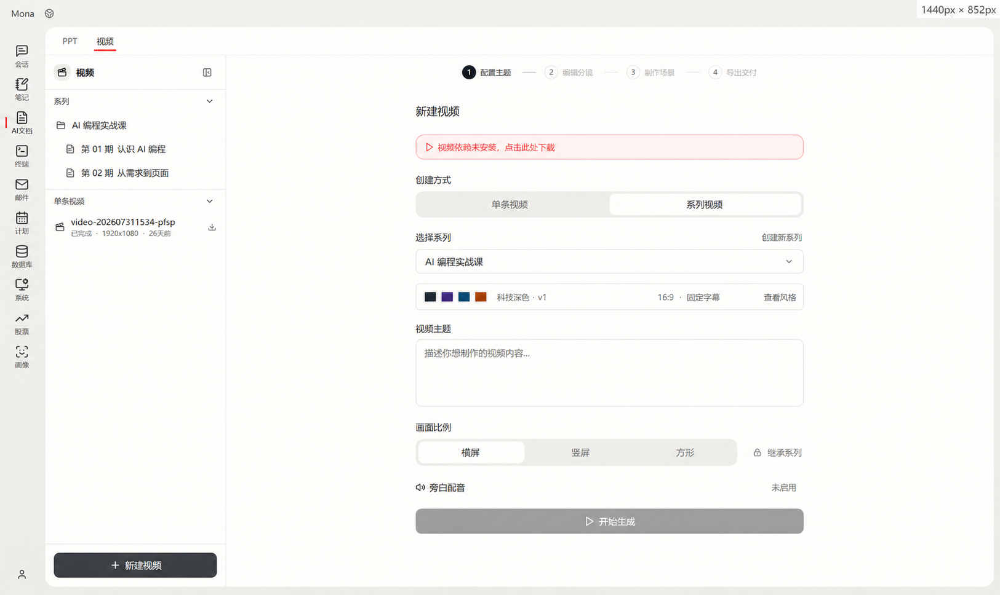
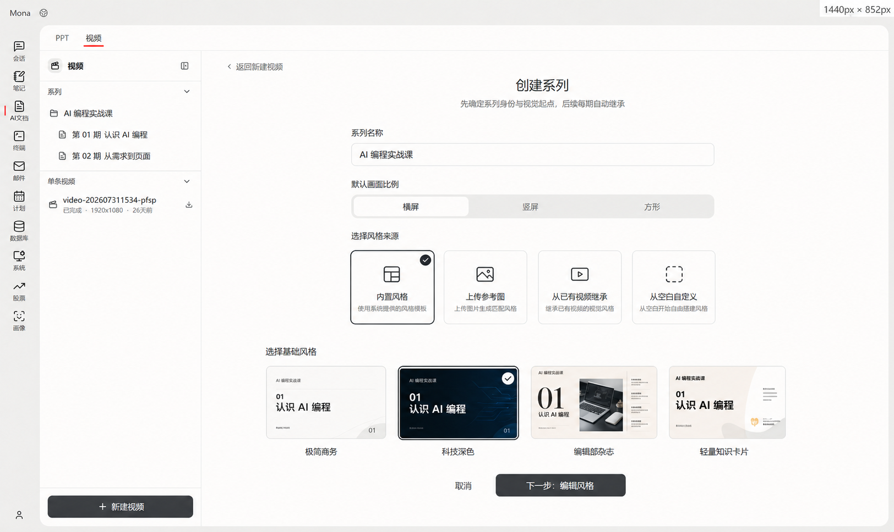
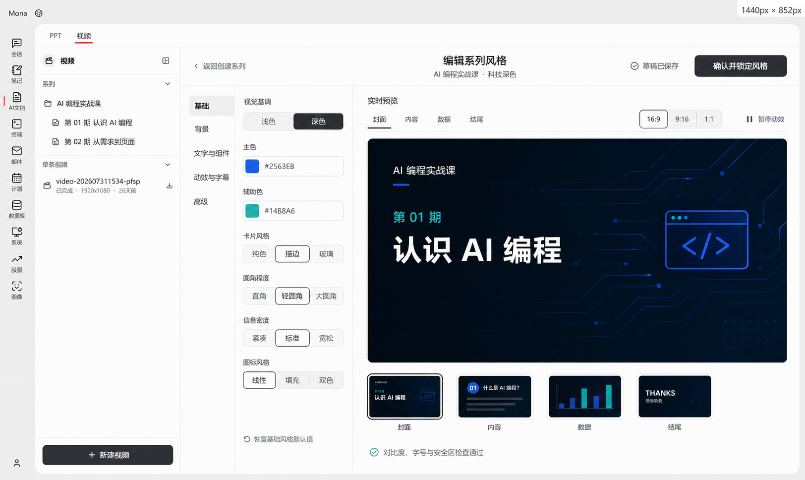
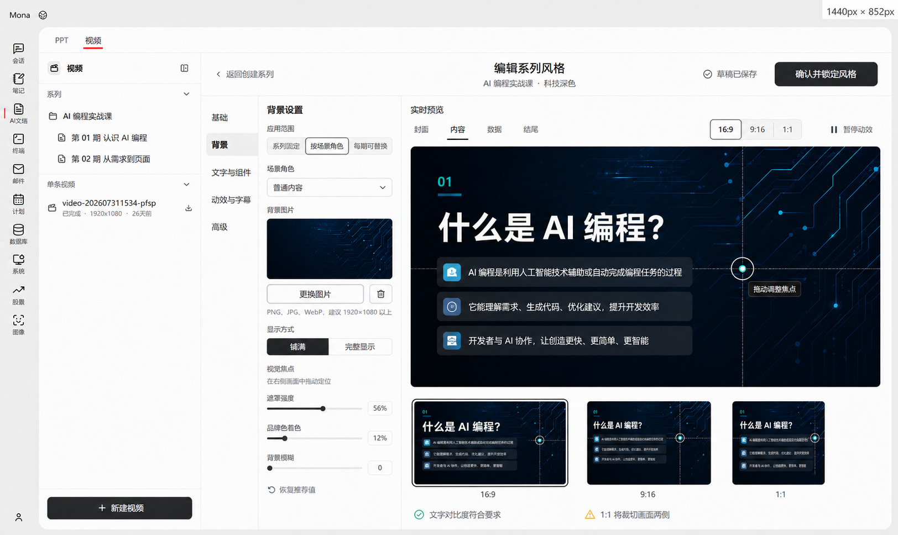
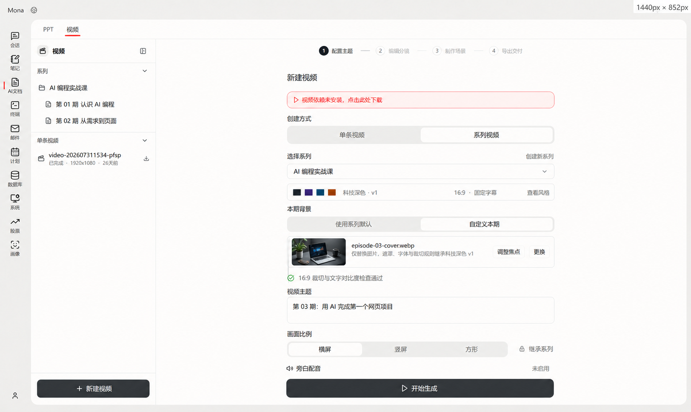
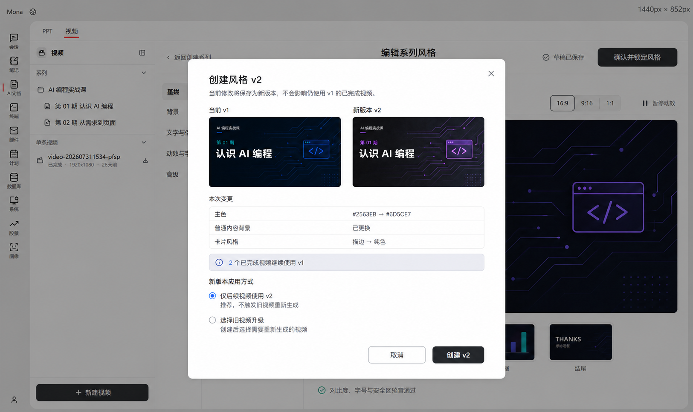

# Mona AI 文档→视频系列风格系统落地方案

> 文档版本：1.0  
> 状态：核心链路已实现；完整设计验收未通过，剩余差距见 20.4  
> 制定日期：2026-08-26  
> 适用范围：AI 文档→视频模块、视频项目管理、分镜生成、场景生成与导出  
> 面向：产品、UI/UX、前端、后端、AI 生成、测试人员

## 1. 方案结论

Mona 应把“系列视频”提升为独立于单条视频项目的一级业务对象。每个系列拥有一套可自定义、可预览、可锁定、可版本化的设计系统；系列内每一期视频只引用确定的风格版本，不再依赖模型根据自然语言自行猜测风格。

本方案确定以下产品与技术规则：

1. **同时支持内置风格、基于参考生成和完全自定义。** 内置风格是高质量起点，不是功能边界。
2. **用户不需要配置所有底层参数。** 用户调整主色、背景、字体气质、卡片风格、圆角、动效等语义参数；系统自动派生对比色、弱化色、间距、组件状态和动画时间等完整设计令牌。
3. **自定义背景图片是一等风格能力。** 支持系列固定背景、按场景角色配置背景，以及允许每期替换图片但保持遮罩、裁切和可读性规则不变。
4. **风格一致性由代码约束，不由提示词承诺。** AI 输出结构化场景规格，系统使用锁定的主题、组件和动效模板编译 HTML；不得继续把“生成任意 HTML+CSS”作为最终方案。
5. **风格锁定后不可原地覆盖。** 修改已使用的风格会创建新版本；旧视频继续引用旧版本，新视频默认使用最新版。
6. **UI 使用渐进式配置。** 默认只展示少量高价值选项，高级参数按需展开，避免把视频模块做成专业设计软件。
7. **所有修改必须实时预览。** 配色、背景、字体、组件和动效修改不触发 LLM，使用本地确定性预览即时反馈。
8. **现有单条视频保持兼容。** 没有 `seriesId` 的历史项目按单条视频处理，不强制迁移，不影响继续编辑和导出。

一句话产品定义：

> 系列定义长期视觉身份，风格版本定义可复现的设计规则，每期视频只负责内容变化。

---

## 2. 背景与当前实现基线

### 2.1 当前流程

当前视频模块采用以下流程：

```text
配置主题与比例
  → 创建独立 video_project
  → Agent 生成 storyboard.md
  → 用户锁定分镜
  → LLM 逐场生成完整 HTML+CSS+GSAP
  → 导出 MP4
```

当前每条视频都是独立项目，项目之间没有系列归属、风格继承或风格版本关系。

### 2.2 已确认的实现缺口

| 当前实现 | 缺口 | 直接影响 |
|---|---|---|
| 新建视频只配置主题、比例和配音 | 没有系列和风格入口 | 用户不能声明“这是同一系列的下一期” |
| `meta.json` 保存分辨率、阶段和 TTS | 没有 `seriesId`、`styleVersion` | 无法稳定继承或追溯风格 |
| `storyboard.md` 只保存场景字段 | 没有场景角色、布局类型和背景槽位 | 场景生成只能依赖自然语言描述 |
| `storyboard_lock.md` 只写场景标题和时长 | 实际没有锁定设计系统 | “风格锁定”名不副实 |
| 每个场景由 LLM 自由输出完整 HTML | 颜色、字号、圆角、卡片和动效可自由漂移 | 单条视频内部也无法硬性保证一致 |
| 历史列表按独立项目展示 | 系列内容没有聚合入口 | 多期视频难以管理 |

### 2.3 根因

当前系统把风格当成分镜文字的一部分，而不是独立的、结构化的生产资产。只要模型仍然可以自由决定 CSS 和组件结构，就只能做到“风格相似”，不能达到“必须是同一套 UI 风格”。

---

## 3. 产品目标与非目标

### 3.1 产品目标

- 用户能够创建、选择和管理视频系列。
- 系列内所有视频使用可追溯的风格版本。
- 用户可以从内置模板开始，也可以从参考图或空白配置创建自定义风格。
- 用户可以调整配色、字体、卡片、圆角、动效、字幕、品牌和背景图片。
- 系统能够从少量用户输入派生完整、可用、可读的设计系统。
- 用户在确认风格前可以实时查看代表性场景的真实预览。
- 背景图片能够正确适配横屏、竖屏和方形画布，不拉伸、不意外裁掉主体、不影响文字可读性。
- AI 只决定内容和允许的布局选择，不得绕过锁定风格。
- 旧项目无迁移成本，现有导出流程继续可用。

### 3.2 第一版非目标

- 不提供自由编写 CSS、HTML 或 JavaScript 的界面。
- 不提供任意拖拽、自由定位和逐像素排版能力。
- 不开放每个场景单独修改全部设计令牌。
- 不支持远程 URL 直接作为背景图片，第一版只接收本地上传，避免网络、权限和 SSRF 风险。
- 不支持 SVG 作为用户上传背景，第一版只支持可安全解码的 PNG、JPEG 和 WebP。
- 不自动把旧视频的任意 HTML 反向提取为完全可靠的组件系统；“从已有视频继承”必须经过预览和用户确认。
- 不承诺不同画面比例共用完全相同的坐标布局；不同画面比例使用同一风格下的响应式变体。

---

## 4. 核心概念

| 概念 | 定义 |
|---|---|
| 视频系列 `VideoSeries` | 一组长期共享视觉身份、品牌、字幕和声音规则的视频 |
| 风格草稿 `StyleDraft` | 尚未锁定、可实时修改的系列风格配置 |
| 风格版本 `StyleVersion` | 锁定后的不可变设计系统快照，如 v1、v2 |
| 基础模板 `BaseTemplate` | Mona 内置的组件、布局和默认设计令牌集合 |
| 设计令牌 `DesignTokens` | 颜色、字体、间距、圆角、阴影、动效等结构化参数 |
| 场景角色 `SceneRole` | 封面、章节、普通内容、数据、对比、结尾等语义角色 |
| 布局类型 `LayoutType` | 某种场景角色允许使用的确定性组件布局 |
| 背景槽位 `BackgroundSlot` | 风格中定义的背景图片位置及其替换、裁切、遮罩规则 |
| 单期视频 `EpisodeProject` | 现有 `video_projects/<name>` 项目，新增系列与风格引用 |
| 画面比例变体 `AspectVariant` | 同一风格对 16:9、9:16、1:1 的布局和背景适配参数 |

### 4.1 关系模型

```text
VideoSeries
  ├── StyleDraft
  ├── StyleVersion v1  ← Episode 01、Episode 02
  └── StyleVersion v2  ← Episode 03、Episode 04

StyleVersion
  ├── DesignTokens
  ├── ComponentVariants
  ├── MotionPresets
  ├── BackgroundSlots
  ├── BrandAssets
  └── AspectVariants
```

风格版本必须完整自包含。即使用户后来删除草稿素材或修改最新版风格，绑定旧版本的视频仍然可以重新生成和导出。

---

## 5. 用户可配置边界

### 5.1 配置分层

| 层级 | 面向用户 | 示例 | 保存方式 |
|---|---|---|---|
| 基础配置 | 所有用户 | 主色、背景、字体风格、卡片、圆角、动效、背景图片 | 写入风格草稿覆盖项 |
| 高级配置 | 有明确品牌要求的用户 | 完整语义色板、字号层级、图表色、组件变体、转场 | 写入风格草稿覆盖项 |
| 系统派生 | 不直接展示或只读展示 | 对比文字色、弱化色、hover 色、具体间距、动画时间 | 锁定时计算并写入完整令牌 |
| 系统约束 | 不允许修改 | 安全区、最小可读字号、组件 DOM 契约、渲染协议 | 由运行时固定 |

### 5.2 基础配置项

默认界面只展示以下高价值选项：

- 风格名称。
- 明亮、深色或自动视觉基调。
- 主色、辅助色、背景色。
- 字体组合或字体气质。
- 卡片风格：纯色、描边、玻璃、无卡片。
- 圆角程度：直角、轻圆角、大圆角。
- 信息密度：紧凑、标准、宽松。
- 图标风格：线性、填充、双色。
- 动效强度：克制、标准、活跃。
- 字幕样式。
- Logo、栏目名、水印。
- 自定义背景图片。

### 5.3 高级配置项

- 语义色板：标题、正文、弱化文字、边框、表面、成功、警告、错误。
- 标题、正文、数字、注释的字体和字号层级。
- 卡片边框、阴影、透明度。
- 数据图表颜色和图例样式。
- 封面、章节、内容、数据、对比、结尾组件变体。
- 入场、强调、退场和转场预设。
- 字幕位置、字号、底轨、描边和最大宽度。
- 各画面比例的背景焦点与安全区适配。

### 5.4 不开放的配置

以下参数不直接开放给用户：

- 单个元素的绝对坐标。
- 单个场景的任意 CSS。
- 每个组件内部的零散间距像素。
- 每个动画关键帧的自由编辑。
- 绕过安全区、最小字号和对比度限制的开关。
- 任意外部字体 URL、外部脚本或外部样式依赖。

---

## 6. 自定义背景图片设计

### 6.1 能力层级

背景图片支持三个层级：

1. **系列默认背景**：所有没有单独角色背景的场景继承。
2. **场景角色背景**：分别为封面、章节、普通内容、数据页、结尾设置背景。
3. **每期可替换背景槽位**：允许每期替换具体图片，但裁切方式、焦点规则、遮罩、滤镜和文字安全区继续继承系列风格。

第三种能力用于“同一栏目每期换主题照片”的场景。图片内容可以变化，但视觉处理不变，因此仍属于同一套 UI 风格。

### 6.2 背景槽位策略

每个槽位必须明确以下策略：

| 字段 | 说明 |
|---|---|
| `assetPolicy` | `fixed`、`episode-replaceable` 或 `none` |
| `fit` | `cover` 或 `contain`，默认 `cover`；不提供拉伸 |
| `focalPoint` | 归一化焦点坐标，用于不同画面比例裁切 |
| `scale` | 受限缩放，用于微调取景 |
| `overlay` | 颜色、透明度和渐变方向 |
| `blur` | 受限背景模糊，不能影响主要视觉内容识别 |
| `tint` | 品牌色着色强度 |
| `contrastMode` | 自动选择深色或浅色前景 |
| `safeArea` | 文字和品牌元素不可进入的区域 |
| `fallback` | 图片不可用时的纯色或渐变背景 |

### 6.3 上传与处理规则

- 支持 PNG、JPEG、WebP。
- 单文件最大 20 MiB。
- 后端必须实际解码图片，不仅检查扩展名。
- 上传后复制到系列草稿资产目录，不保存外部绝对路径引用。
- 锁定版本时把实际使用的图片快照复制到该风格版本目录。
- 生成内容哈希用于去重和完整性校验。
- 规范化图片方向并移除 EXIF 等无关元数据。
- 超大图片生成适合预览和渲染的本地派生文件，保留足够分辨率。
- 目标画布覆盖不足时显示清晰警告；低于交付质量下限时禁止锁定。
- 图片含重要文字时提示用户可能因多比例裁切而丢失内容。

建议质量下限：

| 画面比例 | 背景建议最小尺寸 |
|---|---|
| 16:9 | 1920×1080 |
| 9:16 | 1080×1920 |
| 1:1 | 1080×1080 |

### 6.4 背景编辑交互

用户上传背景后，应直接在预览画面中完成以下操作：

- 拖动图片选择视觉焦点。
- 切换 `铺满` 与 `完整显示`。
- 调整遮罩强度。
- 调整品牌色着色强度。
- 调整轻度模糊。
- 分别检查横屏、竖屏和方形裁切。
- 一键恢复系统推荐值。

焦点调整必须使用直接操作，不要求用户输入 X/Y 数值。系统仍在数据层保存归一化坐标。

### 6.5 可读性保护

背景图片启用后，系统自动计算文字区域的亮度和对比度：

- 自动选择深色或浅色文字。
- 对比度不足时自动建议增加遮罩。
- 锁定前对标题、正文和字幕分别执行可读性检查。
- 用户可以调整遮罩，但不能在关键文字低于最小可读标准时锁定。
- 预览必须展示真实字幕和真实长度的标题，不能只用短占位词掩盖问题。

---

## 7. UI/UX 信息架构

### 7.1 视频模块一级结构

视频模块左侧继续承担项目导航，但历史列表改为：

1. 新建视频。
2. 最近编辑。
3. 系列分组。
4. 单条视频。

系列分组显示系列名称、风格缩略图、视频数量和最新风格版本。展开后显示各期视频及当前阶段。旧项目归入“单条视频”，不强制用户整理。

### 7.2 新建视频流程

新建页增加“创建方式”：

- 单条视频。
- 系列视频。

选择系列视频后：

1. 选择已有系列，或创建新系列。
2. 已有系列直接显示风格摘要：颜色、背景缩略图、画面比例、版本。
3. 用户输入本期主题或文档内容。
4. 如果系列允许每期替换背景，此处显示“本期背景”入口。
5. 点击开始生成后，项目自动绑定 `seriesId` 和 `styleVersion`。

已锁定的系列不应要求用户每次重新选择配色、字体或动效。

### 7.3 新建系列流程

新建系列保持两步，不使用长向导：

**第一步：系列基础信息**

- 系列名称。
- 默认画面比例。
- 风格来源：内置模板、参考图片、从已有视频继承、从空白自定义。

**第二步：编辑并确认风格**

- 左侧为渐进式设置区。
- 右侧为实时预览区。
- 用户完成背景、配色、字体、组件和动效确认。
- 通过可读性与素材检查后锁定 v1。

锁定前不创建正式视频项目，避免产生大量半成品项目。

### 7.4 风格编辑器

风格编辑器设置区分为：

- 基础。
- 背景。
- 文字与组件。
- 动效与字幕。
- 高级。

预览区固定提供四个代表性场景：

- 封面。
- 普通内容。
- 数据或对比。
- 结尾。

用户切换场景和画面比例时，继续使用同一份草稿状态。配色、背景、圆角等修改必须同步更新全部预览，避免用户只把封面调好却看不到内容页问题。

### 7.5 渐进式交互

- 默认展开“基础”和“背景”，其他分组折叠。
- 高级设置不在新用户第一视觉层级中出现。
- 每个选项使用人类可理解的名称，不直接展示 token key。
- 系统派生值默认不显示；需要品牌精确控制时可在高级设置中查看。
- 修改内置模板后显示“已自定义”，而不是让用户误以为仍是原模板。
- 提供“恢复本组默认值”和“恢复整个模板”，两者必须清楚区分。
- 离开未保存草稿时提供保留草稿或放弃修改，不能静默丢失。

### 7.6 状态与反馈

风格编辑器必须明确区分：

| 状态 | UI 表达 |
|---|---|
| 自动保存中 | 轻量“保存中”状态，不阻塞编辑 |
| 已保存草稿 | 显示“草稿已保存” |
| 存在校验问题 | 对应设置项就地提示，预览中标出问题区域 |
| 可以锁定 | 主按钮“确认并锁定风格”可用 |
| 已锁定 | 显示版本号和锁定时间，普通编辑入口变为“基于此版本创建新版” |
| 新版本草稿 | 显示“修改不会影响使用 v1 的视频” |

### 7.7 版本升级体验

用户编辑已锁定风格时，先明确告知：

> 修改将创建风格 v2，已完成视频仍使用 v1，不会自动变化。

新版本锁定后提供三个动作：

- 仅让后续视频使用 v2。
- 选择部分旧视频升级并重新生成。
- 暂不应用。

不得默认批量重渲染旧视频。

### 7.8 性能与无障碍

- 普通令牌修改后，预览反馈目标为 200ms 内。
- 背景焦点拖动必须流畅，不触发网络请求或 LLM。
- 自动保存采用短防抖，并显示明确保存状态。
- 所有颜色选择器提供文本输入和键盘操作。
- 仅靠颜色不能表达选中、错误或锁定状态。
- 动效预览提供暂停和“减少动态效果”。
- 设置区和预览区在窄窗口下改为上下布局，预览优先保留可用尺寸。
- 上传、保存、校验和锁定失败必须给出可恢复操作，不清空用户草稿。

---

## 8. 风格数据模型

### 8.1 文件结构

保留现有视频项目目录，新增系列目录：

```text
video_series/
  <series-id>/
    series.json
    draft/
      style.json
      assets/
    styles/
      v1/
        design-system.json
        theme.css
        assets/
        previews/
      v2/
        design-system.json
        theme.css
        assets/
        previews/

video_projects/
  <episode-name>/
    meta.json
    storyboard.md
    storyboard_lock.md
    scenes/
    scene_specs/
    renders/
```

### 8.2 `series.json`

```json
{
  "schemaVersion": 1,
  "id": "ai-coding-course",
  "name": "AI 编程实战课",
  "latestStyleVersion": 2,
  "defaultAspectRatio": "16:9",
  "createdAt": "2026-08-26T08:00:00Z",
  "updatedAt": "2026-08-26T09:00:00Z"
}
```

### 8.3 风格系统结构

```json
{
  "schemaVersion": 1,
  "seriesId": "ai-coding-course",
  "version": 1,
  "baseTemplateId": "editorial-dark",
  "mode": "dark",
  "tokens": {
    "colors": {
      "primary": "#6C5CE7",
      "secondary": "#00C2A8",
      "background": "#0E1016",
      "surface": "#171A23",
      "textPrimary": "#FFFFFF",
      "textSecondary": "#B7BCCB",
      "border": "#2B3040"
    },
    "typography": {
      "headingFamily": "Noto Sans SC",
      "bodyFamily": "Noto Sans SC",
      "scale": "standard"
    },
    "shape": {
      "cardRadius": 20,
      "cardStyle": "outline",
      "density": "standard"
    }
  },
  "components": {
    "cover": "cover-split-v1",
    "contentCard": "content-outline-v1",
    "metricCard": "metric-large-number-v1",
    "comparison": "comparison-columns-v1",
    "outro": "outro-brand-v1"
  },
  "motion": {
    "intensity": "restrained",
    "enterPreset": "fade-rise",
    "emphasisPreset": "soft-pulse",
    "transitionPreset": "cross-fade"
  },
  "backgrounds": {
    "default": {
      "assetPolicy": "fixed",
      "assetId": "bg-default",
      "fit": "cover",
      "focalPoint": { "x": 0.5, "y": 0.45 },
      "overlay": {
        "type": "linear-gradient",
        "color": "#0E1016",
        "opacity": 0.56,
        "direction": "left-to-right"
      },
      "blur": 0,
      "tint": 0.12,
      "contrastMode": "auto",
      "fallback": "#0E1016"
    },
    "roles": {
      "cover": { "inherit": "default" },
      "content": {
        "inherit": "default",
        "assetPolicy": "episode-replaceable"
      },
      "outro": { "inherit": "default" }
    }
  },
  "subtitle": {
    "position": "bottom-center",
    "style": "caption-rail",
    "maxLines": 2
  },
  "aspectVariants": {
    "16:9": { "enabled": true },
    "9:16": { "enabled": false },
    "1:1": { "enabled": false }
  }
}
```

锁定后的 `design-system.json` 必须包含系统派生的完整值，不能依赖运行时重新计算默认值，否则应用升级可能改变旧视频效果。

### 8.4 视频项目扩展

现有 `meta.json` 新增可选字段：

```json
{
  "seriesId": "ai-coding-course",
  "seriesName": "AI 编程实战课",
  "styleVersion": 1,
  "aspectVariant": "16:9",
  "episodeNumber": 3,
  "backgroundBindings": {
    "content": "assets/episode-content-bg.webp"
  }
}
```

约束：

- `seriesName` 只用于展示缓存，`seriesId` 是事实来源。
- `styleVersion` 创建后不可静默变化。
- `backgroundBindings` 只能绑定风格中声明为 `episode-replaceable` 的槽位。
- 没有 `seriesId` 的项目继续按历史单条视频运行。

---

## 9. 场景与生成契约

### 9.1 扩展分镜字段

在现有场景字段基础上增加：

```markdown
### Scene 1: 开场
- Role: cover
- Layout: cover-split
- Background Slot: cover
- Duration: 6s
- Visual: 左侧主标题，右侧主题插图
- Animation: 标题淡入，插图轻微上浮
- Narration: 欢迎来到本期课程。
```

新增字段：

| 字段 | 作用 |
|---|---|
| `Role` | 决定场景角色和可用布局集合 |
| `Layout` | 选择锁定风格中的布局类型 |
| `Background Slot` | 选择允许的系列背景槽位 |

旧分镜没有这些字段时，由系统按场景位置和内容推断兼容默认值，不影响历史项目。

### 9.2 结构化场景规格

AI 不再直接生成完整 HTML，而是输出：

```json
{
  "schemaVersion": 1,
  "sceneIndex": 2,
  "role": "data",
  "layout": "metric-comparison",
  "backgroundSlot": "content",
  "content": {
    "eyebrow": "核心结果",
    "title": "三个指标验证改造效果",
    "metrics": [
      { "value": "42%", "label": "效率提升" },
      { "value": "31%", "label": "返工减少" },
      { "value": "2.4×", "label": "交付提速" }
    ]
  },
  "animationPreset": "stagger-rise"
}
```

后端验证后使用固定组件编译为 `scenes/scene_NN.html`。现有预览、渲染和导出路径可以继续读取 HTML，不需要重写整个渲染管线。

### 9.3 生成约束

- `layout` 必须存在于当前风格版本允许列表。
- `animationPreset` 必须存在于当前风格的动效预设中。
- AI 不能输出颜色、字体、圆角、阴影和绝对位置。
- 文本长度超过布局容量时，先由场景规格校验要求 AI 压缩或换布局，不允许运行时无限缩小字号。
- 图片只能绑定到明确的媒体槽位，不能覆盖字幕和品牌安全区。
- 背景处理从设计系统读取，AI 不得覆盖遮罩和焦点规则。
- 编译产生的 CSS 必须只引用锁定版本的主题令牌。

### 9.4 `storyboard_lock.md` 调整

`storyboard_lock.md` 不再冒充风格文件，只锁定场景内容、角色和布局。风格引用写入项目元数据：

```text
Series: ai-coding-course
Style Version: 1
Design System: ../../video_series/ai-coding-course/styles/v1/design-system.json
```

实际生成时必须解析并验证该引用，不能仅把整段 Markdown 塞进提示词。

---

## 10. API 设计

### 10.1 系列管理

| 方法 | 路径 | 作用 |
|---|---|---|
| `GET` | `/api/video/series` | 获取系列列表和摘要 |
| `POST` | `/api/video/series` | 创建系列与初始草稿 |
| `GET` | `/api/video/series/{id}` | 获取系列详情 |
| `PATCH` | `/api/video/series/{id}` | 修改系列名称等非风格信息 |
| `DELETE` | `/api/video/series/{id}` | 删除空系列；有视频时需显式确认解绑，保留视频及本地风格快照 |

### 10.2 风格草稿与版本

| 方法 | 路径 | 作用 |
|---|---|---|
| `GET` | `/api/video/series/{id}/style/draft` | 获取风格草稿 |
| `PUT` | `/api/video/series/{id}/style/draft` | 保存草稿覆盖项，使用 revision 防并发覆盖 |
| `POST` | `/api/video/series/{id}/style/preview` | 生成确定性预览，不调用 LLM |
| `POST` | `/api/video/series/{id}/style/validate` | 返回可读性、素材和契约问题 |
| `POST` | `/api/video/series/{id}/style/lock` | 锁定并创建不可变版本 |
| `POST` | `/api/video/series/{id}/styles/{version}/draft` | 基于旧版本创建新草稿 |
| `GET` | `/api/video/series/{id}/styles` | 获取版本列表 |

### 10.3 背景资产

| 方法 | 路径 | 作用 |
|---|---|---|
| `POST` | `/api/video/series/{id}/background-assets` | 从本地文件导入并规范化背景 |
| `DELETE` | `/api/video/series/{id}/background-assets/{assetId}` | 删除未被锁定版本引用的草稿资产 |
| `GET` | `/api/video/series/{id}/background-assets/{assetId}/preview` | 获取本地预览图 |

上传接口接收桌面端选择的本地路径，但服务端必须验证文件存在、实际图片类型、大小和路径权限，然后复制到系列资产目录。API 不把原始本地路径持久化到系列文件。

### 10.4 现有项目接口扩展

`POST /api/video/project/create` 增加可选字段：

```json
{
  "seriesId": "ai-coding-course",
  "styleVersion": 1,
  "episodeNumber": 3,
  "aspectVariant": "16:9",
  "backgroundBindings": {
    "content": "<uploaded-asset-id>"
  }
}
```

创建时必须校验：

- 系列存在。
- 风格版本存在且已锁定。
- 画面比例变体已启用。
- 背景绑定槽位允许每期替换。
- 背景资产满足质量要求。

项目列表与详情接口增加系列名称、风格版本和期数，用于前端分组和展示。

---

## 11. 前端改造范围

### 11.1 现有文件

| 文件 | 改造内容 |
|---|---|
| `webui/src/components/doc/video/VideoMakerView.tsx` | 增加单条/系列创建方式、系列选择、风格摘要和本期背景 |
| `webui/src/components/doc/video/VideoHistory.tsx` | 增加系列分组及风格版本摘要 |
| `webui/src/components/doc/video/StoryboardPhase.tsx` | 展示场景角色、布局和背景槽位；不开放自由风格覆盖 |
| `webui/src/components/doc/video/ProducingPhase.tsx` | 展示继承的系列风格、版本和背景来源 |
| `webui/src/lib/api.ts` | 增加系列、风格、背景资产和扩展项目类型 |
| `webui/src/tests/video-maker.test.tsx` | 增加系列选择、版本与兼容回归测试 |

### 11.2 新增组件

```text
webui/src/components/doc/video/style/
  VideoSeriesSelector.tsx
  SeriesStyleEditor.tsx
  StyleBasicsPanel.tsx
  BackgroundStylePanel.tsx
  TypographyComponentPanel.tsx
  MotionSubtitlePanel.tsx
  StylePreviewPanel.tsx
  StyleValidationSummary.tsx
```

组件只按真实复用边界拆分。设置项较少且只使用一次时保留在所属面板，不继续抽象通用表单框架。

### 11.3 前端状态规则

- 服务端草稿是事实来源，前端保留编辑缓冲和保存状态。
- 使用 `revision` 做乐观并发控制，冲突时提示重新载入，不静默覆盖。
- 颜色和样式修改只更新本地预览，防抖保存到服务端。
- 背景上传成功后再替换草稿引用，上传失败保留原背景。
- 锁定按钮只在服务端校验通过且草稿已保存时可用。
- 选择已有系列时不复制风格到前端状态，项目创建直接引用锁定版本。

---

## 12. 后端与生成改造范围

### 12.1 后端文件

建议新增一个聚合风格读写、派生和校验的模块，避免继续把大量业务逻辑堆入现有 `mona/api/server.py`：

```text
mona/video_style.py
mona/skills/mona-video/templates/styles/
mona/skills/mona-video/scripts/compile_scene_spec.py
```

职责：

- `mona/video_style.py`：安全 ID、目录解析、草稿读写、版本锁定、令牌派生、背景规范化、风格校验。
- `templates/styles/`：内置模板的设计令牌、组件选择和动效预设。
- `compile_scene_spec.py`：验证结构化场景规格并编译为现有 HTML 场景。
- `mona/api/server.py`：只保留 HTTP 参数处理、调用领域函数和返回响应。

### 12.2 内置模板

第一版建议内置 4 套有明显差异但组件覆盖完整的风格：

1. 极简商务。
2. 科技深色。
3. 编辑部杂志。
4. 轻量知识卡片。

每套模板必须覆盖封面、章节、普通内容、数据、对比、流程、引用和结尾，不接受只有颜色不同的“伪模板”。

### 12.3 风格锁定流程

锁定风格时按顺序执行：

1. 校验草稿 schema 和 revision。
2. 解析基础模板与用户覆盖项。
3. 派生完整设计令牌。
4. 验证颜色对比、字体、组件、动效和画面比例。
5. 规范化并复制所有引用资产。
6. 生成不可变 `design-system.json` 和 `theme.css`。
7. 生成四类标准预览快照。
8. 原子写入 `styles/vN/`。
9. 更新 `series.json.latestStyleVersion`。
10. 保留草稿或按产品选择清空草稿修改状态。

任何一步失败都不能产生半个可引用的风格版本。

### 12.4 场景生成流程

最终流程调整为：

```text
文档/主题
  → 生成 storyboard.md
  → 用户确认分镜
  → 为每个场景生成 scene_spec.json
  → schema 与风格契约校验
  → 固定组件编译 scene_NN.html
  → 现有预览与导出流程
```

LLM 失败只影响场景规格生成；编译结果必须确定性，同一个规格和风格版本应产生相同 HTML。

---

## 13. 校验与质量门禁

### 13.1 风格锁定门禁

- 系列 ID、版本和 schema 合法。
- 所有必需设计令牌完整。
- 文字与背景满足最低可读性要求。
- 字体可本地加载并支持目标语言。
- 每种启用画面比例都有有效布局变体。
- 每个核心场景角色至少有一个可用布局。
- 所有背景资产可解码、尺寸合格且已复制到版本目录。
- 背景焦点、遮罩和 fallback 完整。
- 四类标准预览生成成功且非空白。

### 13.2 场景生成门禁

- 场景角色、布局和动效均在允许列表内。
- 场景规格不包含颜色、字体、CSS、脚本或未知组件。
- 文本长度不超过布局容量。
- 图片槽位不覆盖字幕和品牌安全区。
- 编译 HTML 只引用当前版本的本地主题与资产。
- 不出现未授权十六进制颜色、外部字体或外部样式。
- 场景快照能正确渲染，关键文字可读。

### 13.3 系列一致性门禁

对同一风格版本的抽样场景执行：

- 主题令牌引用一致性检查。
- 组件 ID 和布局白名单检查。
- 字体与图标来源检查。
- 背景处理参数检查。
- 字幕位置和样式检查。
- Logo、水印与安全区检查。

视觉模型检查可以作为补充报告，但不能替代结构化校验。

---

## 14. 兼容与迁移

### 14.1 历史项目

- `meta.json` 没有 `seriesId` 时视为单条视频。
- 历史 `storyboard.md` 没有 `Role`、`Layout` 和 `Background Slot` 时使用兼容默认值。
- 历史场景 HTML 继续预览和导出，不强制重新生成。
- 用户选择“转换为系列”时，创建风格草稿并生成标准预览；确认后只影响后续重新生成，不静默修改现有 MP4。

### 14.2 现有 `storyboard_lock.md`

- 旧项目继续允许读取旧格式。
- 新项目写入系列与风格引用。
- 不通过读取旧锁文件推断完整设计系统。

### 14.3 删除规则

- 被任一视频引用的风格版本不可删除。
- 已锁定版本引用的背景资产不可删除。
- 系列存在视频时必须二次确认；删除系列只解除分组关系，各期视频和项目内锁定风格快照继续保留。
- 删除草稿资产前检查草稿是否仍引用。

---

## 15. 开发阶段与退出标准

### P0：契约与测试基线

**任务**

- 固定系列、风格版本、背景槽位和场景规格 schema。
- 为历史项目、非法 ID、版本不可变和背景安全建立失败测试。
- 建立四类标准预览夹具。

**退出标准**

- 数据契约经过产品、前端、后端和生成链路共同评审。
- 历史视频工作流回归测试保持通过。

### P1：系列与风格版本后端

**任务**

- 实现系列 CRUD、草稿保存、令牌派生和版本锁定。
- 扩展视频项目创建与列表接口。
- 实现背景上传、规范化、版本快照和安全校验。

**退出标准**

- 可通过 API 创建系列、锁定 v1、创建引用 v1 的视频。
- 修改风格只能产生 v2，不能覆盖 v1。
- 重启后所有引用仍可解析。

### P2：系列创建与风格编辑 UI

**任务**

- 新建视频增加单条/系列模式。
- 实现系列选择、新建系列和实时风格编辑器。
- 实现背景上传、焦点、裁切、遮罩和多比例预览。
- 历史列表按系列聚合。

**退出标准**

- 新用户无需进入高级设置即可完成系列风格创建。
- 配色和背景修改无需 LLM，预览及时更新。
- 保存、校验、锁定和失败恢复状态清晰。

### P3：结构化场景与确定性编译

**任务**

- 扩展分镜角色、布局和背景槽位。
- LLM 改为输出 `scene_spec.json`。
- 使用固定组件与主题编译现有 HTML 场景。
- 保持 ProducingPhase、预览和导出接口兼容。

**退出标准**

- AI 无法在场景规格中写入任意 CSS。
- 同一风格版本的所有场景只使用允许的组件和令牌。
- 同一输入重复编译得到一致结果。

### P4：版本升级、质量门禁与总验收

**任务**

- 实现基于旧版本创建新草稿和选择性升级视频。
- 补齐风格、场景、系列一致性检查。
- 完成性能、窄窗口、键盘和减少动态效果验收。

**退出标准**

- v1、v2 视频可以并存并分别稳定重渲染。
- 背景替换不会改变锁定的视觉处理。
- 全部验收场景和回归测试通过。

---

## 16. 测试范围

### 16.1 后端测试

- 创建系列、重名、非法 ID。
- 草稿 revision 冲突。
- 锁定 v1、创建 v2、拒绝覆盖 v1。
- 视频项目引用不存在的系列或版本。
- 旧项目无系列字段兼容。
- 背景假扩展名、损坏文件、超限文件、低分辨率文件。
- 背景资产锁定快照与删除保护。
- 非替换槽位拒绝每期覆盖。
- 场景规格未知布局、未知组件、非法 CSS 字段。
- 编译 HTML 不包含外部资源和未授权样式。

### 16.2 前端组件测试

- 单条与系列模式切换不丢失主题输入。
- 选择已有系列后正确显示版本和背景摘要。
- 未锁定风格不能创建系列视频。
- 基础/高级设置展开状态与恢复默认值。
- 背景上传失败保留原图片。
- 焦点、遮罩和画面比例切换更新预览。
- 校验失败时锁定按钮禁用并定位问题。
- 修改已锁定风格显示创建 v2 提示。
- 历史单条视频继续显示和打开。

### 16.3 端到端验收场景

1. 从“科技深色”模板创建系列，修改主色并锁定 v1，连续生成三期视频，三期使用相同组件、字体、字幕和动效。
2. 上传一张自定义系列背景，设置焦点和遮罩，横屏封面与内容页文字均清晰可读。
3. 将内容背景设为“每期可替换”，两期使用不同照片，但遮罩、取景规则、卡片和文字系统保持一致。
4. 基于 v1 修改配色和背景创建 v2，旧视频继续使用 v1，新视频使用 v2。
5. 把历史单条视频打开、修改分镜并重新导出，行为与改造前一致。
6. 上传损坏或尺寸不足的背景，系统明确提示且不破坏当前草稿。
7. 在窄窗口完成系列选择、背景调整和风格锁定，无关键操作被遮挡。

---

## 17. 最终验收标准

功能只有同时满足以下条件才算完整交付：

- 用户可以创建、选择、归档视频系列。
- 用户可以使用内置模板、参考生成或从空白创建风格。
- 用户可以调整配色，并看到全部代表性场景实时更新。
- 用户可以上传、裁切、定位和处理自定义背景图片。
- 系列背景支持固定、按角色和每期可替换三种策略。
- 风格锁定后生成不可变版本，修改产生新版本。
- 视频项目明确记录 `seriesId`、`styleVersion` 和背景绑定。
- 场景 AI 输出结构化规格，不再自由输出任意 HTML/CSS。
- 场景 HTML 由固定组件和锁定主题确定性编译。
- 同一风格版本的视频通过结构化一致性检查。
- 背景不会破坏标题、正文、字幕和品牌元素可读性。
- 风格编辑器默认简单、高级能力可发现、失败可恢复。
- 历史单条视频无需迁移且现有工作流不回归。
- 前端、后端、生成、背景安全、版本和端到端测试全部通过。

---

## 18. 最终产品决策摘要

| 决策项 | 最终方案 |
|---|---|
| 是否内置风格 | 是，第一版 4 套完整模板 |
| 是否允许微调 | 是，默认开放高价值语义参数 |
| 是否允许完全自定义 | 是，但仍受标准组件和安全规则约束 |
| 是否让用户配置所有参数 | 否，系统派生底层令牌和布局细节 |
| 是否支持自定义背景图 | 是，作为风格一级能力 |
| 背景是否可每期更换 | 可配置；图片可换，处理规则保持锁定 |
| 如何保证系列一致 | 风格版本 + 结构化场景 + 固定组件编译 + 自动校验 |
| 修改风格是否影响旧视频 | 不影响；创建新版本后选择性升级 |
| 是否继续依赖提示词锁风格 | 否，提示词只负责内容与允许的布局选择 |

---

## 19. UI 高保真原型定稿

### 19.1 原型基准

本组原型以 Mona 当前真实视频模块 1440×852 界面为唯一母版，不重新设计应用外壳。以下元素保持现有产品语法：

- 顶部 `PPT / 视频` 页签和红色激活短线。
- 左侧全局功能导航。
- 视频项目侧栏、底部“新建视频”主操作。
- 四阶段制作步骤条。
- 暖白工作表面、低对比边框、紧凑中文字体和炭黑主按钮。
- 当前依赖安装提示的红色警示语义。

系列、风格和背景能力作为现有模块的增量改造进入，不新增另一套应用框架，不使用蓝色大按钮、悬浮卡片仪表盘或独立设计工具外壳。

真实界面基准图保存在：`assets/mona-video-series-style-prototypes-v1/00-reference-current-ui.png`。

### 19.2 原型页面与交互决策

| 页面 | 文件 | 确认的交互决策 |
|---|---|---|
| 新建系列视频 | `01-new-series-video.png` | 在现有配置页增加单条/系列切换、系列选择和紧凑风格摘要，不新增右侧面板 |
| 创建系列 | `02-create-series.png` | 使用工作区内的独立页面完成系列信息、风格来源和基础模板选择，不使用长向导或大弹窗 |
| 基础风格编辑 | `03-style-editor-basics.png` | 左侧渐进式设置、右侧实时场景预览；自动保存，只保留一个“确认并锁定风格”主操作 |
| 自定义背景 | `04-background-editor.png` | 背景焦点在真实预览中直接拖动；同时预览 16:9、9:16、1:1 裁切和可读性结果 |
| 本期背景替换 | `05-episode-background.png` | 每期只替换允许的图片槽位，明确提示遮罩、字体与裁切规则继续继承系列风格 |
| 风格版本升级 | `06-style-version-upgrade.png` | 创建 v2 前展示视觉差异和变更摘要；默认不重新生成旧视频 |

### 19.3 新建系列视频



### 19.4 创建系列与选择风格来源



### 19.5 基础风格编辑



### 19.6 自定义背景图片



### 19.7 每期替换背景



### 19.8 风格版本升级



### 19.9 开发使用说明

- 原型用于确认信息架构、视觉层级、操作位置和状态表达，不把图片中的像素值直接作为实现常量。
- 实现继续使用 Mona 全局设计令牌和共享控件，不在视频模块复制按钮、输入框或弹窗组件。
- 原型中的视频场景预览是业务内容，不代表 Mona 应用外壳可以使用高饱和蓝色或紫色。
- 图片生成可能造成个别小字号文案的字形误差；研发以本文档中的字段名称和交互文案为准。
- 第一版按六张原型覆盖的主路径开发；上传失败、校验失败、未保存草稿和窄窗口状态继续按第 7、13、16 节实现和验收。

---

## 20. 开发交付记录

### 20.1 已落地能力

- 系列目录、系列列表与系列项目绑定。
- 四套内置模板与可视化自定义风格编辑器。
- 带 revision 的草稿自动保存与冲突保护。
- 不可变 `styles/vN`、主题 CSS、背景快照和四类标准预览 PNG。
- 系列固定、按场景角色和每期可替换背景。
- PNG、JPEG、WebP 实际解码、20 MiB 限制、WebP 规范化、内容哈希、分辨率门禁与引用删除保护。
- 真实 Mona 视频界面中的单条/系列切换、系列创建、风格编辑、焦点拖动、本期背景和 v2 确认。
- 分镜 `Role / Layout / Background Slot` 结构化契约及旧分镜默认推断。
- 系列项目的 `scene_spec.json` 生成、固定组件编译、自由样式字段拒绝和确定性 HTML。
- 旧视频升级到系列最新风格、旧版本继续可复现、旧场景自动失效。
- 导出快照携带场景、主题和背景资产。
- 无系列字段的历史单条视频继续沿用原生成与导出链路。

### 20.2 主要实现文件

```text
mona/video_style.py
mona/video_scene_compiler.py
mona/api/video_series.py
mona/api/server.py
mona/services/server.py
mona/skills/mona-video/templates/styles/*.json
mona/skills/mona-video/scripts/compile_scene_spec.py
webui/src/components/doc/video/VideoMakerView.tsx
webui/src/components/doc/video/VideoHistory.tsx
webui/src/components/doc/video/StoryboardPhase.tsx
webui/src/components/doc/video/ProducingPhase.tsx
webui/src/components/doc/video/style/*.tsx
webui/src/lib/api.ts
```

### 20.3 验收证据

| 验证项 | 结果 |
|---|---|
| Python 领域、API、编译器、兼容和 HTTP E2E | 77 项通过 |
| 视频前端组件与工作流 | 当前专项 25 项通过 |
| Python Ruff | 通过 |
| 视频相关 TypeScript 检查 | 通过；全仓检查被既有 `SettingsView.tsx:604` 类型错误阻塞 |
| Vite 生产构建 | 通过 |
| 四套模板真实浏览器渲染 | 16 个场景（4 模板 × 4 角色）完成 Edge 无头截图验收 |
| 动画 MP4 实际渲染 | 当前模板生成 1 秒、12fps、640×360 MP4；12 帧哈希均不同，FFmpeg 解码通过 |
| 历史视频工作流专项回归 | 38 项包含在 Python 验收中并通过 |

本地浏览器能够加载 Mona 外壳，但当前浏览器会话未登录且 Gateway 未连接，因此没有以该会话执行登录后的截图回归；界面结构由真实截图原型、组件测试、类型检查和生产构建共同验证。

### 20.4 完整设计验收差距

- 新建系列当前只提供四套内置模板；“参考图片生成”“从已有视频继承”和前端可见的“空白自定义”入口尚未实现。
- 风格编辑器已使用最终编译器提供四类真实场景预览；恢复本组/模板默认值、离开未保存草稿确认尚未实现。
- 系列重命名、归档和批量选择旧视频升级尚未实现；当前支持安全删除并保留各期视频。
- 窄窗口、完整键盘操作、减少动态效果和登录后真实截图回归尚未形成验收证据。

因此当前可以认定为“核心生产链路达标”，不能认定为本文档全部 UI/UX 与管理能力均已达标。

### 20.5 四套模板视觉基准 v2

四套非极简模板的视觉探索、真实编译截图、能力边界和研发验收门槛见 [Mona 视频系列模板视觉探索与落地边界 v2](mona-video-series-template-visual-spec-v2.md)。文生图稿不计入功能完成；模板专属组件编译、真实四场景切换和创建页实际截图已落地，只有通过编译器与浏览器渲染验证的部分计入验收。
