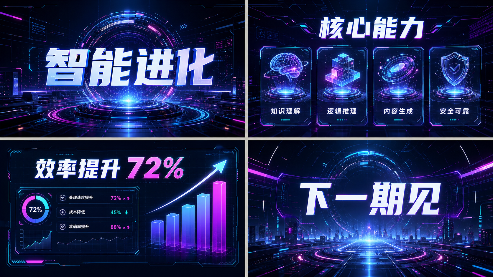
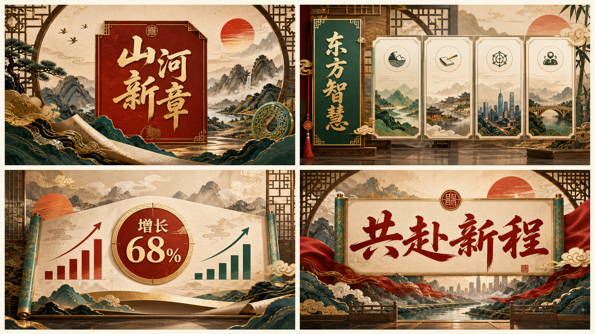
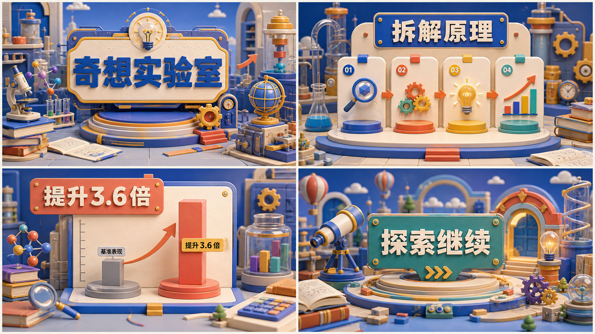
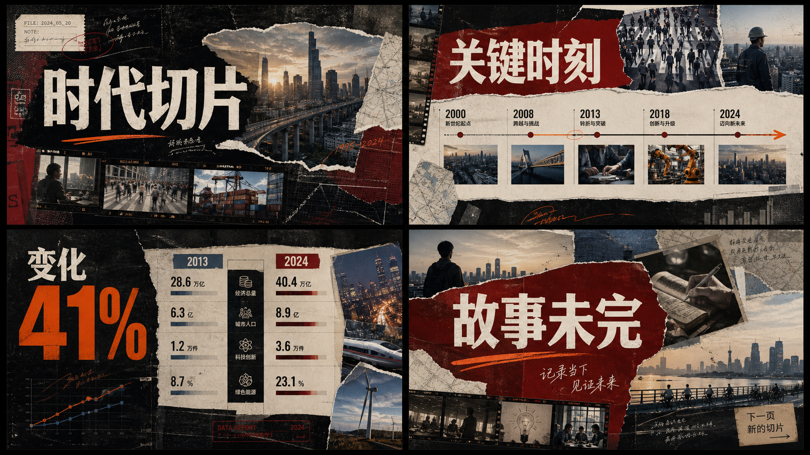
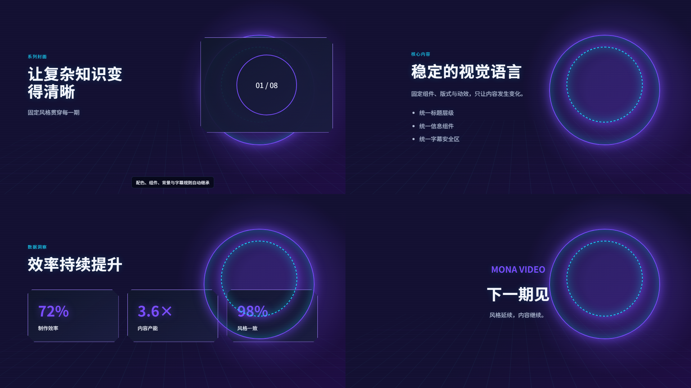
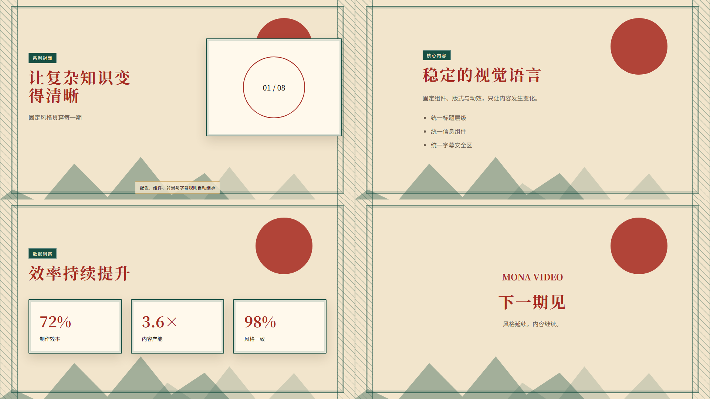
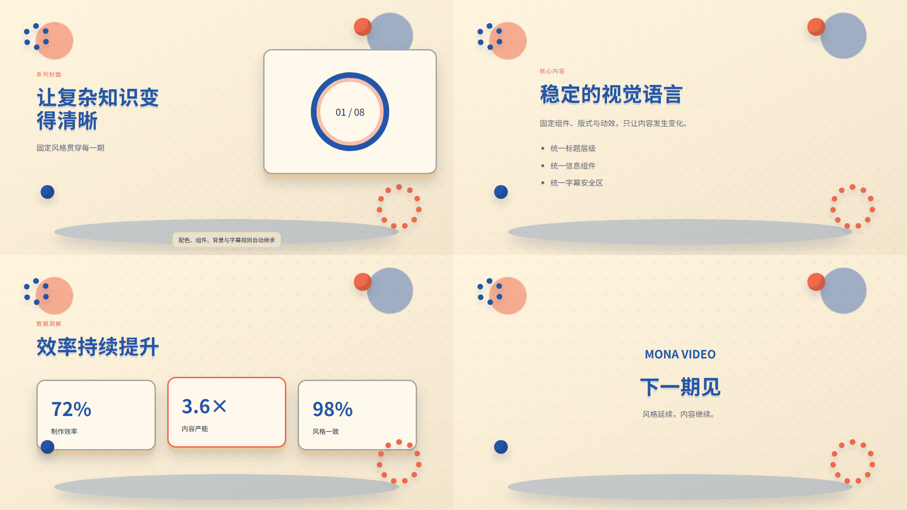
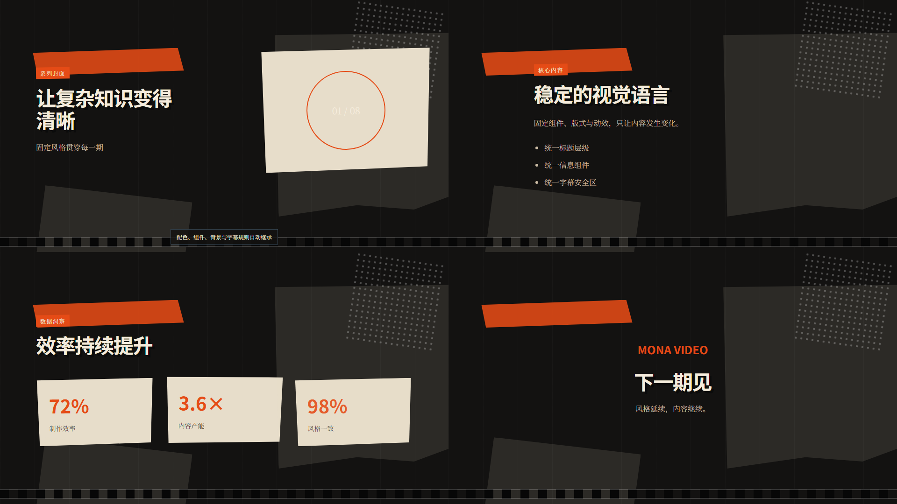

# Mona 视频系列模板视觉探索与落地边界 v2

> 状态：本文件中的文生图图片仅用于确定视觉方向，不作为功能完成证据。真正交付标准是同一编译器可生成、可预览、可测试的 HTML 模板，实际截图见第 8 节。

## 1. 共用落地原则

- 每套模板必须拥有独立的空间、材质、组件和动效语法，不能只替换配色。
- 四类场景沿用同一组字体、装饰、背景层和转场；内容变化不能改变视觉身份。
- 概念图是视觉验收基准，不直接作为带字背景铺进视频。研发需要把标题、卡片、图表、装饰和背景拆成可编译图层。
- 自定义背景图片进入模板后，只替换内容图层；遮罩、焦点、文字安全区、装饰框和调色规则继续锁定。
- 16:9 为第一验收画幅；9:16 与 1:1 必须基于同一设计语法重排，而不是裁切横屏成片。

## 2. 模板 A：霓虹智核

适用：AI、软件、数字化、未来趋势、产品发布。

- 视觉身份：未来指挥中心、环形能量核心、透视网格、全息玻璃面板、扫描线和体积光。
- 配色：深海军蓝 `#050816`、电光青 `#19D8FF`、紫外光 `#7A4DFF`、玫红 `#F338FF`、冷白 `#F5F8FF`。
- 组件：能量环标题台、HUD 能力卡、发光数据条、立体柱状图、轨道式章节标记。
- 动效：镜头推进、环形组装、面板逐层点亮、数据扫描、尾帧能量收束；避免所有元素同时闪烁。
- 字体方向：粗黑无衬线标题 + 窄体数字；正文使用清晰中黑体。

## 3. 模板 B：山河新章

适用：文化、城市、人文、战略叙事、品牌故事。

- 视觉身份：当代新国潮展陈，山水层景、牌匾、卷轴、窗棂、云纹、金箔与朱印共同构成空间。
- 配色：朱砂 `#A62920`、帝王绿 `#174F43`、古金 `#C69A4B`、墨黑 `#211B17`、宣纸 `#F2E5CC`。
- 组件：漆面标题牌、卷轴图表、竖向章节签、金边内容屏、印章式状态标记。
- 动效：卷轴展开、山水景深视差、云纹流动、金线描边、朱印落款；避免廉价粒子和节庆大红背景。
- 字体方向：书法字仅用于一级标题，信息与数据使用现代宋体/黑体，保证可读性。

## 4. 模板 C：奇想实验室

适用：知识科普、课程、方法拆解、亲子教育、技能训练。

- 视觉身份：可操作的 3D 桌面实验室，以显微镜、齿轮、灯泡、分子、书本和模块舞台承载信息。
- 配色：钴蓝 `#2356A8`、珊瑚橙 `#ED6A4A`、向日黄 `#F2B83F`、青绿 `#2A978C`、暖奶油 `#F3E5CC`。
- 组件：立体步骤展台、实验卡槽、对象化流程箭头、实体柱形图、望远镜式片尾引导。
- 动效：模块弹入、齿轮联动、灯泡点亮、物体组装、相机小幅环绕；保持成人级质感，避免幼儿动画感。
- 字体方向：厚重圆角标题 + 中性正文；数字采用实体压印效果但不可牺牲清晰度。

## 5. 模板 D：时代切片

适用：纪录片、商业观察、社会议题、案例复盘、人物与城市故事。

- 视觉身份：电影纪实杂志拼贴，照片接触印样、撕纸窗口、地图碎片、胶片边框、手写批注和档案标签。
- 配色：炭黑 `#131211`、纸张米白 `#E7DDCA`、酒红 `#7D201C`、信号橙 `#E54B16`、钢蓝 `#42576B`。
- 组件：超大标题切片、横向时间线、档案照片墙、撕纸数据对比、胶片式章节条。
- 动效：照片冲印显影、撕纸揭层、接触表推进、手写线出现、胶片跳切；避免复古滤镜堆砌。
- 字体方向：紧凑粗黑标题 + 编辑部风格宋体正文 + 等宽档案数字。

## 6. 生成提示词摘要

本轮使用内置文生图能力分别生成四张 2×2 成片关键帧板。四个提示词共同要求：`ui-mockup`、横屏 16:9、封面/内容/数据/片尾、中文大标题可读、完整视频画面、无应用窗口、无水印、禁止极简和扁平 PPT；分别指定未来 HUD、新国潮展陈、3D 教育实验室、电影纪实拼贴的场景、材质、配色与组件语法。

## 7. 研发验收门槛

- 任何两套模板去掉文案后仍能仅凭轮廓、材质和布局被区分。
- 四类场景均有真实可切换预览，不以四个文字标签替代。
- 模板组件 ID 必须进入编译器选择逻辑；不能把四套模板统一映射为同一套布局。
- 预览 PNG、编辑器预览和实际场景 HTML 使用同一渲染定义。
- 在 16:9、9:16、1:1 三种画幅完成标题、正文、字幕和自定义背景可读性验收。

## 8. 当前可执行模板截图

以下图片由 `mona/video_scene_compiler.py` 生成 HTML 后，使用本机 Edge 无头模式真实截图；创建页展示的也是这些图片。

### 8.1 霓虹智核

### 8.2 山河新章

### 8.3 奇想实验室

### 8.4 时代切片

### 8.5 明确能力边界

- “奇想实验室”当前是 CSS 阴影、舞台、齿轮和球体形成的轻量立体效果，不承诺实时高精度 3D 模型。
- “时代切片”提供撕纸、胶片、网点和档案卡组件；纪实照片来自用户背景或项目素材，不自动虚构新闻照片。
- “山河新章”使用程序化日轮、山形、窗棂、金边与纸张配色，不把文生图国画直接铺成固定背景。
- “霓虹智核”使用可复现的网格、能量环、扫描线和 HUD 卡片，不依赖在线特效或外部 CDN。
