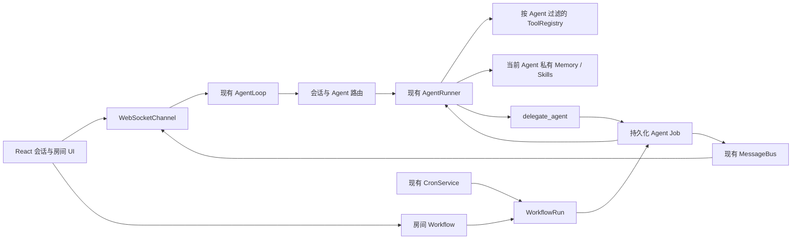

# Mona 多 Agent 协作开发计划

> 日期：2026-08-10
> 状态：待技术评审
> 面向：Python Agent、WebSocket/API、React/Tauri、测试与发布人员
> 产品依据：[multi-agent-functional-design.md](./multi-agent-functional-design.md)

## 1. 开发目标

在不重写现有 Agent 运行时和聊天系统的前提下，完成以下能力：

1. 把当前匿名临时 Subagent 扩展为具有稳定身份的伙伴 Agent。
2. 让私聊和协作房间继续复用现有 `chat_id`、会话 JSONL、WebSocket 和消息 UI。
3. 让每个协作房间拥有目标、成员和一个当前工作流。
4. 让 Mona 能创建可持久化 Agent Job，并把结果以真实 Agent 身份发送回原房间。
5. 让每个 Agent 使用独立的长期记忆、私有 Skill 和工具权限。
6. 实现串行、并行、审批、手动运行和定时运行。
7. 为官方内置 Agent 和后续付费 Agent 使用同一种清单与安装边界。

完成标准不是“界面能展示多个头像”，而是端到端满足：

> 用户在 Mona 私聊创建协作房间 → Mona 生成工作流草稿 → 用户保存并运行 → A 股分析师完成自己的步骤 → Mona 使用分析结果继续执行 → 用户审批 → 所有状态、消息和产物回到原房间 → 重启后仍可查看和恢复。

---

## 2. 实施原则

### 2.1 复用现有实现

- 保留 `AgentRunner` 作为唯一 LLM 工具循环。
- 保留 `AgentLoop` 作为消息入口，不建立每个 Agent 一个常驻 Loop。
- 保留 `MessageBus` 作为进程内消息通道。
- 保留 `SessionManager` 的 JSONL 会话和原子替换写入。
- 保留 WebSocket 单连接、多 `chat_id` 的复用方式。
- 保留现有 `SubagentManager` 的匿名 `spawn` 行为，逐步增加命名 Agent 委派。
- 保留现有 cron 服务，工作流定时触发只增加一种任务负载。
- 前端复用 `ChatList`、`Sidebar`、`ThreadShell`、`ThreadMessages` 和现有流式消息机制。

### 2.2 不提前建设

- 不增加 Redis、Celery、外部数据库或新的后台服务。
- 不增加第三套聊天消息存储。
- 不开发自由画布；现有 `@xyflow/react` 不用于本阶段工作流编辑。
- 不开发通用表达式语言。
- 不建立抽象的多运行时插件框架；只有一套 Python Agent 运行路径。
- 不允许 Agent Package 携带安装脚本或任意二进制。
- 不在第一阶段修改 Rust/Tauri，除非现有文件选择、通知或许可能力确实无法复用。

### 2.3 数据边界

- 会话与房间属于当前 workspace。
- Agent 安装、私有记忆和私有 Skill 属于本机用户。
- 工作流定义属于房间。
- 工作流运行和 Agent Job 属于房间及其启动时版本。
- Package 文件不可变，用户数据可变，两者路径不得重叠。

---

## 3. 已核对的现有实现

| 现有模块 | 路径 | 当前行为 | 本项目改造点 |
| --- | --- | --- | --- |
| Agent 入口 | `mona/agent/loop.py` | 创建单一上下文、SessionManager、工具和 SubagentManager | 根据会话元数据解析当前 Agent；构造 AgentExecutionContext |
| 通用运行器 | `mona/agent/runner.py` | `AgentRunSpec` 驱动模型、工具、流式回调和注入 | 保持核心不变；只补充可选 Agent/Job 追踪字段或通过 hook 传递 |
| 临时子 Agent | `mona/agent/subagent.py` | 创建独立工具表，执行一次任务，结果注入主 Agent | 增加可选命名 Agent 路径和持久化 Job；保留旧 `spawn` |
| 委派工具 | `mona/agent/tools/spawn.py` | Mona 创建匿名后台任务 | 新增显式 `delegate_agent`，要求目标 Agent、房间、成功标准 |
| 上下文 | `mona/agent/context.py` | 构造 Mona 系统提示、记忆和 Skill | 接收当前 Agent，注入身份、私有记忆和当前房间上下文 |
| 记忆 | `mona/agent/memory.py` | 默认读写全局 `~/.mona/memory` | 改为 `~/.mona/agents/<agent_id>/memory`，迁移旧数据到 Mona |
| Skill 加载 | `mona/agent/skills.py` | 读取全局用户 Skill 与内置 Skill | 按当前 Agent 合并平台 Skill、Package Skill 和私有 Skill |
| Skill 创建 | `mona/agent/tools/skill_tools.py` | 写入全局 `~/.mona/skills` | 从执行上下文取得 `agent_id`，写入该 Agent 私有目录 |
| 工具上下文 | `mona/agent/tools/context.py` | 保存 workspace、渠道和会话上下文 | 增加 `agent_id`、`conversation_id`、`room_id`、`job_id`、`workflow_run_id` |
| 会话 | `mona/session/manager.py` | `<workspace>/sessions/*.jsonl`；metadata 可扩展；原子保存 | 用 metadata 表示私聊/房间、目标、成员和当前工作流 ID |
| WebSocket | `mona/channels/websocket.py` | 单连接承载多个 chat_id；包含会话 REST 读取和创建/删除消息 | 增加房间、工作流、运行、审批命令与实时事件 |
| WebUI transcript | `mona/webui/thread_disk.py`、`mona/webui/transcript.py` | 持久化和投影 WebUI 消息 | 保留 Agent 作者、Job、Run、审批和产物元数据 |
| 定时任务 | `mona/cron/service.py`、`mona/cron/types.py` | 按配置触发任务 | 增加“运行房间当前工作流”的负载类型 |
| 前端会话列表 | `webui/src/components/ChatList.tsx`、`Sidebar.tsx` | 展示并分组现有 ChatSummary | 同一列表渲染私聊和房间的头像、角标、预览与未读 |
| 前端聊天 | `webui/src/components/thread/ThreadShell.tsx`、`ThreadMessages.tsx` | 单 assistant 身份、流式回答和工具轨迹 | 增加作者身份、房间右栏、运行卡和审批卡 |
| 前端协议 | `webui/src/lib/types.ts`、`mona-client.ts` | 定义 UIMessage 和 WebSocket 多 chat 路由 | 增加领域类型、命令和事件，不破坏旧事件兼容 |

当前 `Session.get_history()` 只向模型复制已知字段。因此可以给持久化消息增加 UI 元数据而不直接污染模型协议；房间多作者标签应在构造房间上下文时显式转换，不能依赖前端显示文本。

---

## 4. 目标架构



### 4.1 AgentExecutionContext

所有 Agent 运行入口必须携带统一上下文，避免继续依赖全局状态：

```python
@dataclass(frozen=True, slots=True)
class AgentExecutionContext:
    agent_id: str
    conversation_id: str
    conversation_type: Literal["direct", "room"]
    room_id: str | None = None
    job_id: str | None = None
    workflow_run_id: str | None = None
```

要求：

- 工具从该对象读取当前 Agent，不接收模型提供的 `agent_id` 作为信任来源。
- 私聊中 `conversation_id` 是 chat_id，`room_id` 为空。
- 房间中 `conversation_id` 和 `room_id` 使用同一 chat_id。
- 匿名旧 Subagent 使用保留的临时身份语义，不创建持久化私有记忆。

### 4.2 运行时策略

- 不缓存完整 AgentLoop。
- 每次私聊消息、Job 或工作流步骤按 `agent_id` 构造上下文、提示词和工具表。
- Provider 可以继续共享；工具状态、MemoryStore、SkillsLoader 必须按 Agent 构造。
- 同一 Agent 的 Job 第一版单飞执行；全局同时运行的命名 Agent 数由现有并发配置限制。
- Agent 执行结束后释放任务级对象，不保留无界进程内历史。

---

## 5. 数据模型

后端使用 Pydantic 模型校验落盘和 WebSocket 输入。以下字段是协议要求，不代表必须逐字使用相同类名。

### 5.1 AgentDefinition

```json
{
  "schema_version": 1,
  "id": "com.mona.a-share-analyst",
  "display_name": "A股分析师",
  "description": "分析A股公开信息并标记数据时间与来源",
  "avatar": "assets/avatar.png",
  "prompt": "prompt.md",
  "model": "inherit",
  "tool_allowlist": ["web_search", "read_file", "deliver_file"],
  "can_delegate": false,
  "skills": ["skills/market-research"],
  "package_id": "com.mona.a-share-analyst",
  "package_version": "1.0.0"
}
```

校验：

- `id` 必须稳定、大小写归一、不能包含路径分隔符或 `..`。
- `mona` 是保留 ID。
- `prompt`、`avatar` 和 Skill 路径必须解析到 Package 根目录内。
- `tool_allowlist` 只能引用已注册工具。
- `can_delegate` 对首批专业 Agent 固定为 `false`。

第一版一个 Package Agent 只能安装一个实例，实例 ID 等于 Agent ID。确认有真实的多实例需求后再分离 template_id 和 instance_id。

### 5.2 ConversationMetadata

存放在现有 `Session.metadata["conversation"]`：

```json
{
  "schema_version": 1,
  "type": "room",
  "title": "每日市场简报",
  "goal": "每天生成可靠、可追溯的A股市场简报",
  "agent_ids": ["mona", "com.mona.a-share-analyst"],
  "direct_agent_id": null,
  "active_workflow_id": "wf_...",
  "active_workflow_revision": 3,
  "archived": false
}
```

私聊：

```json
{
  "schema_version": 1,
  "type": "direct",
  "title": "A股分析师",
  "goal": null,
  "agent_ids": ["com.mona.a-share-analyst"],
  "direct_agent_id": "com.mona.a-share-analyst",
  "active_workflow_id": null,
  "active_workflow_revision": null,
  "archived": false
}
```

兼容规则：没有 `conversation` metadata 的旧 WebSocket 会话视为与 Mona 的私聊，不立即重写文件。

### 5.3 消息作者与 UI 事件

现有消息保留 `role` 和 `content`，新增：

```json
{
  "role": "assistant",
  "content": "分析结果……",
  "timestamp": "2026-08-10T10:00:00+08:00",
  "author_type": "agent",
  "author_id": "com.mona.a-share-analyst",
  "message_type": "message",
  "job_id": "job_...",
  "workflow_run_id": "run_..."
}
```

字段规则：

- 用户消息：`author_type=user`。
- Agent 消息：`role=assistant`，由 `author_id` 区分作者。
- Job/Run 状态卡使用 `message_type` 和结构化 payload，不把状态编码进自然语言后再解析。
- 只用于 UI 的状态事件标记 `_ui_only=true`，`Session.get_history()` 必须过滤。
- 房间上下文把 Agent 作者转换成模型可见标签，例如 `[A股分析师]`，前端不显示该内部前缀。
- 不将完整工具轨迹作为房间共享历史；只共享用户可读进度、最终结果和产物。

### 5.4 WorkflowDefinition

```json
{
  "schema_version": 1,
  "id": "wf_...",
  "room_id": "chat_uuid",
  "revision": 3,
  "status": "active",
  "goal": "每天生成可靠、可追溯的A股市场简报",
  "trigger": {
    "type": "manual"
  },
  "steps": [
    {
      "id": "analyze",
      "type": "agent",
      "agent_id": "com.mona.a-share-analyst",
      "task": "分析上一交易日市场和主要事件",
      "expected_output": "包含数据时间和来源的市场分析",
      "depends_on": []
    },
    {
      "id": "summarize",
      "type": "agent",
      "agent_id": "mona",
      "task": "把分析整理成每日简报",
      "expected_output": "用户可直接阅读的简报",
      "depends_on": ["analyze"]
    },
    {
      "id": "approve",
      "type": "approval",
      "message": "确认发送本次简报",
      "depends_on": ["summarize"]
    }
  ],
  "created_at": "...",
  "created_by": "user"
}
```

第一版并行不需要单独节点类型。多个步骤拥有相同的 `depends_on`，且被同一下游步骤共同依赖，即可在 UI 中显示为并行步骤组。

校验要求：

- ID 在同一工作流内唯一。
- 至少一个 Agent 步骤。
- Agent 必须是房间成员且处于启用状态。
- 所有依赖必须存在。
- 使用 Python 标准库 `graphlib.TopologicalSorter` 检测环并生成执行顺序，不自行实现图算法。
- 定时触发使用现有 cron 表达能力，并在保存时校验。
- 一个房间只能有一个 `active` 版本。

### 5.5 WorkflowRun

```json
{
  "id": "run_...",
  "room_id": "chat_uuid",
  "workflow_id": "wf_...",
  "workflow_revision": 3,
  "status": "running",
  "trigger_type": "manual",
  "started_by": "user",
  "started_at": "...",
  "finished_at": null,
  "steps": {
    "analyze": {
      "status": "succeeded",
      "job_id": "job_...",
      "started_at": "...",
      "finished_at": "...",
      "output": {"summary": "...", "artifacts": []},
      "error": null
    },
    "summarize": {
      "status": "running",
      "job_id": "job_...",
      "started_at": "...",
      "finished_at": null,
      "output": null,
      "error": null
    }
  }
}
```

运行启动时保存完整工作流快照，不能只保存 revision 指针。这样即使版本文件丢失或 Package 升级，历史仍可解释。

### 5.6 AgentJob

```json
{
  "id": "job_...",
  "room_id": "chat_uuid",
  "requested_by": "mona",
  "assigned_to": "com.mona.a-share-analyst",
  "task": "分析上一交易日市场和主要事件",
  "success_criteria": "标明数据时间、来源、事实与推断",
  "status": "queued",
  "workflow_run_id": "run_...",
  "workflow_step_id": "analyze",
  "parent_job_id": null,
  "attempt": 1,
  "result": null,
  "error": null,
  "created_at": "...",
  "started_at": null,
  "finished_at": null
}
```

状态写入必须执行 compare-and-set 语义：只有允许的前置状态才能进入新状态。已取消或失败的 Job 不接受迟到成功结果。

---

## 6. 文件与持久化设计

### 6.1 本地目录

```text
<workspace>/
  sessions/                         现有会话 JSONL
  workflows/
    <room_id>.json                  当前草稿、版本索引和版本内容
  workflow-runs/
    <run_id>.json                   运行快照和步骤状态
  agent-jobs/
    <job_id>.json                   Job 状态、结果摘要和错误

~/.mona/
  packages/
    <package_id>/<version>/         不可变 Agent Package
  agents/
    <agent_id>/
      agent.json                    当前启用版本与用户配置
      memory/                       私有记忆
      skills/                       Agent 自建 Skill
```

### 6.2 存储选择

第一版继续使用文件存储，理由：

- Mona 是本地单用户进程。
- 当前会话已经使用 JSONL 和原子替换。
- 运行数量和并发规模尚未证明需要数据库。
- Python 标准库和现有 `filelock` 已能覆盖单进程及基本跨进程写入保护。

实现要求：

- JSON 状态文件使用“写临时文件 → flush → `os.replace`”。
- 每个 room/run/job 使用独立锁；不使用一个全局锁阻塞所有房间。
- 读到未知字段时忽略并保留兼容，写入时带 `schema_version`。
- 解析失败时不覆盖原文件，返回明确错误并保留修复可能。
- Job 的完整模型工具轨迹不写进房间会话；调试轨迹使用现有日志或受限运行记录。

当出现跨进程写冲突、运行查询明显变慢或需要云同步时，再用 SQLite 替换状态 Store；领域模型和 API 不随存储变化。

### 6.3 两类消息存储的职责

当前系统同时存在：

- `SessionManager`：提供模型历史、会话 metadata 和会话列表摘要。
- WebUI transcript：提供前端消息投影和流式恢复。

本项目不新增第三套消息源。新增作者、Job 和 Run 元数据时必须同时通过现有写入路径保存，禁止在前端凭内存拼出不可恢复的消息。

Job/Run 状态文件是业务状态真相，聊天中的卡片是其投影。恢复时以前者修正卡片，不从聊天文本反向解析状态。

---

## 7. 后端实施方案

### 7.1 Agent 注册与目录

建议新增：

```text
mona/agent/partners.py
```

该文件第一版包含：

- `AgentDefinition` Pydantic 模型。
- Agent ID 和 Package 路径校验。
- `AgentRegistry`：加载 Mona、内置 Agent 和已安装 Agent。
- 查询单个 Agent、列出启用 Agent、解析 Package Skill 路径。

不要为 Registry 再建立 Repository/Service/Factory 三层接口。文件系统只有一个实现时直接实现即可。

首批定义建议放在：

```text
mona/agents/com.mona.xhs-operator/
mona/agents/com.mona.a-share-analyst/
```

构建配置需要把 `mona/agents/**/*` 加入 wheel/sdist。

Mona 本身继续复用现有模板；Registry 为其合成保留定义，不复制整套模板。

### 7.2 Agent 上下文改造

修改：

- `mona/agent/loop.py`
- `mona/agent/context.py`
- `mona/agent/memory.py`
- `mona/agent/skills.py`
- `mona/agent/tools/context.py`
- `mona/agent/tools/loader.py`
- `mona/agent/tools/skill_tools.py`
- Dream/记忆整理相关调用点

步骤：

1. 入口根据会话 metadata 解析活动 Agent：
   - 旧会话或 Mona 私聊 → `mona`。
   - 专业 Agent 私聊 → `direct_agent_id`。
   - 房间普通消息 → `mona`。
   - 明确目标 Agent 的内部执行 → 指定 Agent。
2. 创建 `AgentExecutionContext`。
3. ContextBuilder 按 Agent 注入：
   - 平台基础约束。
   - Agent 身份与专属提示词。
   - 当前 Agent 私有记忆。
   - 当前 Agent 可见 Skill。
   - 房间目标、相关共享消息和当前 Job。
4. ToolLoader 根据 allowlist 和平台安全策略取交集。
5. 专业 Agent 的工具表不注册 `delegate_agent` 和旧 `spawn`。

提示词顺序保持稳定：

```text
平台安全规则
→ Agent 身份与职责
→ 工具契约
→ 私有记忆
→ 可见 Skill
→ 房间目标与共享上下文
→ 当前 Job
```

### 7.3 记忆和 Skill 迁移

修改路径帮助函数，使其必须接收 `agent_id`：

```text
MemoryStore(agent_id="mona")
SkillsLoader(agent_id="mona", package_skill_dirs=[...])
SkillCreateTool(context.agent_id)
```

加载优先级：

1. Agent 自建私有 Skill。
2. 当前 Agent Package 内置 Skill。
3. 平台内置通用 Skill。

同名时上层优先，记录一次告警，不同时加载两个同名 Skill。

旧数据迁移：

- 仅当 `agents/mona/memory` 为空时，把旧 `~/.mona/memory` 复制给 Mona。
- 仅当 `agents/mona/skills` 为空时，把旧 `~/.mona/skills` 中的用户 Skill 复制给 Mona。
- 迁移使用临时目录和原子改名。
- 首次成功后写 schema marker。
- 第一版不删除旧目录；确认新版本稳定后另行提供清理操作。
- 迁移可重复执行，第二次不得产生重复文件或覆盖新内容。

### 7.4 命名 Agent Job

建议新增：

```text
mona/agent/jobs.py
mona/agent/tools/delegate.py
```

`jobs.py` 负责：

- AgentJob 模型和状态转换。
- 原子保存与加载。
- 房间 Job 查询。
- 取消、失败和成功的 compare-and-set。

`delegate_agent` 参数：

```json
{
  "agent_id": "com.mona.a-share-analyst",
  "task": "分析这家公司最近一季现金流",
  "success_criteria": "引用财报数据并区分事实与判断"
}
```

模型不得提供可信的 room_id、requested_by 或 workflow_run_id；这些字段由 ToolContext 注入。

改造 `SubagentManager`：

- 保留 `spawn(task, label, ...)`。
- 新增命名 Agent 执行入口，复用现有 `_run_subagent`、工具构建、并发限制和结果注入。
- 当存在 `agent_id` 时加载 Registry、私有 Memory/Skill、专属提示词和工具权限。
- 在真正启动协程前持久化 `queued` Job。
- 开始执行时原子转为 `running`。
- 最终结果先写 Job，再发送 Agent 作者消息和 Mona 注入。
- 发送失败不回滚已完成 Job；重连后可从 Job 恢复投影。

不要在这一阶段为了名称整洁重命名整个 `SubagentManager`。当旧匿名和命名路径稳定后，再决定是否改名。

### 7.5 房间上下文与路由

新增纯函数或小模块完成：

- 解析 `ConversationMetadata`。
- 校验 Agent 是否为房间成员。
- 解析直接 `@Agent` 的结构化目标；不要只用模糊文本匹配。
- 从共享会话投影当前 Agent 所需历史。
- 给模型历史增加作者标签但不修改 UI 原文。

WebSocket 用户消息建议增加可选字段：

```json
{
  "type": "message",
  "chat_id": "...",
  "content": "补充分析现金流",
  "target_agent_ids": ["com.mona.a-share-analyst"]
}
```

前端 `@` 选择器产生 ID；后端不信任显示名称，必须按房间成员校验。

### 7.6 工作流模型、存储和执行器

建议新增一个文件开始：

```text
mona/agent/workflow.py
```

第一版集中包含：

- WorkflowDefinition、WorkflowStep、WorkflowRun、StepRun 模型。
- 结构校验和拓扑排序。
- 文件存储。
- WorkflowRunner。

文件增长到出现明确独立变化原因后，再拆分 `schema.py`、`store.py` 和 `runner.py`。

WorkflowRunner 算法：

1. 获取房间锁，确认没有活动运行。
2. 加载 active 工作流并验证房间成员与 Agent 状态。
3. 保存工作流完整快照和 `queued` WorkflowRun。
4. 将没有依赖的步骤标记为 ready。
5. Agent 步骤创建 AgentJob；可并行的 ready 步骤使用受限 `asyncio.gather`。
6. 步骤成功后保存结构化输出，再计算新的 ready 步骤。
7. 审批步骤保存 `waiting_approval` 并立即停止继续调度。
8. 批准后从持久化状态继续；拒绝后取消剩余步骤。
9. 任一步失败时把运行标记为 failed，不执行依赖它的下游步骤。
10. 全部步骤成功后标记 succeeded，并向房间发送最终运行卡更新。

输出传递：

- 下游步骤只接收直接和间接依赖步骤的结构化结果摘要及产物引用。
- 不把上游完整模型工具轨迹传给下游。
- 每个步骤输入设置字符或 Token 上限；超过时使用现有压缩能力生成摘要，并保留产物引用。

取消：

- WorkflowRun 持有取消事件。
- queued 步骤直接取消。
- running AgentJob 请求现有 AgentRunner/任务取消路径停止。
- 已完成步骤和产物保留。
- 迟到回调先检查当前状态。

恢复：

- 启动时扫描非终态 run。
- `waiting_approval` 原样恢复。
- 尚未启动的 queued 步骤可以继续。
- 无法证明可安全恢复的 running 外部副作用步骤标记 failed，不能盲目重放。
- 纯模型/只读步骤可以创建新 attempt 重试，但必须保留旧 attempt。

### 7.7 定时触发

复用现有 cron：

- 保存 active 工作流时同步更新该房间的 cron 条目。
- cron payload 只保存 `room_id`，执行时读取当时的 active 版本。
- 版本替换时更新同一 cron 条目，不累积重复计划。
- 禁用或归档房间时禁用 cron。
- 触发时已有活动运行则记录 skipped，不排队。

第一版一个房间当前工作流最多一个定时触发。

### 7.8 Agent Package

阶段 D 再实现，但阶段 A 的 AgentDefinition 必须使用兼容格式。

建议新增：

```text
mona/agent/packages.py
```

职责：

- 解析 manifest。
- 校验 schema_version 和最低 Mona 版本。
- 校验所有归档项路径，拒绝绝对路径、`..`、符号链接和超限文件。
- 校验每个文件哈希和官方 Ed25519 签名。
- 安装到版本目录，成功后原子切换启用版本。
- 显示新增工具权限并要求确认。
- 失败时删除未激活临时目录，不影响上一版本。

许可证校验复用 `src-tauri/src/license.rs` 已有边界；购买、订单和授权由官网负责，不把支付逻辑放进 AgentRunner。

---

## 8. WebSocket 与本地 API 协议

### 8.1 原则

`websockets` 服务器的同端口 HTTP 处理目前主要支持 GET，不要强行在该处理器上增加不可用的 POST 路由。协作状态变更使用现有 WebSocket 命令；读取可复用现有 GET 响应或通过 WebSocket 请求/响应。

所有命令必须：

- 包含 request_id。
- 返回 success 或明确 error code。
- 校验 chat_id、Agent 成员关系、当前状态和字段大小。
- 不信任前端传入的用户、发起 Agent 或权限字段。

### 8.2 客户端命令

建议命令：

```text
create_direct_conversation
create_room
update_room
save_workflow_draft
activate_workflow
run_workflow
cancel_workflow_run
resolve_workflow_approval
delegate_agent
cancel_agent_job
list_agents
get_room_state
get_workflow_run
```

### 8.3 服务端事件

建议事件：

```text
room_updated
agent_job_updated
workflow_draft_ready
workflow_updated
workflow_run_updated
approval_requested
agent_message
```

公共信封：

```json
{
  "event": "workflow_run_updated",
  "chat_id": "...",
  "request_id": "...",
  "data": {},
  "schema_version": 1
}
```

兼容：

- 现有 `delta`、`reasoning_delta`、`message`、`stream_end` 和 `turn_end` 保持不变。
- 命名 Agent 流式消息在事件中增加 `author_id`，旧前端忽略未知字段时仍可显示内容。
- 新前端遇到没有 `author_id` 的 assistant 消息时按 Mona 渲染。

---

## 9. 前端实施方案

### 9.1 类型与客户端

修改：

- `webui/src/lib/types.ts`
- `webui/src/lib/mona-client.ts`
- `webui/src/hooks/useMonaStream.ts`
- WebUI thread 投影与兼容工具

新增类型：

```ts
type ConversationType = "direct" | "room";

interface AgentSummary {
  id: string;
  displayName: string;
  avatarUrl?: string;
  description: string;
  enabled: boolean;
}

interface ConversationMeta {
  type: ConversationType;
  title: string;
  goal?: string;
  agentIds: string[];
  directAgentId?: string;
  activeWorkflowId?: string;
  activeWorkflowRevision?: number;
}
```

扩展 `UIMessage`：

```ts
interface UIMessage {
  // 现有字段保留
  authorType?: "user" | "agent" | "system";
  authorId?: string;
  messageType?: "message" | "job_status" | "workflow_run" | "approval" | "artifact";
  jobId?: string;
  workflowRunId?: string;
  payload?: unknown;
}
```

禁止通过 `content` 正则判断运行或审批状态。

### 9.2 会话列表

修改 `ChatList.tsx` 和 `Sidebar.tsx`：

- ChatSummary 增加 conversation metadata。
- 私聊显示单 Agent 头像。
- 房间显示最多若干成员组合头像；更多成员以数量表示。
- 显示 running、scheduled、waiting_approval 角标。
- 排序继续复用当前置顶、workspace 和更新时间规则；不要为房间另建列表。
- 搜索覆盖房间标题、目标和 Agent 名称，但不上传消息正文。
- 旧会话按 Mona 私聊渲染。

### 9.3 房间头部和侧边栏

修改 `ThreadHeader.tsx`、`ThreadShell.tsx`，新增：

```text
webui/src/components/room/RoomContextPanel.tsx
```

内容：

- 房间目标。
- 成员和角色。
- 当前工作流只读摘要。
- 当前活动运行。
- 最近产物。
- 编辑工作流、运行和取消入口。

布局：

- 宽屏作为可折叠右栏。
- 中小宽度使用 Drawer/Dialog，不压缩聊天输入区到不可用宽度。
- 私聊不显示工作流摘要，改为伙伴简介。

### 9.4 多作者消息

修改 `ThreadMessages.tsx` 及消息气泡：

- 按 `authorId` 显示 Agent 头像和名称。
- 同一 Agent 连续普通消息可以复用头像，但跨 Job/Run 卡不能错误合并。
- 工具活动继续收拢在对应 Agent 的活动区域。
- 默认 assistant 作者为 Mona，兼容旧数据。
- System/UI-only 事件使用专门样式，不伪装成 Agent 自然语言。

流式状态必须按 `chat_id + author_id + job_id` 定位，不能继续假设一个 chat 同时只有一个 assistant 输出游标。第一阶段如果后端强制房间内单一前台流，可以先保持现有游标；引入并行可见流之前必须完成多游标改造。

为降低风险，推荐第一版并行步骤后台并行执行，但只以进度事件和完成消息投影到聊天，不同时展示多个逐字流。

### 9.5 工作流编辑器

建议新增：

```text
webui/src/components/workflow/WorkflowEditor.tsx
webui/src/components/workflow/WorkflowStepCard.tsx
webui/src/components/workflow/WorkflowRunCard.tsx
webui/src/components/workflow/ApprovalCard.tsx
```

编辑器不使用 XYFlow：

- 步骤采用可排序纵向列表。
- 并行步骤使用分组容器。
- Agent 使用房间成员选择器。
- 依赖由列表位置和并行组自动生成；高级依赖只在确有需要后开放。
- 使用现有 Radix Dialog、Avatar、Progress、Tabs 等依赖。
- 保存前在前端提供即时校验，后端再次完整校验。
- “让 Mona 编排”产生 draft 事件，用户确认后加载到编辑器。

编辑器状态：

```text
loading
empty
editing_clean
editing_dirty
saving
validation_error
save_error
```

离开 dirty 编辑器时提示保存或放弃。

### 9.6 运行和审批 UI

运行卡从结构化 WorkflowRun 渲染：

- 总状态和完成步骤数。
- 每一步 Agent、状态、结果摘要和错误。
- 查看过程、取消和重新运行。
- `waiting_approval` 时显示审批卡。

审批按钮：

- 点击后立即 disabled，等待服务端确认。
- 重复请求必须幂等。
- 服务端返回状态冲突时刷新运行，而不是继续显示成功。

### 9.7 国际化与可访问性

- 新增文案同步更新 `zh-CN`、`zh-TW` 和 `en`。
- 图标按钮提供 accessible name 和 tooltip。
- 状态不能只靠颜色区分。
- 拖动排序提供键盘移动或上下移动按钮。
- 头像加载失败显示名称首字母，不显示破图。

---

## 10. 安全与权限

### 10.1 工具权限

实际工具集合：

```text
平台注册工具
∩ AgentDefinition.tool_allowlist
∩ 用户已批准权限
∩ 当前上下文安全策略
```

任何一层拒绝都不能由 Prompt 覆盖。

### 10.2 委派权限

- `delegate_agent` 只注册给 Mona。
- 目标必须是当前房间成员且处于启用状态。
- 禁止目标为当前 Agent。
- 第一版不允许 parent_job 再创建 child_job。
- 每个任务设置最大并发、最大运行轮数和现有工具失败熔断。

### 10.3 高风险操作

- 发布、发送、删除、写数据库、交易和安装 Package 等动作在实际边界再次检查审批状态。
- 不能只在前端隐藏按钮或依赖 Agent 提示词自觉。
- 审批 token 使用随机不可预测值并绑定 run、step、用户和有效状态。
- 日志不记录完整授权 token、私有记忆和敏感正文。

### 10.4 Package 安全

- 签名验证和授权验证是两件事：签名证明来源与完整性，授权证明用户可使用。
- 仅有 SHA-256 不能证明发布者身份。
- 解压前检查路径、符号链接、文件数量和总体大小。
- Package 内置 Skill 第一版只允许 Markdown 和明确白名单资源，不执行脚本。

---

## 11. 迁移与兼容

### 11.1 会话迁移

- 不批量重写旧 JSONL。
- 缺少 conversation metadata 的 `websocket:*` 会话读取为 Mona 私聊。
- 用户第一次修改标题、置顶或发送新消息时，可按现有保存路径写入新 metadata。
- 删除、归档和 workspace 分组行为保持兼容。

### 11.2 消息迁移

- 缺少 author_id 的 assistant 消息显示为 Mona。
- 旧 subagent 注入内容继续使用现有清洗逻辑，不反向转换为虚假的伙伴消息。
- 新命名 Agent 只写结构化作者字段。

### 11.3 记忆与 Skill 迁移

按第 7.3 节复制给 Mona，旧目录暂时保留。迁移必须提供自动化测试，覆盖：

- 首次迁移。
- 重复启动。
- 目标已有用户内容。
- 中途写入失败。
- 文件名冲突。

### 11.4 回滚

- 新版本无法加载 workflow/job 文件时，旧聊天仍然可用。
- 未完成运行可以显示为不可恢复失败，但不能破坏会话。
- Package 升级保留上一版本引用。
- schema_version 未识别时只读展示错误，不覆盖文件。

---

## 12. 分阶段开发任务

### 阶段 0：协议与存储纵切

目标：先证明 `agent_id` 能从会话入口贯穿到提示词、工具、消息和持久化。

任务：

- [x] 定义 AgentDefinition、AgentExecutionContext、ConversationMetadata。
- [x] 建立 AgentRegistry 和两个内置专业 Agent 清单。
- [x] 旧会话默认映射 Mona。
- [x] UIMessage/WebSocket 增加 author_id，旧消息兼容 Mona。
- [x] 完成一个不调用专业工具的命名 Agent 回声集成测试。

退出标准：

- [x] 同一聊天中可以持久化并重放不同 Agent 作者消息。
- [x] 旧聊天列表、旧流式消息和现有 Mona 对话测试不回归。

### 阶段 1：伙伴私聊与隔离

任务：

- [x] 会话 metadata 支持 direct_agent_id。
- [x] 私聊根据 Agent 构造身份提示、工具和私有 Memory/Skill。
- [x] 改造 MemoryStore、SkillsLoader、SkillCreateTool 和 Dream。
- [x] 完成旧全局记忆与用户 Skill 的幂等迁移。
- [x] 实现伙伴列表和专业 Agent 私聊入口。

退出标准：

- [x] 三个 Agent 的私聊分别使用正确身份。
- [x] A Agent 创建的 Skill 不会被 B Agent 列出或调用。
- [x] 专业 Agent 工具表没有 delegate/spawn。
- [x] 旧 Mona 记忆仍可用。

### 阶段 2：协作房间与 Mona 委派

任务：

- [x] 创建、更新、归档协作房间。
- [x] 统一会话列表和组合头像。
- [x] 房间目标、成员和右侧栏。
- [x] 多作者消息投影。
- [x] AgentJob 存储和状态机。
- [x] `delegate_agent` 工具。
- [x] 扩展 SubagentManager 执行命名 Agent。
- [x] Job 取消、失败、结果注入和应用重启恢复。

退出标准：

- [x] Mona 可以在房间中安排 A 股分析师，分析师以自己的身份回复。
- [x] Job 状态和结果在重启后可查看。
- [x] 已取消 Job 的迟到结果不改变终态。
- [x] 非房间成员和专业 Agent 无法调用委派。

### 阶段 3：房间工作流

任务：

- [x] WorkflowDefinition 校验和版本存储。
- [x] 房间当前工作流和草稿。
- [x] 纵向步骤卡片编辑器。
- [x] 自然语言生成结构化草稿工具。
- [x] WorkflowRunner 串行、并行、失败和取消。
- [x] WorkflowRun/StepRun 持久化。
- [x] 运行卡和步骤详情。
- [ ] 最近产物（`StepRun.output.artifacts` 仍为空，待收口阶段补齐）。
- [x] 每房间单活动运行锁。

退出标准：

- [x] 串行和并行流程按依赖顺序执行。
- [x] 环、缺失依赖和非成员 Agent 无法保存。
- [x] 编辑新版本不影响正在运行的旧版本。
- [x] 一次运行只在原房间出现，不产生新会话。

### 阶段 4：审批、恢复与定时

任务：

- [x] 用户审批步骤和持久化 token。
- [x] 批准、拒绝、重复点击和过期状态处理。
- [x] 应用启动恢复非终态运行。
- [x] cron 同步、更新、禁用和跳过重叠运行。
- [ ] 未读、系统通知和待处理审批提示（后端数据已具备，UI 未接通，待收口阶段补齐）。

退出标准：

- [x] 等待审批时没有副作用发生。
- [x] 重启后审批卡可以继续处理。
- [x] 定时运行写入原房间。
- [x] 重叠触发被明确跳过且不会形成队列。

### 阶段 4.5：IM 壳层（功能栏 + 会话列表 + 伙伴列表）

> 背景：阶段 0-4 完成了管道层与房间内部，但功能设计文档 6.1 的
> 企业 IM 壳层未落入任务清单。本阶段补齐。布局基线：第一屏即
> 「功能栏 - 会话列表 - 对话区」三栏（展开上下文栏后四栏）。

任务：

- [x] 功能栏改为企业微信式窄图标栏：头像置顶、图标 + 小字标签、
  无展开/折叠态；消息域（消息、伙伴）在前，现有模块（笔记/邮件/
  日程等）保留为后续图标，设置置底。（`components/shell/AppRail.tsx`）
- [x] 消息 Tab 第二列：右上角「+」新建菜单（新建私聊 /
  新建协作房间）+ Mona/私聊/房间混排列表（组合头像）。
  （`components/shell/SessionListPanel.tsx`，复用 `ChatList`；
  会话列表沿用既有逻辑，单聊与房间混排，同一 agent 可有多个会话）
- [ ] 会话搜索框与真实未读角标（当前仅有搜索按钮占位，角标数据未接通，
  待收口阶段补齐）。
- [x] 伙伴 Tab 第二列：已安装 Agent 列表（Mona 固定第一）；主区
  伙伴详情：简介、操作（开始私聊、创建房间）。
  （`components/shell/PartnersView.tsx`；能力/工具清单待阶段 5
  的 agent package manifest 落地后补充）
- [x] 房间创建对话框：成员多选、标题、目标，调用 `createRoom`
  后跳转到新房间会话。（`components/shell/ConversationDialogs.tsx`）
- [x] 私聊创建：伙伴详情/新建菜单调用 `createDirectConversation`
  后跳转。（WS 命令 `create_direct_conversation`，见 `channels/websocket.py`）

退出标准：

- [x] 第一屏无需任何命令即可看到功能栏 + 会话列表 + 对话区。
- [ ] 从 UI 能完成建私聊、建房间、进房间发起工作流全路径。（需联调验证）
- [ ] 其他模块（笔记/邮件等）从功能栏进入后布局不回归。（需联调验证）

### 阶段 5：Agent Package 与商店

任务：

- [ ] Package manifest、签名和安全解压。
- [ ] 安装、升级、回滚和卸载。
- [ ] 权限差异确认。
- [ ] 官网 catalog、订单和 entitlement 接口。
- [ ] 授权失效与本地用户数据保留。
- [ ] 商店和伙伴详情 UI。

退出标准：

- [ ] 未签名、篡改或路径非法的包不能安装。
- [ ] 升级失败自动保留上一版本。
- [ ] 卸载产品文件前明确处理仍在房间中的 Agent 引用。
- [ ] 授权失效不删除用户数据。

---

## 13. 测试计划

### 13.1 Python 单元测试

至少新增：

```text
tests/test_agent_registry.py
tests/test_agent_isolation.py
tests/test_agent_jobs.py
tests/test_workflow_schema.py
tests/test_workflow_runner.py
tests/test_workflow_recovery.py
tests/test_agent_package.py          阶段 5
```

关键用例：

- Agent ID 和 Package 路径穿越。
- 工具 allowlist 交集。
- Memory/Skill 目录隔离。
- 旧目录幂等迁移。
- Job 合法和非法状态转换。
- 取消后的迟到结果。
- 拓扑排序、并行、环和缺失依赖。
- 审批前不执行下游。
- 工作流版本快照。
- 崩溃后恢复。
- 定时重叠跳过。

### 13.2 WebSocket/API 集成测试

- 创建专业 Agent 私聊。
- 创建房间和更新成员。
- 不属于房间的 Agent 目标被拒绝。
- 多作者消息重连后保持 author_id。
- 命名 Agent Job 的进度、结果和失败事件。
- 保存、激活、运行和取消工作流。
- 审批幂等和状态冲突。
- 旧客户端忽略新事件仍能接收 Mona 文本。

### 13.3 前端测试

- 旧 ChatSummary 显示为 Mona 私聊。
- 私聊和房间混排、搜索、置顶和归档。
- 组合头像和状态角标。
- 多 Agent 消息作者渲染。
- 工作流 dirty 离开确认。
- 串行/并行步骤编辑和校验。
- 运行卡状态更新。
- 审批按钮防重复。
- 窄屏侧边栏 Drawer。
- 键盘操作与 accessible name。

### 13.4 端到端场景

#### 场景一：直接委派

1. 用户在 Mona 私聊要求分析某公司。
2. Mona 建议并创建协作房间。
3. Mona 委派 A 股分析师。
4. 分析师以自己的身份返回结果。
5. Mona 汇总。
6. 重启应用后消息、Job 和作者不丢失。

#### 场景二：多 Agent 工作流

1. 创建“上市公司内容策划”房间。
2. A 股分析师和小红书运营并行工作。
3. 小红书运营使用分析结果生成草稿。
4. Mona 审核。
5. 用户拒绝发布审批。
6. 运行取消，无发布副作用，已生成草稿保留。

#### 场景三：隔离

1. A 股分析师写入一条私有记忆并创建 Skill。
2. 小红书运营执行任务。
3. 验证其 Prompt、Skill 列表、工具读取和文件访问均不包含分析师私有数据。

### 13.5 必跑命令

每个阶段合并前至少执行：

```powershell
pytest
ruff check mona tests
Set-Location webui
pnpm test
pnpm lint
pnpm build
```

涉及 Rust 或 Package 许可时追加：

```powershell
Set-Location src-tauri
cargo test
cargo check
```

如果全量测试受仓库既有失败阻塞，必须记录失败命令、原始错误、是否由本次改动引起，并至少跑通直接相关测试；不能把未执行写成通过。

---

## 14. 代码评审检查表

### 14.1 架构

- [ ] 是否复用了 AgentRunner、MessageBus、SessionManager 和 cron。
- [ ] 是否避免引入新服务和重复消息存储。
- [ ] 是否只有一个可信 AgentExecutionContext 来源。
- [ ] 是否把 Job/Run 状态与聊天展示分离。

### 14.2 隔离

- [ ] 每次 MemoryStore 和 SkillsLoader 构造是否都显式带 agent_id。
- [ ] 路径是否经过 canonicalize/包含关系校验。
- [ ] 专业 Agent 是否无法取得 delegate/spawn。
- [ ] Package 与用户目录是否完全分开。

### 14.3 工作流

- [ ] 工作流是否只属于一个房间。
- [ ] 是否每个房间最多一个 active 版本和一个活动运行。
- [ ] 是否使用不可变运行快照。
- [ ] 是否拒绝环和无效依赖。
- [ ] 取消、审批和迟到结果是否执行合法状态检查。

### 14.4 UI

- [ ] 私聊和房间是否在同一列表。
- [ ] 是否没有新增全局“工作流”导航。
- [ ] Agent 消息是否显示真实作者。
- [ ] 工作流是否可不用画布完成配置。
- [ ] 窄屏、键盘和错误状态是否可用。

### 14.5 数据完整性

- [ ] 文件写入是否原子。
- [ ] 迁移是否幂等且保留旧数据。
- [ ] 解析错误是否保留源文件。
- [ ] 状态和数据是否来自真实持久化结果，而不是前端推测。

---

## 15. 主要风险与处理

| 风险 | 后果 | 处理 |
| --- | --- | --- |
| Agent 身份只加在 UI | 实际仍共享提示词、工具和记忆 | agent_id 必须从入口贯穿到 Context、Memory、Skill 和 ToolContext |
| 并行 Agent 同时逐字流式输出 | 当前 `useMonaStream` 单游标错绑消息 | 第一版后台并行、前台以进度和完整消息投影；再单独实现多游标 |
| 把运行状态只写进聊天文本 | 无法恢复、重试和可靠审批 | Job/Run 文件为真相，聊天卡只是投影 |
| 编辑工作流覆盖进行中运行 | 中途改变步骤和权限 | 运行保存完整不可变快照 |
| 全局记忆直接搬走 | 迁移失败导致用户数据丢失 | 复制、校验、marker，第一版保留旧目录 |
| Agent Package 可执行任意代码 | 本地命令执行和供应链风险 | 第一版只允许声明式 Prompt、Skill 和资源 |
| 画布拖慢核心闭环 | 大量 UI 工作但执行模型未验证 | 先步骤卡片，底层保持 DAG |
| 一个房间多个活动运行 | 状态卡、审批和产物混乱 | 第一版 per-room lock，重叠触发拒绝或跳过 |
| A 股结果缺少时间与来源 | 用户把过期或错误数据当事实 | 在 Agent 提示、输出 Schema 和验收测试中强制来源与 as_of |

---

## 16. 完成定义

本项目整体完成需要同时满足：

- [ ] 功能设计文档的 P0、P1 验收项全部通过。
- [ ] 三个 Agent 的身份、记忆、Skill 和工具权限隔离有自动化测试。
- [ ] 私聊和房间统一会话列表上线且旧会话兼容。
- [ ] 房间只有一个当前工作流，工作流没有全局导航入口。
- [ ] 串行、并行、审批、取消、失败、重启恢复和定时触发均有集成测试。
- [ ] 外部副作用在批准前绝不执行。
- [ ] 前端测试、lint、build 和相关后端测试通过。
- [ ] 数据迁移经过真实旧数据副本验证，原数据可恢复。
- [ ] 文档随最终代码更新，不保留已经失效的接口名和路径。

---

## 17. 明确延后

- 自由工作流画布。
- 条件、循环、脚本、Webhook 和子流程。
- 一个房间多套 active 工作流。
- 专业 Agent 递归委派。
- 房间长期记忆提炼。
- 云端多人和租户系统。
- 第三方可执行插件市场。
- 独立分布式任务队列。

只有当现有串行、并行、审批和房间工作流无法满足已经出现的真实需求时，才增加对应能力。
