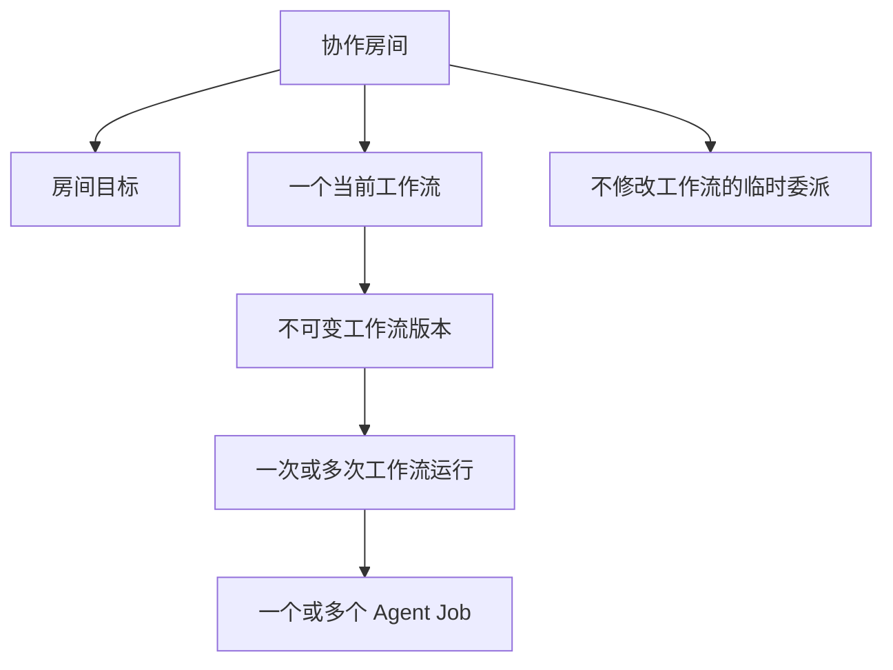
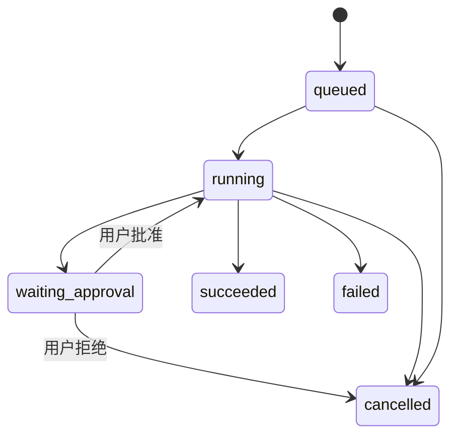

# Mona 多 Agent 协作功能设计方案

> 日期：2026-08-10
> 状态：待产品、设计与技术评审
> 面向：产品、交互、视觉、研发、测试与运营人员

## 1. 方案结论

Mona 将从单一 AI 助手升级为以 IM 为主要交互形态的多 Agent 协作产品。

本方案确定以下产品规则：

1. **Mona 是默认伙伴，也是默认协调者。** 用户没有明确指定其他伙伴时，由 Mona 接收消息、拆解工作并安排专业 Agent。
2. **伙伴私聊与协作房间统一出现在同一个会话列表。** 不分别建立“伙伴”“房间”两个会话分区。
3. **协作房间围绕一个明确目标存在。** 房间不是无主题群聊，而是由用户和多个 Agent 共同完成长期或一次性目标的工作空间。
4. **每个协作房间只有一个当前工作流。** 工作流描述房间内 Agent 的默认协作方式；每次执行产生一个独立运行实例。
5. **工作流不占用全局功能导航。** 用户在房间右侧栏查看工作流摘要，在主区域完成编辑；一次性自然语言协作只生成临时运行，不进入工作流导航。
6. **第一版不做自由连线画布。** 可复用或定时流程使用“自然语言生成 + 纵向步骤卡片 + 并行步骤组”的编辑方式；即时协作直接生成临时运行。底层保留有向无环依赖模型，未来可增加画布作为同一数据的另一种视图。
7. **房间聊天记录共享，长期记忆和 Skill 按 Agent 隔离。** Agent 只能读取自己的长期记忆、内置专属 Skill 和自己创建的 Skill。
8. **工作过程可见、可恢复、可取消、可追溯。** Agent 的身份、任务状态、审批、产物和失败原因都显示在原房间中。
9. **付费 Agent 使用统一 Agent Package 安装。** 产品包与用户记忆、自建 Skill 分离，更新产品包不得覆盖用户数据。

一句话产品定义：

> 私聊用于和伙伴交流，房间用于完成目标，工作流是房间内伙伴的协作方式。

---

## 2. 背景与问题

### 2.1 当前基础

Mona 已经具备以下能力：

- 单 Agent 聊天与多会话管理。
- `SubagentManager` 和 `spawn` 工具，可由 Mona 创建后台子任务。
- `AgentRunner`、独立工具注册表和 `MessageBus`。
- 会话 JSONL 持久化、WebSocket 实时消息、定时任务、记忆与 Skill。
- React 聊天界面、会话列表、消息流、执行过程和文件交付。

### 2.2 当前不足

现有子 Agent 是匿名、临时的一次性执行器，无法形成“伙伴”体验：

- 没有稳定的 Agent 身份、名称、头像和简介。
- 没有独立的长期记忆和自建 Skill 空间。
- 子 Agent 结果以 Mona 的内部执行结果呈现，不是房间里的一级消息作者。
- 会话没有参与者、房间目标和当前工作流。
- 无法持久化展示多 Agent 任务的等待、执行、审批和失败状态。
- 没有可安装、升级、授权和付费分发的 Agent 产品格式。

### 2.3 用户问题

用户希望完成的不是“同时打开多个聊天窗口”，而是：

- 有多个长期存在、能力不同的 AI 伙伴。
- 可以直接与某个伙伴私聊。
- 可以建立一个有明确目标的房间，让多个伙伴共同工作。
- Mona 能主动拆解任务并安排其他伙伴。
- 用户能用简单界面配置房间的协作流程。
- 每个伙伴持续积累自己的经验，同时不污染其他伙伴的记忆和 Skill。

---

## 3. 产品目标与非目标

### 3.1 产品目标

- 让用户能够识别、理解和信任不同 Agent 的职责。
- 让多 Agent 协作过程像群聊一样自然，同时比普通群聊更可控。
- 让用户无需理解 DAG、节点或表达式即可创建工作流。
- 让房间目标、Agent 分工、执行状态和最终产物保持一致。
- 为后续官网付费购买 Agent 建立稳定的安装和数据隔离边界。
- 在应用重启、网络错误或模型失败后，保留可恢复的任务状态。

### 3.2 第一版不做

- 不做任意拖拽、缩放和自由连线的工作流画布。
- 不做条件表达式、循环、脚本节点、Webhook 和任意子流程。
- 不允许专业 Agent 递归委派其他 Agent。
- 第一版仅 Mona 可以受控委派或编排；不承诺递归委派、Agent 自由辩论或投票。
- 不允许一个房间同时维护多套当前工作流。
- 不为每次工作流运行创建新会话。
- 不引入服务器中继、Redis、Celery 或每个 Agent 一个常驻进程。
- 不允许 Agent Package 执行安装脚本或携带任意可执行代码。
- 不自动发布小红书内容，不执行证券交易，不绕过用户审批完成高风险外部操作。

---

## 4. 核心概念

| 概念 | 定义 | 是否出现在会话列表 |
| --- | --- | --- |
| Agent / 伙伴 | 拥有稳定身份、职责、工具权限、私有记忆和私有 Skill 的 AI | 私聊时出现 |
| 私聊 | 用户与一个 Agent 的直接会话 | 是 |
| 协作房间 | 围绕一个目标，由用户和多个 Agent 共同工作的会话 | 是 |
| 房间目标 | 房间长期或一次性要完成的结果，不等同于某次执行 | 否 |
| 当前工作流 | 房间内默认的 Agent 分工和依赖关系；每个房间最多一个 | 否 |
| 工作流版本 | 每次保存工作流产生的不可变版本 | 否 |
| 工作流运行 | 某个工作流版本的一次实际执行 | 作为房间运行卡显示 |
| Agent Job | 分配给一个 Agent 的可追踪工作单元 | 作为消息或运行步骤显示 |
| 临时委派 | 不修改当前工作流、只在当前房间执行一次的 Agent Job | 作为房间事件显示 |
| 产物 | Agent 生成的文档、图片、表格、链接或结构化结果 | 在消息与房间产物区显示 |
| Agent Package | 从 Mona 官方专家库安装、升级的不可变 Agent 产品包 | 专家库与伙伴详情显示 |

### 4.1 四层关系



核心边界：

- 房间目标回答“这个房间为什么存在”。
- 工作流回答“通常由谁、按什么顺序完成”。
- 运行回答“这一次执行到哪里了”。
- Job 回答“某个 Agent 当前具体负责什么”。

---

## 5. 用户与首批 Agent

### 5.1 用户角色

第一版只有一个本地用户角色，用户拥有：

- 创建、编辑、归档房间的权限。
- 添加或移除房间伙伴的权限。
- 保存、运行、取消和修改工作流的权限。
- 批准或拒绝高风险步骤的权限。
- 查看、导出和删除自己的会话、Agent 记忆与 Skill 的权限。
- 安装、升级和卸载付费 Agent 的权限。

### 5.2 Mona

- 保留 ID：`mona`。
- 默认接收没有明确指定伙伴的消息。
- 可以拆解目标、创建 Agent Job、安排房间内其他 Agent。
- 对可复用或定时流程可以生成工作流草稿，但不能绕过用户激活草稿或批准高风险动作；即时协作按本轮意图直接生成临时运行。
- 可以汇总其他 Agent 的结果。

### 5.3 小红书运营

核心职责：

- 选题、内容结构、标题、正文、标签和发布建议。
- 根据用户品牌、历史反馈和房间目标持续调整内容。
- 输出内容草稿和素材需求。

默认边界：

- 第一版只生成草稿，不自动发布。
- 不读取 A 股分析师或 Mona 的私有记忆和自建 Skill。
- 不拥有委派其他 Agent 的能力。

### 5.4 A 股分析师

核心职责：

- 收集、核验和分析 A 股市场与公司公开信息。
- 对结论标记数据时间和来源。
- 清楚区分事实、计算、推断和无法确认的信息。

默认边界：

- 只提供研究分析，不执行交易。
- 缺少当前数据或可靠来源时必须明确说明，不能猜测。
- 不拥有委派其他 Agent 的能力。

---

## 6. 信息架构

### 6.1 总体布局

采用企业 IM 的四栏结构：

```text
┌────────┬──────────────────┬──────────────────────────────┬────────────────────┐
│ 功能栏 │ 会话/对象列表    │ 主内容区                     │ 上下文侧边栏       │
│        │                  │                              │                    │
│ 消息   │ 搜索             │ 私聊、房间聊天或工作流编辑器 │ 房间目标           │
│ 伙伴   │ Mona             │                              │ 伙伴               │
│ 商店   │ 小红书运营       │                              │ 工作流摘要         │
│ 设置   │ 每日市场简报     │                              │ 当前运行与产物     │
└────────┴──────────────────┴──────────────────────────────┴────────────────────┘
```

### 6.2 功能栏

第一版只包含：

- 消息。
- 伙伴。
- 商店。
- 设置。

工作流不作为顶级功能。工作流属于房间，只能从房间上下文进入。

### 6.3 消息列表

伙伴私聊与协作房间统一混排：

```text
搜索

Mona
小红书运营
A股分析师
每日市场简报
小红书内容运营
某上市公司舆情策划
```

显示规则：

- 单头像表示伙伴私聊。
- 组合头像表示协作房间。
- 未读圆点表示有新消息或需要用户处理的审批。
- 运行角标表示存在进行中的工作流运行或临时 Job。
- 时钟角标表示当前工作流启用了定时触发。
- 预览文本显示最近一条用户可读消息，不显示原始工具调用和系统注入文本。
- 置顶项优先，其余按最近更新时间倒序。
- 已归档会话不出现在默认列表，通过搜索或归档入口查看。

### 6.4 伙伴列表

切换到“伙伴”后，第二列显示所有已安装 Agent；主区域显示：

- 名称、头像、简介和版本。
- 擅长的任务和建议用法。
- 已授权工具与高风险权限。
- 内置专属 Skill。
- Agent 自建 Skill。
- 私有记忆管理入口。
- 更新、停用和卸载操作。

Mona 不允许卸载。

### 6.5 商店

商店用于浏览和购买 Agent，不显示用户私有数据。商品页至少包含：

- 名称、头像、开发者和版本。
- 能力说明和适用场景。
- 内置 Skill 和所需权限。
- 价格与授权状态。
- 最低 Mona 版本。
- 安装或升级按钮。

---

## 7. 功能总览

| 编号 | 优先级 | 模块 | 功能说明 |
| --- | --- | --- | --- |
| F01 | P0 | 伙伴身份 | 为 Mona 和专业 Agent 提供稳定 ID、名称、头像、简介、职责、模型配置和工具权限。所有 Agent 消息必须标明作者。 |
| F02 | P0 | 统一会话列表 | 私聊和协作房间在同一列表中搜索、排序、置顶、未读提示和归档，不额外建立工作流列表。 |
| F03 | P0 | 伙伴私聊 | 用户可直接与任一已启用 Agent 对话；私聊使用该 Agent 的私有记忆、Skill 和工具权限。 |
| F04 | P0 | 创建协作房间 | 用户从新增菜单、Mona 私聊或现有结果创建房间，填写目标并选择伙伴；Mona 可生成工作流草稿。 |
| F05 | P0 | 房间聊天 | 用户、Mona 和专业 Agent 作为不同作者在同一消息流中交流，支持 `@伙伴`、文件、产物与任务状态。 |
| F06 | P0 | 房间侧边栏 | 显示房间目标、成员、当前工作流摘要、当前运行、最近产物和编辑入口；默认可折叠。 |
| F07 | P0 | 工作流编辑 | 在主区域使用纵向步骤卡片配置触发方式、Agent 步骤、依赖、并行组、审批和输出位置。 |
| F08 | P0 | 自然语言编排 | 可复用或定时流程由 Mona 生成结构化工作流草稿，草稿必须经用户检查和保存才能成为当前工作流；即时协作按明确意图直接生成一次性运行。 |
| F09 | P0 | 手动运行 | 用户在房间中启动当前工作流，查看步骤状态、取消运行、查看结果或重新运行。 |
| F10 | P0 | Mona 委派 | Mona 可在普通聊天或运行中给房间内专业 Agent 创建 Job；结果回到原房间并再次唤醒 Mona。 |
| F11 | P0 | Agent 私有记忆 | 每个 Agent 独立读取、写入和整理长期记忆；房间聊天共享，但不能直接读取其他 Agent 的私有记忆。 |
| F12 | P0 | Agent 私有 Skill | Agent 内置专属 Skill 和自建 Skill 只对该 Agent 可见；自建 Skill 永不写入全局 Skill 目录。 |
| F13 | P0 | 审批 | 外部发布、交易、删除及其他高风险动作在真正执行前进入等待审批状态，用户可以批准或拒绝。 |
| F14 | P0 | 持久化恢复 | 房间、工作流版本、运行、Job 和审批在应用重启后保持状态；不能把未完成操作误报为成功。 |
| F15 | P1 | 定时运行 | 当前工作流可配置一个定时触发；到期后在原房间执行，不创建新会话。 |
| F16 | P1 | 版本与运行历史 | 每次保存产生工作流版本；历史运行固定引用启动时的版本，并可查看失败步骤和产物。 |
| F17 | P1 | 房间复制 | 用户可以复制房间目标、成员和当前工作流创建新房间，不复制聊天、私有记忆和历史运行。 |
| F18 | P2 | Agent Package | 从 Mona 官方专家库安装 Agent Package，显示权限变化，保持产品文件和用户数据分离。 |
| F19 | P2 | 购买与授权 | 官网处理商品、订单和授权；本地负责登录态、授权校验、包下载、安装和升级。 |

---

## 8. 核心交互设计

### 8.1 伙伴私聊

进入方式：

- 在消息列表选择伙伴私聊。
- 在“伙伴”详情点击“开始聊天”。
- 商店安装完成后点击“和它聊聊”。

规则：

- 新私聊只有用户与该 Agent 两个成员。
- 没有工作流侧边栏，只显示伙伴简介、能力和产物。
- 私聊中需要多个 Agent 时，当前 Agent 不能私自拉人；由 Mona 或用户发起“创建协作房间”。
- 与专业 Agent 私聊时，消息直接交给该 Agent，Mona 不拦截、不代答。

### 8.2 创建协作房间

入口：

- 消息列表右上角“新建”。
- Mona 私聊中的“创建协作房间”建议卡。
- 某条消息或产物的“发起协作”。

最小创建流程：

1. 用户描述房间目标，必填。
2. Mona 根据目标建议房间名称和伙伴。
3. 用户确认或调整成员。
4. Mona 生成工作流草稿。
5. 立即进入房间；草稿可继续编辑，保存后才能运行。

创建表单只保留：

- 房间目标：必填，描述希望持续或一次性得到的结果。
- 房间名称：默认由 Mona 生成，可修改。
- 伙伴：至少包含 Mona，可增加已安装 Agent。

不要求用户在创建前完成全部工作流配置。

### 8.3 房间聊天

消息头显示作者头像和名称。消息类型包括：

- 用户消息。
- Agent 消息。
- Mona 委派事件。
- Job 进度和结果。
- 工作流运行卡。
- 审批卡。
- 文件与产物卡。
- 失败、取消和恢复提示。

路由规则：

- 没有结构化 `@` 目标的普通房间消息默认唤醒 Mona；不能把回复文本中的普通 `@` 当作执行指令。
- 存在结构化 `@` 目标时只唤醒被点名的 Agent；默认多个目标并行执行，并共享同一份消息开始时的房间上下文快照；每个 Agent 只回答自己的部分，不代表或介绍其他被 `@` 的成员。
- 明确出现“先……再”“先……然后”或“先……接着”时，按目标顺序创建一次性串行运行；明确出现“复核”“审查”“评审”或“检查”时，先由第一个目标产出，后续目标依赖并复核上游结果。
- 只有结构化 targets 包含 Mona，且用户表达“总结”“汇总”或“综合”意图时，才由伙伴并行产出、最后由 Mona 输出唯一汇总；没有 Mona 时保持默认并行语义。
- 上述串行、复核和汇总均为立即执行的临时 WorkflowRun：保存运行快照但不创建或激活可复用 workflow draft；需要复用或定时执行时仍走“让 Mona 编排”并由用户确认工作流草稿。
- 工作流步骤只唤醒分配到该步骤的 Agent。
- 真正的委派必须通过受控的 `delegate_agent` 创建 Job；Agent 回复文本中的 `@` 不会触发执行。
- Mona 可以显式创建专业 Agent Job；第一版只允许 Mona 做单层委派，专业 Agent 不能委派其他 Agent。
- Agent 不会因为看见其他 Agent 的每条消息而自动响应。

### 8.4 房间侧边栏

```text
房间目标
每天生成可靠、可追溯的 A 股市场简报

伙伴
Mona · 协调者
A股分析师 · 分析

当前工作流
[A股分析师] → [Mona] → [用户确认]
[编辑工作流]

当前运行
进行中 · 第 2/3 步
[查看] [取消]

最近产物
2026-08-10 每日市场简报
```

规则：

- 桌面宽屏默认显示，窄屏和用户手动关闭后折叠。
- 侧边栏只显示摘要，不在窄栏中完成复杂编辑。
- 没有工作流时显示“让 Mona 帮我编排”和“手动配置”。
- 存在未保存草稿时显示草稿标记，不影响当前已激活版本。

### 8.5 工作流编辑器

点击“编辑工作流”后，聊天主区域切换为编辑器，房间和会话列表保持不变。

编辑器结构：

```text
房间：每日市场简报                 [返回聊天]

目标
[每天生成可靠、可追溯的 A 股市场简报]

启动方式
(●) 手动运行  ( ) 定时运行

步骤

1  [A股分析师]
   收集上一交易日公开数据并分析市场事件
   输入：房间目标、运行日期
   输出：市场分析报告

          ↓ 完成后

2  [Mona]
   根据上一步生成简报，核对数据时间与来源
   输入：步骤 1 输出
   输出：最终简报

          ↓ 完成后

3  [用户确认]
   确认后把最终简报发送到当前房间

[＋添加步骤]  [让 Mona 重新编排]

[放弃草稿]              [保存并测试] [保存]
```

支持的步骤类型：

1. **Agent 步骤**：选择一个房间成员，填写任务、输入和期望输出。
2. **并行步骤组**：组内 Agent 步骤同时开始；全部成功后下游步骤才开始。
3. **用户审批步骤**：显示待审批内容，用户批准后继续，拒绝后结束运行。

第一版不支持：

- 条件分支。
- 循环。
- 任意代码。
- Webhook。
- 跨房间步骤。
- 工作流调用工作流。

编辑规则：

- Agent 步骤只能选择当前房间成员。
- 不允许依赖不存在或位于下游的步骤。
- 不允许形成环。
- 工作流必须至少有一个 Agent 步骤。
- 审批必须发生在高风险动作真正执行前。
- 保存成功才生成新版本；编辑草稿不覆盖当前版本。
- “保存并测试”先保存新版本，再启动一次明确标记为测试的运行。

### 8.6 自然语言编排

自然语言有两条明确路径。即时协作直接按本轮意图运行；需要复用或定时执行时，用户可以在房间中说：

> 每个交易日 18 点让 A 股分析师整理市场，再让 Mona 生成简报，发之前让我确认。

Mona 输出可复用工作流草稿卡：

```text
已生成工作流草稿
3 个步骤 · 2 位伙伴 · 定时运行

[查看并编辑] [放弃]
```

约束：

- 可复用或定时流程只能先生成草稿，不能自动激活；草稿必须通过与手动编辑相同的结构校验，并经用户检查和保存。
- 即时协作不创建或激活草稿，而是创建一次性、手动触发的 transient WorkflowRun，并把完整运行快照持久化到原房间。
- 无法确认的 Agent、时间、权限和输出位置必须标记为待用户填写，不能猜测。
- 可复用工作流草稿不触发实际 Agent 工作；即时协作运行启动后按步骤执行。

### 8.7 工作流运行

启动方式：

- 用户点击“运行”。
- 用户在房间要求 Mona 运行当前工作流。
- 已启用的定时触发到期。

运行开始时固定保存：

- 工作流版本。
- 房间目标快照。
- 房间成员快照。
- 启动人和启动方式。
- 每个步骤的输入。

运行卡：

```text
每日 A 股复盘
运行中 · 2/3

✓ A股分析师  市场分析
● Mona        生成简报
○ 用户确认    等待

[查看过程] [取消]
```

展开后显示：

- 每个步骤的状态、开始时间和结束时间。
- 执行 Agent。
- 用户可读进度。
- 结果摘要和产物。
- 可操作的失败原因。
- 失败步骤支持单步重试，运行中的步骤支持单步取消；成功的兄弟步骤和已完成的上游结果保留。

同一房间第一版只允许一个活动运行：

- 手动重复启动时提示“当前已有运行”。
- 定时触发遇到活动运行时跳过本次，并在房间记录原因。
- 不建立隐式无限队列。

### 8.8 临时委派

用户可以用结构化 `@` 指定本轮回答目标；Mona 则通过受控的 `delegate_agent` 创建一次性 Job，例如：

> Mona：请 A 股分析师补充分析这家公司最近一季现金流。

临时委派：

- 不修改房间当前工作流。
- 必须关联原房间和发起人。
- 结果由执行 Agent 以自己的身份发送。
- Mona 发起时，Job 完成后自动通知 Mona，由 Mona 决定是否继续处理。
- 用户直接 `@` Agent 表示本轮回答目标，不等同于 Mona 的委派；同一轮已被直接 `@` 的 Agent 不得再次被 Mona 委派。
- 回复文本中的 `@` 只属于内容，不创建 Job；只有通过受控 `delegate_agent` 动作才会产生委派。
- Job 可以取消、失败和重试，但重试创建新的尝试记录。

### 8.9 用户审批

审批卡必须显示：

- 谁请求审批。
- 即将执行的动作。
- 使用的数据或产物。
- 目标平台或影响范围。
- 批准和拒绝按钮。

规则：

- 等待审批时不得提前执行副作用。
- 拒绝后运行进入 `cancelled`，后续步骤不执行。
- 应用重启后审批仍然有效，除非对应运行已取消或失效。
- 小红书发布、证券交易、文件删除、对外发送敏感信息等必须审批。
- A 股分析师第一版没有交易工具，即使用户批准也不能执行交易。

### 8.10 产物

- 产物必须关联房间、运行或 Job、创建 Agent 和创建时间。
- 房间消息显示产物卡，侧边栏显示最近产物。
- 工作流失败不能删除此前已经生成的产物。
- 重新运行产生新产物，不覆盖历史文件；用户明确保存为同名目标时再按现有文件规则处理。

---

## 9. 状态模型

### 9.1 工作流状态

```text
draft → active → replaced
             └→ disabled
```

- `draft`：未激活草稿，不能定时执行。
- `active`：房间当前版本。
- `replaced`：被新版本替代，只供历史运行查看。
- `disabled`：保留定义但不允许新运行。

### 9.2 运行状态



### 9.3 Job 状态

```text
queued → running → succeeded
                 → failed
                 → cancelled
```

状态只能按允许的方向变化；迟到的 Agent 结果不能把已经取消的 Job 改回成功。

---

## 10. 记忆、会话与 Skill 隔离

### 10.1 共享内容

房间成员被唤醒时可以读取：

- 房间目标。
- 当前工作流或本次运行中与自己有关的步骤。
- 房间内与当前任务相关的共享消息。
- 上游步骤明确传递的结果。

### 10.2 私有内容

每个 Agent 独立拥有：

- 长期记忆。
- 原始记忆历史。
- SOUL、USER 和行为偏好。
- Agent 自建 Skill。
- 产品包内置专属 Skill。
- 私聊历史。

### 10.3 禁止行为

- Agent 不得枚举或读取其他 Agent 的私有目录。
- Mona 不能直接打开专业 Agent 私有记忆，只能向该 Agent 委派或询问。
- 工作流只传递显式步骤输出，不自动传递完整私有上下文。
- 一个 Agent 创建的 Skill 不得进入全局 Skill 列表。
- Agent Package 升级不得覆盖私有记忆和自建 Skill。

### 10.4 房间记忆

第一版不新增独立的“房间长期记忆”。房间目标、共享消息、工作流和产物已经构成可追溯上下文。

如果未来证明确实需要跨大量历史自动提取房间知识，再增加房间摘要；不能把该摘要混入任何 Agent 的私有记忆文件。

---

## 11. Agent Package 与付费购买

### 11.1 产品文件与用户数据分离

```text
~/.mona/packages/<package_id>/<version>/   不可变产品文件
~/.mona/agents/<agent_id>/                 用户可变数据
```

产品文件包括：

- Agent 定义。
- 系统提示词。
- 头像和展示素材。
- 内置专属 Skill。
- 默认工具权限声明。

用户数据包括：

- 私有记忆。
- Agent 自建 Skill。
- 用户个性化配置。
- 会话、房间和工作流运行产生的数据。

### 11.2 安装流程

1. 官网确认购买或订阅授权。
2. 下载指定版本的 Agent Package。
3. Mona 校验文件哈希、目录路径、包大小和 Schema。
4. 显示 Agent 请求的工具权限和新增风险。
5. 用户确认后安装不可变产品文件。
6. 创建本地 Agent 数据目录。
7. Agent 出现在伙伴列表，可以开始私聊和加入房间。

### 11.3 升级与授权失效

- 升级只创建新的 Package 版本并切换当前版本。
- 正在运行的 Job 继续使用启动时的版本。
- 升级失败时保留上一可用版本。
- 授权失效时可以阻止新运行或新升级，但不得删除用户记忆、Skill、会话和产物。
- 用户始终可以导出和删除自己的数据。

---

## 12. 错误、空状态与恢复

| 场景 | 产品行为 |
| --- | --- |
| 没有安装专业 Agent | 房间创建页只显示 Mona，并提供进入商店入口 |
| 房间没有工作流 | 允许聊天；右侧栏显示“让 Mona 帮我编排”和“手动配置” |
| 工作流草稿校验失败 | 保留草稿，定位到错误步骤，不激活版本 |
| Agent 未启用或已卸载 | 阻止启动并指出具体步骤；历史运行仍可查看 |
| Agent 执行失败 | Job 标记失败，显示错误摘要；不把失败包装成正常回答 |
| 模型无响应或超时 | 标记失败或允许明确重试，不能永久显示为运行中 |
| 应用退出 | 持久化当前状态；下次启动恢复或把不可恢复步骤标记为失败 |
| 定时触发时已有运行 | 跳过本次并在原房间记录，不创建无限队列 |
| 用户取消 | 停止尚未开始的步骤；已产生的产物保留并标记来自已取消运行 |
| 编辑正在运行的工作流 | 创建新版本；当前运行继续使用旧版本 |
| 需要审批但客户端离线 | 保持等待审批，重新连接后恢复审批卡 |

---

## 13. 数据与产品指标

第一版只定义观察指标，不预设未经验证的目标数值。

### 13.1 使用指标

- 创建协作房间的用户数和房间数。
- 从创建房间到保存首个工作流的完成率。
- 自然语言草稿被保存、修改或放弃的比例。
- 手动运行和定时运行次数。
- 临时委派次数。
- 每个房间参与的 Agent 数量。

### 13.2 质量指标

- 工作流运行成功、失败、取消和等待审批的比例。
- Agent Job 成功率与重试率。
- 应用重启后的运行状态恢复成功率。
- 工作流草稿结构校验失败率。
- 用户在 Agent 输出后要求事实纠正或重新执行的比例。
- 高风险动作未经审批实际执行的次数；该值必须为零。

### 13.3 商业指标

- 商店访问、商品详情查看、购买、安装和首次使用转化。
- 已购买 Agent 的活跃使用和升级成功情况。
- 授权失败、包校验失败和安装回滚次数。

埋点不得记录完整提示词、私有记忆、证券分析原文、文件正文或用户敏感数据。

---

## 14. 分阶段范围

### 阶段 A：命名伙伴与房间闭环

- Mona、小红书运营、A 股分析师稳定身份。
- 统一会话列表。
- 伙伴私聊。
- 创建协作房间和房间目标。
- 多作者消息。
- 房间成员与右侧栏。
- Mona 显式委派专业 Agent。
- Agent 私有记忆和 Skill。

### 阶段 B：房间工作流

- 每房间一个当前工作流。
- 自然语言草稿和步骤卡片编辑器。
- Agent 步骤、并行步骤组和用户审批。
- 手动运行、取消、失败与重新运行。
- 工作流版本、运行和 Job 持久化恢复。

### 阶段 C：定时与体验完善

- 定时触发。
- 运行历史和最近产物。
- 房间复制。
- 通知和未读状态。

### 阶段 D：Agent 商店

- Agent Package。
- 官方源校验、权限确认、安装、升级和回滚。
- 官网商品、订单和授权接入。

每个阶段必须通过验收门槛后才能进入下一阶段，不以日期代替质量门槛。

---

## 15. 验收标准

### 15.1 会话与房间

- [ ] 私聊和协作房间出现在同一个会话列表。
- [ ] 用户可通过头像识别私聊与房间，不依赖额外分区。
- [ ] 房间必须保存明确目标和成员列表。
- [ ] 普通房间消息默认由 Mona 响应；直接 `@` 专业 Agent 时能正确路由。
- [ ] 每条 Agent 消息显示真实 Agent 作者，不能统一显示为 Mona。

### 15.2 工作流

- [ ] 工作流没有全局功能栏入口，只从协作房间进入。
- [ ] 每个房间最多一个当前工作流，但可以有多个历史版本和运行。
- [ ] 编辑器不依赖自由画布即可完成串行、并行和审批配置。
- [ ] 可复用或定时流程的自然语言只能生成草稿，未经用户保存不能运行；即时协作可按明确意图直接启动一次性 WorkflowRun。
- [ ] 一次性串行、复核和 Mona 汇总运行持久化快照但不创建或激活可复用草稿。
- [ ] 失败步骤支持单步重试，运行中步骤支持单步取消，成功兄弟和上游结果保留。
- [ ] 一次运行不创建新会话，过程和结果进入原房间。
- [ ] 修改工作流不影响已经开始的运行。
- [ ] 同一房间不能同时启动两个工作流运行。
- [ ] 应用重启后可以恢复等待审批和未完成状态，或明确标记无法恢复的失败原因。

### 15.3 Agent 隔离

- [ ] 三个 Agent 的长期记忆目录不同。
- [ ] 一个 Agent 创建的 Skill 不出现在其他 Agent 的 Skill 列表中。
- [ ] 专业 Agent 的工具列表不包含委派工具。
- [ ] Mona 可以向房间成员创建 Job，非成员不能被静默调用。
- [ ] Agent Package 更新不会覆盖 Agent 的私有记忆和自建 Skill。

### 15.4 安全

- [ ] 小红书内容默认只生成草稿，发布前需要审批。
- [ ] A 股分析师不具备交易执行工具。
- [ ] 用户拒绝审批后不会发生对应副作用。
- [ ] 已取消 Job 的迟到结果不能把状态改回成功。
- [ ] Agent Package 未通过哈希和路径安全校验时不能安装。

---

## 16. 待后续验证而非当前实现的能力

- 自由画布视图：只有当分支、汇合和复杂依赖成为高频需求时增加。
- 一个房间多套工作流：只有当真实房间需要独立触发多类流程时增加。
- 专业 Agent 相互委派：只有在循环防护、预算和权限模型经过验证后开放。
- 房间长期摘要：只有当房间历史过长确实影响任务质量时增加。
- 用户可以创建和维护本地自定义专家；第三方市场及向 Mona 官方专家库上传内容不在产品范围内，官方库资源只由 Mona 维护。
- 云端多人协作：当前方案面向本地单用户 Mona，不提前引入租户、成员账号和服务端中继。
