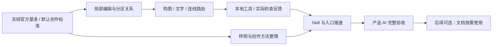

# Mona AI 画布官方 Demo 质量开发计划

> 日期：2026-09-07
> 状态：执行中。本轮将官方基准扩展为四类可迁移的画布语法，并同步更新任务矩阵与验收清单。
> 设计依据：[官方 Demo 质量优化方案](../design/ai-canvas-official-demo-development.md)。
> 核心验收主体：Mona 的实际 AI 创作过程。手工 JSON、预制截图、单元测试或独立 Codex 成图均不能代替产品 AI 验收。

## 当前实施状态（2026-09-07）

| 阶段 | 状态 | 当前证据 |
| --- | --- | --- |
| D0 基准与方法 | 已完成 | 已固化官方拼图、四类语法 manifest 和 18 条不泄漏坐标的评测任务；官方样例只作参考和 L0 回归 |
| D1 局部编辑与分区 | 已完成 | 分区成员持久化、局部节点/边/标签样式、影响范围、重排和重开回归已覆盖 |
| D2 构图与路由底座 | 已完成本期必要范围 | 已支持淡色主题、图标、手动/自动布局、分组/泳道、可靠端点、避障、标签样式，以及 zIndex/rotation/opacity/decorative；同心与自由构图由通用图元表达，没有加入 Demo 模板 |
| D3 工具与真实检查 | 已完成代码闭环 | `canvas.open/inspect/apply/export` 已接入真实编辑器；不可见画布不能伪装成检查通过，并按保存路径尝试重新显示；apply 有哈希保护和修复预算 |
| D4 Skill 与入口 | 已完成 | `mona-canvas` 已改为内容模型 → 视觉语法 → 首次应用 → 真实检查；首个 apply 前最多一份协议参考；默认遵循官方 Demo 的低饱和浅色系统 |
| D5 产品 AI 验收 | 未完成 | 已取得跨题型真实运行证据，但没有完成 18 次矩阵。自由图形猫生成 23 个独立对象，低饱和截图经重新显示后检查为零问题；该 AI 回合内视觉检查因窗口最小化返回 unavailable，所以按本计划仍不计完整通过。同心图已正确选择语法和淡色方案，但最终 apply 同样被最小化窗口阻断 |

当前应停止继续重复跑样例。后续只在 Mona 窗口保持可见的专门验收时段执行 D5 矩阵，并把“AI 在同一回合收到成功截图”作为通过条件。


## 1. 目标与执行顺序

用户只给内容需求，AI 也应自主选择图型、布局、视觉角色、配色和连线方式，生成达到官方 Demo 组合所代表的视觉质量。不要求用户先成为图形设计师，也不允许依赖某个官方示例的固定坐标、文案或节点数组。

沿用 Mona React Flow、JSON 图源、现有编辑器、Gateway 模型与 Tauri 存储。新增本地 `canvas` 工具及前端回执属于完成 AI 创作所必需的调用能力；不新增云端功能、多人协作、draw.io 内核或画布业务会话服务。



主 Agent 负责方案、图模型、跨进程契约、生成闭环和最终验收。Luna 只承担已明确接口下的资源整理、固定回归样例、独立测试等有界任务，不同时修改主 Agent 持有的核心文件。

每阶段先检查当前工作树。保留现有无关改动，只编辑本阶段指定范围；测试不能通过降低标准、删题或把输出写死来变绿。

## 2. D0：冻结成图标准与默认创作方法

状态：已完成。

- [ ] 将用户提供的[官方 Demo 拼图](../design/assets/ai-canvas-official-demo/official-demo-grid.png)及 Transformer 单图与本地上游来源建立基准 manifest；记录哈希、四类 Demo 家族的内容清单和版本，保留截图依据。
- [ ] 从 `next-ai-draw-io/lib/system-prompts.ts`、生成/编辑工具和视觉检查调用中整理“规划 → 图形选择 → 几何/样式表达 → 应用 → 反馈”映射，区分已实现功能与仅有提示词要求。
- [ ] 按方案第 5.0 节写成默认创作规范：用户未指定时，AI 如何判断关系类型、选择构图、组织内容、确定阅读画幅、配色和连线语义。
- [ ] 建立不向模型泄漏答案的 L2 测试需求；至少包含图片参考、纯文字、无样式短需求和四类语法的新内容迁移。示例仅用于评审和 L0 表达性回归，不能成为生成模板。
- [ ] 用最小底座 fixture 验证端口、分区、字体测量和路由可行性；特别确认现有 `elkjs` 对复杂布局的适用范围，不默认认定它支持任意固定节点的独立路由。

负责范围：主 Agent 制定设计/验收标准与路由选型；Luna 整理 `tests/fixtures/canvas/` 基准清单和许可来源，不改生产生成逻辑。

交付：参考 manifest、任务输入与语义覆盖清单、默认创作规则、L0 可表达性记录。官方 Demo 中的标题、两列、模块、残差、跨区关系及 Nx 都有明确对应对象。该阶段不能标记“AI 达标”。

## 3. D1：修复局部修改与分区关系

状态：已完成。

主要文件：`flowchart-document.ts`、`flowchart-patch.ts`、`flowchart-operations.ts`、`FlowchartDocumentEditor.tsx` 及其现有测试。

- [ ] 为 AI 视觉分区持久保存 memberIds/边界属性，明确与现有手工组合的区别；引用、成员变化、复制、序列化、重开和两个哈希均保持一致。
- [ ] 支持分区增删改、节点局部位置/尺寸、边标签位置/样式。所有操作仍进入原 patch 校验器；动作名与字段冻结后供 D4 引用。
- [ ] 根据操作类型计算影响范围；纯改色不重排、不重新生成全部边；改字和改尺寸只更新实际受影响的边界与自动路线。
- [ ] 重新布局作用域明确；锁定对象、手动路线及未指定区域不能被顺带改写。
- [ ] 修复 `reflow` 后框与成员脱离；移动分区时保持成员相对位置，删除分区时不隐式删除其内容。
- [ ] 无变化操作返回 unchanged，失败原子拒绝，用户视觉修改触发旧哈希冲突。

必须通过的近场回归：

| ID | 操作 | 必须证明 |
| --- | --- | --- |
| R1 | 只改一个节点字色 | 全部节点几何和全部边路径不变 |
| R2 | 将一个标签改为长中文 | 内容保留；目标可读；只调整相关布局，无关颜色/文本不变 |
| R3 | 带分区的图执行 reflow | 每个成员仍在所属分区中，标题区不被覆盖 |
| R4 | 移动分区后保存重开 | 成员随分区等量移动，关联路线正确，保存后关系不丢 |

主 Agent 持有生产模块；Luna 可补独立测试文件。现有绿色测试是回归基础，不替代新增失败用例。

## 4. D2：实现官方级构图与可靠连线

状态：已完成本期必要范围；不新增通用约束语言或固定 Demo 布局器。

主要文件：现有 `flowchart-patch.ts`、`FlowchartCanvas.tsx`、`FlowchartControlEdge.tsx`、`flowchart-shapes.tsx`；必要时新增只供这些调用方复用的布局/几何模块，不改第二套编辑器。

- [ ] 增加有限布局意图：顺序流/连接数据流、双列堆叠、分层、边界拓扑、泳道、同心/径向和自由形状组合；AI 选择，程序落实对齐、同宽、间距、环层、z-order 和画幅。允许复杂构图的局部几何控制。
- [ ] 使用真实字体与标签测量；字号、内边距、分区标题和图标共同决定尺寸。长文字先换行或增高，不直接缩字。
- [ ] 分区的圆角、透明度和标题位置按文档字段渲染；不忽略 AI 已提交的合法样式。
- [ ] 同侧多端口、残差/反馈路线、跨区通道、标签偏移有明确模型表示。SVG 路径与质检复用同一几何结果。
- [ ] 逐段避障，覆盖通向外围路线的首段与末段；多条不同关系不重合成不可区分的一条线。
- [ ] 自动布局使用 Dagre 或经 D0 验证的 ELK 小型适配；固定构图的局部路线单独验证，不把算法名称当作效果保证。
- [ ] 检查实际成图画幅及阅读尺度。缩放过低不能靠“默认适应视图”判定已修复。

必须通过的近场回归：

| ID | 输入 | 必须证明 |
| --- | --- | --- |
| R5 | TB 目标 `(0,0)`、来源 `(0,240)`、障碍 `(240,240)`，节点均 `160×64` | 反馈路线每一段均绕开障碍；不再出现首段穿线 |
| R6 | 同侧多条边、双向关系、跨区长线 | 路径可辨认，箭头与标签对应正确 |
| R7 | 官方 Transformer 结构 fixture | 双列与分区关系、主要线、残差线、标题/Nx 都可编辑且完整显示 |
| R8 | 四类官方语法的最小表达 fixture | 连接数据流、边界拓扑、同心/径向和自由形状对象都能表达，且不互相污染路由 |
| R9 | 官方风格迁移到不同数量模块 | 构图适应内容，不依赖固定节点名称、文案或坐标数组 |

L0 fixture 只验证底座；本阶段最终图必须进入 D5 的 AI 生成测试。

## 5. D3：让 AI 取得执行与质检回执

状态：已完成代码闭环；产品矩阵中的可见窗口稳定性继续由 D5 验证。

主要范围：拟新增 `mona/agent/tools/canvas.py` 与前端薄画布命令入口；复用 `tauri_ipc.py`、`src-tauri/src/ipc_bridge.rs`、`workspace_canvas.rs`；使用现有工具注册与配置机制，不新增 Services 画布模块。

- [ ] 实现 `open / inspect / apply / export`。`inspect` 按需支持选区、对象、能力、质量和图像；open 一次返回当前图、两个哈希和画幅。
- [ ] 在当前编辑器内校验目标、哈希和操作并提交；Tauri 转发请求与回执，不维护另一份可写图。
- [ ] 结果包含 requestId、canvasId、状态、变更对象、精确版本和质量问题；同一请求超时后可查询，不能直接重放产生重复节点。
- [ ] 每次完成的有效批次在画布可见；关闭/重开同一文件能重新绑定 AI 上下文，不能再次落入纯预览或假写者状态。
- [ ] 结构检查与实际 DOM/SVG 检查返回同一轮 Agent；字体、DOM、路径或图像不可用返回明确状态，不以空列表伪装通过。
- [ ] 增加分区出界/标签冲突/漏渲染检测；内容清单、确定性检查和 AI 看图结论分别记录。
- [ ] 当前模型有视觉能力时把真实图像送入既有模型上下文。仅给一个图片路径而没有读取能力，不算已观察。
- [ ] 修图预算按一次创作最多 3 次，连续两次无改善停止当前策略；保存问题和草稿，不无限循环。
- [ ] 接通新工具后消除最终 fenced patch 的重复应用路径；消息展示不泄漏内部载荷。

最近的跨端测试：Agent 工具 → IPC → 前端 apply → 回执生产与消费；错误字段、过期图、未挂载、响应丢失、重复 requestId、取消、用户插入编辑和保存失败。只测试 mock 返回 success 不算通过。

主 Agent 负责此阶段整合；Luna 在契约冻结后只负责调用端回归用例。

## 6. D4：Skill、默认创作与入口接通

状态：已完成。

主要文件：`mona/skills/mona-canvas/`、`notes-ai.ts`、`conversation-canvas.ts`、`useConversationCanvases.ts`、`CanvasFileView.tsx`、`DocMakerView.tsx` 的画布分支，以及必要的工具/skill 可见范围配置。

- [ ] 消除 `replaceGraph.pools` 等新旧规则冲突；能力说明只维护一个权威契约，精确列出合法字段和值。
- [ ] 将方案第 5.0 节落实为模型默认创作标准。用户没有说“高级”时也执行内容理解、构图与样式设计，不追问无关风格问题。
- [ ] 增加 connected-dataflow、boundary-topology、concentric-radial、freeform-composition 四组完整源例、效果图和设计理由；增加一次错误检测到局部修复的完整例。官方源例只作为训练/验收材料，不能作为关键词命中后的复制源。
- [ ] SKILL.md 只保留路由和核心操作；图种知识、实例和协议按需读取。不要把全套资源塞进每轮上下文。
- [ ] 创建意图覆盖架构图、泳道图以及“把这段内容画成图”等明确请求，由 AI 判断图型；不能只扩充前端关键词正则。普通讨论不创建文件，原本只要段落/表格的请求不强制建画布。
- [ ] 主会话、画布页和文件重开使用同一当前图上下文及工具结果；切换目标不会写错图，重开仍能按 ID 修改。
- [ ] 验证实际 Mona/目标 Agent 可发现并使用该 skill；不要仅检查目录里存在 SKILL.md。
- [ ] 运行 skill validator 和独立 L1 前向测试；记录失败并根据共性问题修正文案或工具，不仅修改测试请求。

验收：短需求无需用户指定图型以外的设计细节；AI 能说明选择构图的理由并完成真实调用。局部改色不重复读所有指南。L1 成功不替代下一阶段。

## 7. D5：正常 Mona 入口的最终 AI 验收

状态：部分执行，未达通过门槛。依赖 D0–D4；必须在编辑器可见时继续。

### 7.1 创作任务矩阵

| 任务 | 给 AI 的内容 | 不允许提供给 AI 的答案 | 重点 |
| --- | --- | --- | --- |
| A 参考图生成 | 用户指定的官方 Demo 与生成要求 | 手工 patch/坐标 | 同内容、同级构图及可编辑性 |
| B 纯文字生成 | Transformer 架构的内容需求 | 参考图、目标 JSON | AI 自主组织列、模块与路线 |
| C 新内容迁移 | RAG 连接数据流、React/AWS 边界拓扑、Open Innovation 同心/径向 | Transformer/AWS/RAG 示例坐标、文案和对象数组 | 学到语法，能迁移 |
| D 内容变化 | 长中文、不同数量模块与新增关系 | 预先缩减的内容或改好的图 | 信息完整与可读性 |
| E 多轮修改 | 改色、改字、加模块、移动分区、重开后继续改 | 工程师代改文件 | 局部精度、反馈和持久化 |
| F 无风格短需求 | 新内容短请求，其中至少一题只说“整理成一张图”，另含自由形状组合任务 | 配色、字号、间距、布局指令或示例图 | AI 判断图型并主动做设计 |

最终每类 3 次，共 18 次完整产品任务。A/B/F 各 3 次必须全部达标，总成功至少 17/18；保留所有尝试和原因。每次必须从空图或指定当前版本开始，不挑选最好结果，也不让开发者手改最后图。

### 7.2 每次任务的必过门槛

- [ ] 用户要求的节点/关系/文字覆盖完整，无伪造业务事实。
- [ ] 官方对照要求的分区、统一尺度、颜色语义、路线和标题层级满足。
- [ ] 实际尺寸下主要文字可读；A 以 768×690 并排评审，中文变体按设计方案阅读尺度验收。节点尺寸未靠缩小字体解决，画布未靠无限扩展规避。
- [ ] 无非预期重叠、文字或标签裁切、穿线、分区关系错误；质量检查覆盖本次完整图版本。
- [ ] AI 收到真实报告/画面，能根据问题执行对应修复；无法修复则该次不通过，不能只向用户报告“已完成”。
- [ ] 只改色不改坐标/边；重排不遗失成员关系；用户在途修改不被旧请求覆盖。
- [ ] 保存、关闭、重开后仍可修改；导出 PNG 与源文件对应同一最终版本。
- [ ] 全过程通过正常 Mona 入口。独立 Agent、CLI 默认 provider、硬编码图源不代替产品模型。

### 7.3 证据与效率记录

每个运行保存到 `output/ai-canvas-official-demo/<run-id>/`：

```text
request.md              原始用户输入与所用参考
run.json                模型/参数/代码/skill版本、工具次数、token与耗时
trace.jsonl             全部真实工具请求、反馈、修正与失败
coverage.json           用户内容与图对象对应清单
review.json             最终版本、结构/渲染/视觉判定与未完成项
final.mona-canvas       可编辑源
final.png               原比例最终图
reopen.json             保存重开与再次修改结果
```

敏感数据不进入证据。质量优先，随后比较首个有效画面时间、完成时间、输入/输出/视觉 token 与重复查询；不能靠删内容或降低画质优化数字。

执行阶段报告记录观察事实和失败样本，不能只写“测试通过”。没有有效产品模型时完成其它可独立工作，并保留 L2 未验证状态；不要结束用户现有进程或擅自修改凭据来绕过环境问题。

## 8. 后续项：文档按需求使用画布

状态：仅规划，不计入本期 D0–D5，不默认启动。

在画布质量通过后，给 Word/PPT skill 增加判断条件，复用同一本地画布工具生成、复核、导出，再使用已有 Office 插图操作。需要设计图时才调用，普通文本/表格任务不用强制画图。

不做跨文档同步、Office 源包保存、任意图转原生 Office 节点等扩展。这些不应重新混入当前 AI 成图质量任务。

## 9. 最终完成审计

- [ ] D0–D4 的代码、协议、skill、入口和对应回归均完成。
- [ ] D5 的实际 Mona AI 任务、默认无样式需求和新内容迁移达标。
- [ ] G1–G3 以及实际 DOM 漏报/未完成状态有最近故障层的回归证据。
- [ ] Python 相关模块执行 `ruff check` 与对应 pytest；前端/IPC 执行相关 Vitest、类型检查、Rust 契约测试和必要构建。窄测试不描述为全量测试。
- [ ] 文档、skill、工具能力声明与当前真实实现一致，所有新命令都确实可被目标 Agent 调用。
- [ ] 没有引入排除项，也没有将手工图或独立 Agent 图冒充产品 AI 成果。

达标时更新本文件和验收报告的实际结果。只有“AI 能生成并修正到官方 Demo 的质量，且未给样式指令也成立”得到证据，才能标记本期完成。
