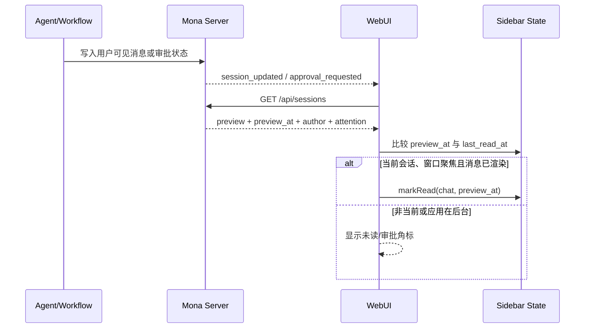

# Mona 企业 IM UI 与交互开发计划

> 文档版本：1.0  
> 文档状态：待执行，作为 IM UI 交付与验收基线  
> 代码基线：本地 `master@18b7c9bd` 及其后的多 Agent 修复  
> 适用范围：Mona 桌面端 WebUI  
> 关联文档：`../design/multi-agent-functional-design.md`、`../design/multi-agent-development-guide.md`

---

## 1. 文档目的

本文档用于把 Mona 当前已存在的三栏壳层，完善为可正式交付的企业 IM 式多 Agent 产品界面。

本文档不是视觉概念稿，而是开发执行规范。开发人员应当能够只依据本文档完成：

1. 功能栏、统一会话列表、聊天主区和房间上下文栏的最终交互。
2. Mona 私聊、专业 Agent 私聊、协作房间三种会话的一致呈现。
3. 搜索、创建、置顶、归档、未读、运行、审批和定时状态闭环。
4. 房间目标、成员、工作流摘要和主区域工作流编辑。
5. 桌面宽屏、窄窗口和移动宽度下的响应式行为。
6. 数据契约、持久化、兼容、自动化测试和人工验收。

本文使用以下约束词：

- **必须**：不满足即不得交付。
- **应当**：默认实现；只有存在明确技术阻塞时才能调整，并在合并请求中说明。
- **可以**：不影响交付的实现选择。
- **禁止**：与产品方案冲突，不得实现。

---

## 2. 最终交付目标

### 2.1 用户第一感知

用户启动 Mona 后，不需要学习“Agent 编排系统”的技术概念，而是看到一个熟悉的伙伴协作 IM：

- 左边是固定功能栏。
- 中间是私聊和协作房间混排的会话列表。
- 右边是当前聊天。
- 进入协作房间后，可以打开房间上下文栏查看目标、伙伴、工作流、运行和产物。
- 用户可以像在群聊中一样 `@` 专业 Agent，也可以让 Mona 安排其他 Agent 工作。
- 工作流属于房间，不出现在全局导航中。

### 2.2 完成定义

只有以下条件全部成立，IM UI 才能标记为完成：

- [ ] Mona、专业 Agent 私聊和协作房间出现在同一会话列表。
- [ ] 用户只看头像和标题即可识别私聊与房间。
- [ ] 每个列表项显示最新一条用户可读消息，而不是首条消息、工具调用或系统注入文本。
- [ ] 非当前会话收到 Agent 消息或审批时出现真实未读状态；进入会话后按规则清除，重启后不丢失。
- [ ] 搜索框常驻列表顶部，可即时搜索会话、房间目标和 Agent 名称。
- [ ] 用户可以从“+”菜单完成新建 Mona 会话、专业 Agent 私聊和协作房间。
- [ ] 私聊主区显示真实 Agent 身份；房间消息显示每条消息的真实作者。
- [ ] 房间侧栏只显示摘要；工作流复杂编辑在聊天主区域完成。
- [ ] 宽屏、窄屏、窗口缩放、浅色和深色主题均可用。
- [ ] 本文列出的自动化测试、构建检查和人工验收全部通过。

---

## 3. 已确认的产品决策

以下内容不再作为开发过程中的开放问题：

1. **Mona 是默认伙伴和默认协调者。** 普通消息未指定 Agent 时由 Mona 处理。
2. **私聊和房间使用同一个会话列表。** 禁止新增“房间列表”或“工作流会话列表”。
3. **伙伴页是对象管理入口，不是第二套会话列表。**
4. **工作流不进入全局功能栏。** 工作流只能从协作房间进入。
5. **每个房间只有一个当前工作流。** 可以存在草稿、版本和多次运行。
6. **不使用自由画布作为第一版工作流编辑器。** 使用纵向步骤卡、并行组和审批步骤。
7. **房间侧栏只展示摘要。** 工作流编辑时，聊天主区域切换为工作流编辑器。
8. **所有 Agent 使用同一消息基础设施。** 禁止为了 IM UI 再建一套消息、房间或工作流引擎。
9. **企业微信只作为信息架构参考。** 使用 Mona 自己的主题色和视觉变量，不复制企业微信品牌色。
10. **第一版不实现会话静音、已读回执、在线状态和跨设备同步。** 没有产品需求前不得预留复杂协议。

---

## 4. 当前代码基线与明确差距

| 模块 | 当前文件 | 已有能力 | 必须补齐的问题 |
| --- | --- | --- | --- |
| 应用功能栏 | `webui/src/components/shell/AppRail.tsx` | 固定 64px、消息/伙伴入口、模块溢出菜单 | 增加需要注意的会话数；补齐窄窗口行为和测试 |
| 消息列表列 | `webui/src/components/shell/SessionListPanel.tsx` | 三栏结构、“+”菜单、复用 ChatList | 当前是搜索按钮，不是常驻搜索框；宽度和状态不符合最终规范 |
| 会话列表 | `webui/src/components/ChatList.tsx` | 排序、置顶、归档、右键菜单、部分头像 | Mona 无头像；仍有项目分组；预览、时间、未读和状态语义不完整 |
| 会话摘要 | `mona/session/manager.py` | 返回 title、preview、updated_at、conversation | 当前 preview 读取首条可读消息，不是最新消息；缺少 preview 时间和作者 |
| 会话 API | `mona/channels/websocket.py`、`webui/src/lib/api.ts` | `/api/sessions` 单次返回列表 | 缺少最终列表需要的可读消息和工作流注意状态字段 |
| UI 状态 | `mona/webui/sidebar_state.py`、`webui/src/hooks/useSidebarState.ts` | 置顶、归档、重命名、视图设置持久化 | 缺少每个会话的最后阅读时间；schema 仍为 v1 |
| 快速搜索 | `webui/src/components/SessionSearchDialog.tsx` | `Ctrl/Cmd+K`、本地筛选、键盘选择 | 与常驻搜索存在重复筛选逻辑；搜索字段范围未统一 |
| 聊天头部 | `webui/src/components/thread/ThreadHeader.tsx` | 已支持标题、房间人数、侧栏切换 | `App.tsx` 当前传入 `showHeader={false}`，主区缺少正式聊天头部 |
| 房间上下文 | `webui/src/components/room/RoomContextPanel.tsx` | 目标、成员、工作流块 | 当前把完整编辑器塞入窄栏；缺少产物摘要、清晰的状态入口 |
| 工作流 UI | `WorkflowPanel.tsx`、`WorkflowEditor.tsx` | 草稿、激活、运行、审批和纵向编辑 | 编辑器必须移到主区；侧栏只保留摘要和操作入口 |
| 创建会话 | `ConversationDialogs.tsx` | 新建私聊、房间表单 | 房间目标当前非必填；Mona 未固定为必选成员；错误反馈需补齐 |
| 响应式 | `webui/src/App.tsx` | 存在旧 Sidebar Sheet | 小窗口仍可能同时渲染桌面栏；移动 Drawer 仍使用旧 Sidebar，不是新 IM 列表 |
| 测试 | `webui/src/**/*.test.*`、`tests/` | 已有 Vitest、Testing Library、pytest | 当前没有 AppRail、SessionListPanel、ChatList 和创建房间的专项交付测试 |

开发不得仅调整 CSS 后宣称完成。列表摘要、未读、审批提醒和工作流主区编辑均属于本次交付范围。

---

## 5. 信息架构与页面状态

### 5.1 桌面宽屏结构

```text
┌────────┬────────────────────┬────────────────────────────────┬────────────────────┐
│ 功能栏 │ 会话/伙伴列表      │ 主内容区                       │ 上下文栏           │
│ 64px   │ 默认 320px         │ 聊天或工作流编辑器             │ 默认 360px，可折叠 │
│        │                    │ 最小可用宽度 520px             │                    │
└────────┴────────────────────┴────────────────────────────────┴────────────────────┘
```

宽度规则由本方案规定：

- 功能栏固定 `64px`，不支持拖拽。
- 会话/伙伴列表在 `>=1280px` 窗口下固定 `320px`。
- `1024px-1279px` 下列表宽度为 `300px`。
- 主内容区可伸缩，但显示聊天时不得小于 `520px`。
- 上下文栏默认宽度 `360px`，允许通过现有 `SplitPane` 在 `320px-480px` 范围内调整。
- 不增加会话列表拖拽宽度。本地保存宽度不是本阶段需求。

### 5.2 主视图状态

应用主内容只能处于以下一个顶级状态：

| 状态 | 第二列 | 主内容 | 右侧上下文 |
| --- | --- | --- | --- |
| 消息首页 | 会话列表 | 新会话首页/最近会话 | 关闭 |
| Mona 私聊 | 会话列表 | Mona 聊天 | 伙伴简介或产物栏，可折叠 |
| 专业 Agent 私聊 | 会话列表 | 对应 Agent 聊天 | 伙伴简介或产物栏，可折叠 |
| 协作房间聊天 | 会话列表 | 多作者房间聊天 | 房间上下文，宽屏默认打开 |
| 工作流编辑 | 会话列表 | 当前房间工作流编辑器 | 保持打开并显示只读摘要，或在窄屏关闭 |
| 伙伴 | 伙伴列表 | 伙伴详情 | 关闭 |
| 其他模块 | 该模块自身导航 | 模块主内容 | 由模块自己决定 |

### 5.3 导航原则

- 切换会话时不得创建新的浏览器路由或窗口。
- 切换会话保留未发送的输入草稿，草稿按 `chat_id` 隔离；如果当前代码尚无此能力，本阶段至少保证切换时不会把草稿带到另一个会话。
- 从工作流编辑器切换到其他会话时，如果存在未保存修改，必须弹出离开确认。
- 返回原房间后恢复聊天位置和右侧栏开合状态；工作流未保存草稿按现有草稿持久化规则处理。
- 工作流编辑器的“返回聊天”只切换主内容，不删除草稿。

---

## 6. 视觉与布局规范

### 6.1 设计变量

所有颜色必须使用现有语义 token；禁止在业务组件中硬编码企业微信绿色。

| 项目 | 交付值 |
| --- | --- |
| 功能栏宽度 | `64px` |
| 会话列表宽度 | 桌面 `320px`，中等窗口 `300px` |
| 列表顶部区域高度 | `64px` |
| 搜索框高度 | `36px` |
| 会话行高度 | 默认 `68px`，不提供紧凑模式入口 |
| 私聊头像 | `44px × 44px` |
| 房间组合头像外框 | `44px × 44px` |
| 标题字号 | `14px`，中等字重，单行省略 |
| 预览字号 | `12px`，弱化色，单行省略 |
| 时间字号 | `11px`，等宽数字优先 |
| 未读圆点 | `8px`；位于头像右上角，不遮挡主体 |
| 行内水平留白 | `12px` |
| 选中行 | 使用 `--sidebar-active-surface` 和当前主题前景色 |
| Hover 行 | 使用 `--sidebar-hover-surface` |
| 分隔线 | 默认不逐行显示；只有顶栏与列表主体之间显示弱分隔 |

### 6.2 视觉状态

每个会话行必须支持：

- 默认。
- Hover。
- 键盘 focus-visible。
- 当前选中。
- 未读。
- 正在运行。
- 等待审批。
- 已启用定时。
- 已归档列表中的归档状态。
- Agent 头像加载失败的回退状态。

状态不得完全依赖颜色表达：运行、审批、定时必须有图标和 accessible name。

---

## 7. 功能栏交互规范

### 7.1 固定入口

顶部依次为：

1. Mona 头像：首页。
2. 消息。
3. 伙伴。
4. 当前已启用的其他业务模块。

底部为：

1. 更新提示（存在更新时）。
2. 设置。
3. 账号。

工作流禁止作为功能栏图标出现。

### 7.2 选中与角标

- 当前位于聊天、房间或工作流编辑器时，“消息”保持选中。
- 当前位于伙伴列表/详情时，“伙伴”选中。
- “消息”角标显示**需要用户注意的会话数**，计算为“未读会话 ∪ 等待审批会话”的去重数量，不是消息条数，最大显示 `99+`。
- 等待审批的房间即使已经打开，也必须计入；审批解决后移除。
- 邮件、日程等现有角标逻辑保持不变。

### 7.3 高度不足

继续复用当前 `AppRail` 的动态槽位和“更多”菜单：

- 消息、伙伴永不进入“更多”。
- 设置和账号永不进入“更多”。
- 只有其他业务模块允许进入“更多”。
- “更多”内的模块角标不得丢失。

---

## 8. 消息列表顶部区域

### 8.1 结构

```text
┌──────────────────────────────────┐
│ [🔍 搜索会话、伙伴或房间]   [＋] │
└──────────────────────────────────┘
```

- 顶部不再显示“消息”文字标题。
- 搜索框常驻，占满除“+”按钮之外的剩余宽度。
- “+”为 `36px × 36px` 图标按钮，具有 Tooltip 和 `aria-label`。
- 归档入口放入“+”菜单下方的分隔区域或搜索框清空后的辅助菜单，不占用顶部第三个图标。

### 8.2 “+”菜单

菜单顺序固定：

1. 新建 Mona 会话。
2. 新建伙伴私聊。
3. 新建协作房间。
4. 分隔线。
5. 查看已归档会话；只有存在归档项时显示数量。

交互要求：

- 菜单使用现有 Radix DropdownMenu。
- 新建 Mona 会话直接创建并进入，不再二次确认。
- 新建伙伴私聊打开伙伴单选对话框。
- 新建协作房间打开房间创建流程。
- 创建操作进行中时禁止重复提交。
- 创建失败时对话框不关闭，在表单底部显示可读错误和“重试”。

---

## 9. 常驻搜索与快速搜索

### 9.1 两种搜索入口

- 常驻搜索框：筛选当前消息列表，不打开弹窗。
- `Ctrl+K` / `Cmd+K`：继续打开现有 `SessionSearchDialog`，用于跨当前视图快速切换会话。

两者必须复用同一个纯搜索函数，禁止出现搜索结果不一致。

### 9.2 可搜索字段

搜索使用本地已有摘要数据，不发起逐字网络请求。字段包括：

- 用户重命名后的会话标题。
- 房间标题。
- 房间目标。
- 私聊 Agent 显示名称。
- 房间成员 Agent 显示名称。

第一版不搜索完整消息正文，不上传搜索关键词。

### 9.3 匹配规则

- 输入前后空格忽略。
- 多个空格分词，所有词都匹配才算命中。
- 拉丁字符大小写不敏感。
- 中文按原字符串包含关系匹配。
- 排序保持原会话排序，不按匹配分数重新排序。

### 9.4 键盘行为

- 点击搜索框后立即输入。
- `Esc`：有内容时清空；内容为空时移出焦点，不关闭应用视图。
- `ArrowDown/ArrowUp`：移动高亮项。
- `Enter`：进入高亮会话。
- 点击清除按钮后焦点留在输入框。
- 搜索无结果时显示“没有匹配的会话”，并保留“新建协作房间”入口。

### 9.5 归档搜索

- 默认搜索不包含归档会话。
- 用户进入“已归档”模式后，列表顶部显示明确的“已归档”状态和返回按钮。
- 已归档模式中的搜索只筛选归档项。
- 从搜索结果恢复归档后，该会话立即移出归档列表并进入普通列表。

---

## 10. 统一会话列表

### 10.1 列表模型

消息 Tab 只能显示一个连续列表：

- 不按 Mona、专业 Agent、房间分组。
- 不按 workspace/project 显示分组标题。
- 置顶通过排序实现，不额外显示“置顶”分组标题。
- workspace 元数据和现有右键操作可以保留，但不得破坏连续 IM 列表。
- 归档会话默认不显示。

### 10.2 排序

排序规则固定：

1. 置顶会话在前，置顶会话之间按最近用户可见活动时间倒序。
2. 非置顶会话按最近用户可见活动时间倒序。
3. 时间相同使用 `key` 稳定排序，避免刷新后跳动。

不再向最终用户暴露 `created_desc`、`title_asc` 和紧凑模式设置。本地已有旧设置需要兼容读取，但消息 Tab 始终使用上述产品排序。

### 10.3 列表项信息结构

```text
┌────────────────────────────────────────┐
│ [头像]  显示标题                 10:32 │
│   ●     最近一条用户可读消息      状态 │
└────────────────────────────────────────┘
```

显示标题计算顺序：

1. 用户手动重命名。
2. 协作房间标题。
3. 会话已有生成标题；这使同一 Agent 的多个不同主题会话仍可区分。
4. 专业 Agent 显示名称。
5. Mona。
6. “新会话”。

列表只显示一行标题和一行预览，不再使用“Agent 名称 + 会话标题”挤占消息预览。

### 10.4 头像

- Mona 私聊：Mona 单头像。
- 专业 Agent 私聊：该 Agent 单头像。
- 协作房间：最多四个成员的组合头像；Mona 参与排序时固定第一。
- 成员超过四个不继续缩小头像；在房间头部/侧栏显示成员数量。
- 头像 URL 失败时使用显示名称首字符或现有默认图标。
- 不允许因为旧会话没有 `conversation` 字段而不显示头像；旧会话按 Mona 私聊处理。

### 10.5 消息预览

预览必须是最近一条用户能在聊天主区看到并理解的内容。

允许作为预览：

- 用户文本消息。
- Agent 最终文本消息。
- 文件/图片消息的本地化摘要，如“[图片]”“[文件] 报告.pdf”。
- Agent Job 成功/失败的用户可读摘要。
- 工作流等待审批、完成或失败的用户可读摘要。

禁止作为预览：

- system prompt。
- 工具名、工具参数和原始工具结果。
- reasoning/thinking。
- trace/activity 行。
- 内部注入文本、Subagent 原始回注 blob。
- 仅供协议使用的 JSON。

如果没有可读消息：

- 新私聊显示该 Agent 的一句简短能力描述。
- 新房间显示房间目标。
- 两者都没有时显示“开始对话”。

### 10.6 时间

- 当天：`HH:mm`。
- 昨天：`昨天`。
- 本周内：本地化星期。
- 本年内：`MM/DD`。
- 跨年：`YYYY/MM/DD`。
- Tooltip 显示完整本地日期时间。
- 时间来源是最近用户可见活动时间，不是文件元数据更新时间。

### 10.7 状态优先级

未读圆点与业务状态独立。右下角最多显示一个主要业务状态，优先级如下：

1. 等待审批：琥珀色审批图标和“待审批”。
2. 运行失败：当失败结果仍未读时显示红色失败图标；用户打开会话后依靠同一 `last_read_at` 规则移除，不新增“已确认失败”状态。
3. 正在运行：旋转/脉冲状态图标和“运行中”。
4. 已启用定时：时钟图标。
5. 无状态：不占位。

“运行完成”不长期显示绿色完成图标；运行结果应成为一条可读消息并通过未读提示用户。

### 10.8 选择与刷新

- 单击行立即切换主区。
- 再次点击当前行不重复拉取完整历史。
- 列表刷新不得让当前选择丢失。
- 当前会话被删除后，优先选择删除项的下一项；没有下一项时选择上一项；列表为空时进入消息首页。
- 新消息导致排序变化时：
  - 用户没有滚动或操作列表时允许更新排序。
  - 用户正在使用键盘搜索时保持高亮会话身份，不按旧索引跳动。

### 10.9 右键菜单

普通列表项菜单：

1. 置顶/取消置顶。
2. 重命名。
3. 归档。
4. 分隔线。
5. 删除。

归档列表项菜单将“归档”替换为“恢复”。

删除必须二次确认，并明确：

- 会删除该会话历史和对应 WebUI transcript。
- 不会删除 Agent 本身、Agent 私有记忆和 Skill。
- 删除房间不会删除已经复制到共享输出目录之外的外部文件。

---

## 11. 未读、审批与通知闭环

### 11.1 未读判定

会话满足以下条件时标记未读：

1. 最近用户可见活动由 Agent 或系统业务事件产生；并且
2. 该活动时间晚于本地持久化的 `last_read_at`；并且
3. 活动发生时会话不是“前台可见且窗口聚焦”的当前会话。

用户自己发送的消息不得制造未读。

### 11.2 标记已读

- 用户进入会话后，以当时的 `preview_at` 更新 `last_read_at`。
- 只能标记到已看到的时间点，禁止直接写当前系统时间后吞掉并发新消息。
- 当前会话在窗口聚焦时收到新消息，消息渲染成功后自动推进 `last_read_at`。
- 应用在后台、最小化或页面不可见时，即使会话当前被选中，也产生未读。
- 进入房间可清除消息未读，但不能清除尚未解决的“待审批”状态。

### 11.3 审批提醒

- `approval_requested` 必须由应用级订阅处理，不能只在当前挂载的 `WorkflowPanel` 内处理。
- 非当前房间收到审批：会话行出现未读和“待审批”；功能栏消息角标增加；允许发送系统通知。
- 当前房间收到审批：房间侧栏和聊天中的审批卡同步更新；如果应用不在前台，仍发送系统通知。
- 用户点击系统通知后应进入对应房间并定位到审批卡；如果当前 Tauri 通知能力暂不支持定位，至少进入对应房间。
- 批准、拒绝、过期或运行取消后，待审批状态立即移除。

### 11.4 重启恢复

应用重启后：

- `last_read_at` 从 WebUI sidebar state 恢复。
- `/api/sessions` 返回每个会话的最新可读活动时间。
- `preview_at > last_read_at` 的非用户活动重新显示未读。
- 等待审批状态从持久化 WorkflowRun 恢复，不依赖曾经收到过 WebSocket 推送。

### 11.5 事件流程



---

## 12. 会话摘要与状态数据契约

### 12.1 后端会话摘要

`SessionManager.list_sessions()` 返回的每项必须增加以下 snake_case 字段：

```json
{
  "key": "websocket:<chat_id>",
  "created_at": "2026-08-14T10:00:00+08:00",
  "updated_at": "2026-08-14T10:05:00+08:00",
  "title": "每日市场简报",
  "preview": "分析已完成，等待你确认后发布",
  "preview_at": "2026-08-14T10:05:00+08:00",
  "preview_author_type": "agent",
  "preview_author_id": "com.mona.a-share-analyst",
  "preview_message_type": "approval",
  "workspace": null,
  "run_started_at": null,
  "workflow_run_status": "waiting_approval",
  "waiting_approval": true,
  "scheduled": true,
  "conversation": {}
}
```

字段规则：

- `preview` 与 `preview_at` 必须来自同一条用户可见消息/事件。
- `preview_author_type` 取 `user | agent | system | null`。
- 旧 assistant 消息缺少作者时按 Mona 处理。
- `workflow_run_status` 取现有 `WorkflowRunStatus` 或 `null`，用于区分排队、运行、等待审批、成功、失败和取消。
- `waiting_approval` 来自当前持久化运行状态，不从前端临时猜测。
- `scheduled` 来自该房间当前激活工作流的有效定时触发状态。
- `updated_at` 继续保留兼容，但列表排序改用 `preview_at ?? updated_at ?? created_at`。

### 12.2 摘要持久化策略

继续使用现有文件存储，不为 IM UI 新增数据库。

在会话 metadata 中维护一个小型摘要缓存：

```json
{
  "ui_summary": {
    "schema_version": 1,
    "preview": "...",
    "preview_at": "...",
    "preview_author_type": "agent",
    "preview_author_id": "mona",
    "preview_message_type": "message"
  }
}
```

实现要求：

- 在用户可见消息进入 Session 的共享写入路径更新摘要，禁止在每个调用方各写一份逻辑。
- 非用户可见消息不更新摘要。
- 旧会话没有 `ui_summary` 时，从已有 JSONL 计算最后一条可见消息作为回退；下次正常保存时写入缓存。
- `/api/sessions` 不得为每个会话读取完整 WebUI transcript 并重放全部 UI 状态。
- 保留现有会话文件原子写入方式。

### 12.3 前端类型

`ChatSummary` 增加：

```ts
previewAt: string | null;
previewAuthorType: AuthorType | null;
previewAuthorId: string | null;
previewMessageType: MessageType | null;
workflowRunStatus: WorkflowRunStatus | null;
waitingApproval: boolean;
scheduled: boolean;
```

前端 UI 层可以派生：

```ts
type ConversationListStatus =
  | "waiting_approval"
  | "failed"
  | "running"
  | "scheduled"
  | null;
```

禁止把派生状态重复存入多个 React store。

### 12.4 Sidebar state v2

`SidebarStatePayload` 升级为 schema v2：

```json
{
  "schema_version": 2,
  "pinned_keys": [],
  "archived_keys": [],
  "title_overrides": {},
  "last_read_at_by_key": {
    "websocket:<chat_id>": "2026-08-14T10:05:00+08:00"
  },
  "view": {
    "show_archived": false
  }
}
```

迁移规则：

- v1 自动迁移到 v2，不修改原有置顶、归档和重命名。
- 首次迁移时，为当前已存在会话把 `last_read_at` 初始化为其当前 `preview_at`，避免升级后所有历史会话突然全部变成未读。
- 新创建会话立即初始化为已读。
- 删除会话时清理对应 `last_read_at`、置顶、归档和标题覆盖。
- 保留文件大小、键数量和字符串长度限制。

### 12.5 前端刷新策略

- 继续复用 `useSessions` 和 `session_updated` 事件。
- 多个短时间连续事件只允许合并为一次正在执行的 refresh 和至多一次后续 refresh，避免并发请求覆盖新数据。
- 不引入新的全局状态库；现有 React state 和 sidebar state 足够。
- Agent 列表通过现有 `useAgents` 获取，同一屏幕不得每行单独请求。

---

## 13. 新建伙伴私聊

### 13.1 入口

- 消息列表“+”菜单。
- 伙伴详情页“开始聊天”。
- Agent 商店安装完成后的“和它聊聊”（商店上线后接入）。

### 13.2 交互

- 从伙伴详情进入时直接创建该 Agent 私聊，无需再次选择。
- 从“+”菜单进入时打开单选列表。
- Mona 不出现在专业 Agent 单选列表中，因为“新建 Mona 会话”已有独立入口。
- 每个 Agent 行显示头像、名称和一句简介。
- 没有已安装专业 Agent 时显示空状态和“前往伙伴/商店”。
- 创建成功后关闭对话框、刷新列表、选中新会话并聚焦输入框。
- 专业 Agent 私聊的默认标题为 Agent 显示名称。
- 专业 Agent 私聊消息必须直接路由到该 Agent，UI 不允许显示为 Mona 代答。

---

## 14. 新建协作房间

### 14.1 表单字段

创建流程只保留三个核心字段：

1. 房间目标：必填，去除首尾空格后不得为空。
2. 房间名称：可修改；留空时使用 Mona 建议或确定性默认名称。
3. 伙伴：Mona 固定选中且不可取消；可以增加已启用专业 Agent。

至少选择 Mona。允许先创建只有 Mona 的房间，但运行包含专业 Agent 的工作流前必须把对应 Agent 加入房间。

### 14.2 表单顺序

1. 用户先填写目标。
2. 用户点击“让 Mona 推荐”时，Mona 根据目标返回建议名称、伙伴和工作流草稿摘要。
3. 用户确认或调整名称与伙伴。
4. 点击“创建房间”。
5. 创建成功后进入房间；推荐结果作为草稿展示，不自动激活、不自动运行。

如果本阶段暂时没有预创建推荐命令，必须仍完成目标必填、Mona 固定成员和手动创建闭环；“让 Mona 推荐”不得做无响应的占位按钮。推荐能力合入前该按钮不显示。

### 14.3 校验与错误

- 目标为空：字段下方显示错误，提交按钮禁用。
- Agent 已停用或安装状态变化：提交前重新校验，并指出具体 Agent。
- 创建请求超时：保留表单，允许重试；使用 `request_id` 防止重复创建。
- 创建成功但列表刷新延迟：先插入乐观会话行，再由服务端摘要替换。
- 关闭存在输入的对话框：弹出放弃确认；空表单直接关闭。

---

## 15. 聊天主区

### 15.1 正式聊天头部

`App.tsx` 不再对聊天视图传入 `showHeader={false}`。头部固定存在，高度 `64px`。

私聊头部：

- 左侧：移动/窄屏菜单按钮。
- 主标题：当前会话显示标题。
- 标识：Agent 名称或“AI”标识；不得把所有 Agent 标成 Mona。
- 右侧：打开伙伴/产物侧栏、更多菜单。

房间头部：

- 主标题：房间标题。
- 成员数量入口：点击打开/关闭房间上下文栏。
- 当前运行时显示轻量“运行中”状态，不显示完整运行详情。
- 更多菜单包含重命名、编辑目标、归档和删除。

### 15.2 私聊

- 消息流只显示用户和当前 Agent 的消息。
- Agent 消息显示真实头像和名称。
- 专业 Agent 私聊没有工作流入口。
- 需要多个 Agent 时，提供“创建协作房间”建议动作，不允许专业 Agent直接拉入其他 Agent。
- 右侧栏可以展示 Agent 简介、能力和当前会话产物，但没有房间目标、成员和工作流。

### 15.3 房间聊天

- 普通消息默认发送给 Mona。
- 输入 `@` 时使用现有房间成员选择器；提交结构化 `target_agent_ids`。
- 用户手输但未通过选择器确认的同名文本不得伪造成结构化 mention。
- 多个 Agent 消息按真实 `authorId` 渲染头像和名称。
- Job、工作流运行、审批、文件和错误使用对应卡片，不伪装成普通 Agent 文本。
- 同一 Agent 的连续文本可以视觉合并，但跨 Job、Run、审批卡不得错误合并。
- 运行中的工具轨迹保持收拢，不进入会话列表预览。

### 15.4 输入区

- 切换会话后聚焦输入框，但不得抢夺用户在搜索框中的焦点。
- 房间输入框 placeholder 应提示“发送给 Mona，或输入 @ 选择伙伴”。
- 发送中允许用户切换会话；流式结果必须继续按 `chat_id` 更新正确房间。
- 附件、图片、语音等现有能力保持，不因壳层改造回归。
- 运行审批等高风险动作继续使用独立按钮，不能通过普通文本输入模拟批准。

---

## 16. 房间上下文栏

### 16.1 展示内容

房间上下文栏从上到下固定为：

1. 房间目标。
2. 伙伴。
3. 当前工作流摘要。
4. 当前运行摘要。
5. 最近产物。

### 16.2 开合规则

- `>=1280px`：首次进入房间默认打开；用户手动关闭后，同一应用会话内记住选择。
- `1024px-1279px`：默认关闭，点击房间头部入口后以覆盖式右侧 Drawer 打开。
- `<1024px`：使用全高右侧 Sheet，关闭后返回聊天。
- 切换到私聊时不保留房间栏内容。
- 打开文件预览时，文件预览优先占用右侧区域；关闭文件后恢复之前的房间栏状态。

### 16.3 摘要规则

- 目标最多显示四行，提供“展开/收起”和“编辑”。
- 成员显示头像、名称和职责；Mona 标记为“协调者”。
- 工作流摘要显示当前激活版本、步骤数、启动方式、草稿标记和“编辑工作流”。
- 当前运行显示状态、完成步骤数、开始时间及“查看/取消”。
- 最近产物最多显示五项；查看更多进入现有产物面板。
- 没有工作流时显示“让 Mona 帮我编排”和“手动配置”。
- 侧栏禁止直接承载完整 `WorkflowEditor`。

---

## 17. 工作流编辑器在 IM 中的交互

### 17.1 进入和退出

- 点击侧栏“编辑工作流”“手动配置”或草稿卡“查看并编辑”后，主内容区从聊天切换为工作流编辑器。
- 功能栏和会话列表保持不变，“消息”仍为选中状态。
- 编辑器头部显示房间名称和“返回聊天”。
- 返回聊天、切换会话、进入其他模块或关闭窗口时，如果有未保存修改，必须确认。

### 17.2 编辑器结构

主区从上到下：

1. 房间名称和返回聊天。
2. 工作流目标。
3. 启动方式：手动或定时。
4. 纵向步骤列表。
5. 添加 Agent 步骤、并行组、用户审批。
6. “让 Mona 重新编排”。
7. 固定底部操作：放弃草稿、保存并测试、保存。

### 17.3 步骤交互

- 新增 Agent 步骤默认串接到最后一步。
- Agent 只能从当前房间成员中选择。
- 并行组以明确容器显示，组内步骤同时执行；不得要求普通用户手动编辑依赖 ID。
- 审批步骤显示审批提示和后续动作。
- 高级依赖如果当前产品仍保留，放入“高级设置”，默认隐藏。
- 删除有下游依赖的步骤时，必须说明依赖将如何调整并二次确认。
- 前端即时校验；后端保存时再次校验。

### 17.4 草稿与运行

- Mona 生成的工作流只能成为草稿。
- 草稿和当前激活版本同时存在时，侧栏明确显示两者，不能用草稿覆盖运行中的版本。
- 保存成功才生成版本。
- “保存并测试”先保存，再启动带测试标记的运行。
- 有运行进行中时，编辑可以产生新草稿，但禁止激活覆盖该运行的快照。
- 运行状态和审批卡继续回写原房间，不创建新会话。

---

## 18. 伙伴视图

### 18.1 第二列

- 使用与消息列表同宽的 `320px/300px` 列。
- 顶部显示常驻搜索框，搜索 Agent 名称和简介。
- Mona 固定第一，其余按显示名称排序。
- 行显示头像、名称和一句简介。
- 已停用 Agent 置灰并标记状态；不允许开始新私聊或加入房间。

### 18.2 伙伴详情

详情至少显示：

- 头像、名称、简介。
- 能力说明。
- 内置 Skill 与所需权限；Package manifest 接通前可以隐藏该区，不显示假数据。
- “开始聊天”。
- “创建协作房间”；Mona 详情也允许创建房间，房间中 Mona 固定存在。

点击“开始聊天”时允许创建同一 Agent 的新会话；不强制复用已有会话。

---

## 19. 空、加载、错误和离线状态

### 19.1 消息列表

| 状态 | 展示 |
| --- | --- |
| 首次加载 | 5 个与正式会话行同尺寸的 skeleton，禁止只显示一行文字 |
| 空列表 | Mona 欢迎说明 + “开始和 Mona 聊天” + “创建协作房间” |
| 搜索无结果 | 查询文本 + 清除搜索 + 创建房间入口 |
| 加载失败 | “会话加载失败” + 原始可读错误摘要 + 重试按钮 |
| 离线/重连 | 列表顶部非阻塞提示；保留已有列表，不清空 |
| 归档为空 | “没有已归档会话” + 返回 |

### 19.2 头像和 Agent 数据失败

- Agent 列表暂时不可用时，已有会话仍使用 `authorId/directAgentId` 和首字符回退展示。
- 不得因为 `/api/agents` 失败而隐藏会话。
- Agent 已卸载但历史会话存在时，显示原保存名称或 ID，并标记“未安装”；历史仍可查看，发送前提示不可用。

### 19.3 创建和操作错误

- 创建、重命名、置顶、归档和删除失败都必须在动作附近反馈。
- 乐观更新失败时恢复原状态并提示，不能静默保留错误 UI。
- 错误文案使用用户能理解的动作结果；日志保留原始错误。

---

## 20. 响应式与窗口行为

### 20.1 `>=1280px`

- 显示功能栏、会话列表和主内容。
- 房间上下文首次进入默认打开。
- 工作流编辑器使用主内容区。

### 20.2 `1024px-1279px`

- 显示 64px 功能栏、300px 会话列表和主内容。
- 房间上下文默认关闭，打开时覆盖主内容右侧，不压缩到不可用宽度。
- 文件预览和房间上下文不能同时覆盖。

### 20.3 `<1024px`

- 桌面功能栏和固定会话列表不再常驻。
- 聊天头部显示菜单按钮。
- 菜单打开一个 `320px` 或不超过视口宽度的 Sheet。
- Sheet 内使用同一套消息/伙伴切换和同一个 `ChatList` 数据逻辑，禁止继续使用旧 Sidebar 形成第二套体验。
- 选择会话后 Sheet 自动关闭。
- 房间上下文使用右侧全高 Sheet。
- 工作流编辑器占满主内容宽度。

### 20.4 窗口和缩放

- Windows 100%、125%、150% 显示缩放下不得出现横向溢出和不可点击按钮。
- 窗口从宽屏缩小再恢复时，当前会话、搜索词和未发送输入不得丢失。
- 应用最小化/失焦必须影响未读判定。

---

## 21. 键盘、焦点与无障碍

### 21.1 全局快捷键

| 快捷键 | 行为 |
| --- | --- |
| `Ctrl/Cmd+K` | 打开快速会话搜索 |
| `Esc` | 按层级关闭菜单、Dialog、Drawer；工作流脏数据先确认 |

### 21.2 列表

- 搜索结果和会话行使用语义化 `ul/li/button`。
- 当前会话使用 `aria-current="page"`。
- 未读状态通过屏幕阅读器文本宣布。
- 上下键移动时保持高亮项可见。
- 右键菜单的所有动作也可通过键盘触发。
- 删除、审批等危险操作的确认按钮必须有明确名称。

### 21.3 焦点恢复

- Dialog 关闭后焦点返回触发按钮。
- 选择会话后，如果不是从搜索框键盘操作进入，焦点进入聊天输入区。
- 从工作流编辑返回聊天时焦点回到“返回聊天”的逻辑后继位置，不跳到页面顶部。
- Drawer 关闭后焦点返回头部菜单/上下文按钮。

---

## 22. 文件级实施清单

### 22.1 后端与持久化

#### `mona/session/manager.py`

- [ ] 修复会话摘要从“首条可读消息”变为“最后一条用户可读消息”。
- [ ] 增加 `ui_summary` 缓存的读写和旧数据回退。
- [ ] 明确排除工具、reasoning、系统注入和原始结构化数据。
- [ ] 输出 preview 时间、作者和消息类型。

#### `mona/webui/sidebar_state.py`

- [ ] schema 升级到 v2。
- [ ] 增加并校验 `last_read_at_by_key`。
- [ ] 实现 v1 到 v2 兼容和数量限制。
- [ ] 删除不存在会话对应的阅读状态。

#### `mona/channels/websocket.py`

- [ ] `/api/sessions` 输出新增摘要字段。
- [ ] 聚合 `workflow_run_status`、`waiting_approval` 和 `scheduled` 的持久状态。
- [ ] 保证新消息、审批、运行结束和元数据变化发送 `session_updated`。
- [ ] 保持旧客户端忽略新字段仍可工作。

### 22.2 前端数据层

#### `webui/src/lib/types.ts`

- [ ] 更新 `ChatSummary` 和 `SidebarStatePayload`。
- [ ] 不改变现有事件联合类型的兼容行为。

#### `webui/src/lib/api.ts`

- [ ] 映射新增 snake_case 字段到 camelCase。
- [ ] 缺失字段使用安全默认值，兼容旧服务端。

#### `webui/src/hooks/useSessions.ts`

- [ ] 合并连续 refresh，避免重复并发刷新。
- [ ] 新会话乐观摘要包含正确 conversation/阅读初始状态。
- [ ] refresh 后保持 activeKey 和乐观项。

#### `webui/src/hooks/useSidebarState.ts`

- [ ] 支持 v2 normalize、prune 和 persist。
- [ ] 提供按明确 `previewAt` 标记已读的操作。
- [ ] 派生未读会话集合和总数；不创建第二个状态源。

#### `webui/src/lib/session-list-model.ts`（新增纯函数文件）

- [ ] 实现 display title、搜索文本、稳定排序、相对时间和状态优先级。
- [ ] 同时供 `ChatList` 和 `SessionSearchDialog` 使用。
- [ ] 不包含 React state、网络请求或持久化。

### 22.3 前端壳层与列表

#### `webui/src/components/shell/AppRail.tsx`

- [ ] 接收“未读 ∪ 待审批”的去重会话数并显示消息角标。
- [ ] 保持消息/伙伴固定槽位。
- [ ] 补齐键盘、Tooltip 和溢出菜单角标。

#### `webui/src/components/shell/SessionListPanel.tsx`

- [ ] 改为常驻搜索框 + “+”。
- [ ] 管理 query、高亮和归档视图。
- [ ] 向 `ChatList` 传入筛选结果和未读/状态数据。
- [ ] 增加 loading/error/empty UI。
- [ ] 支持桌面固定列与 Sheet 内 `w-full` 两种容器宽度。

#### `webui/src/components/ChatList.tsx`

- [ ] 移除消息 Tab 的 project/group 标题，渲染连续列表。
- [ ] 所有会话显示头像，包括 Mona 和旧会话。
- [ ] 改为标题 + 最新预览 + 时间 + 未读 + 业务状态。
- [ ] `showTimestamps` 要么真正生效，要么从最终产品接口中删除；禁止保留无效 prop。
- [ ] 保留置顶、归档、重命名、删除和增量显示能力。

#### `webui/src/components/SessionSearchDialog.tsx`

- [ ] 复用 `session-list-model.ts` 搜索规则。
- [ ] 补齐头像、类型和最新预览，保持快速切换定位。

### 22.4 主内容和房间

#### `webui/src/App.tsx`

- [ ] 恢复正式聊天头部。
- [ ] 连接“未读 ∪ 待审批”的去重会话数到 AppRail。
- [ ] 在会话选择、窗口 focus/visibility 变化和消息刷新时执行正确已读逻辑。
- [ ] 将审批事件订阅提升到应用级。
- [ ] 用新 IM Sheet 替换 `<1024px` 下的旧 Sidebar Sheet。
- [ ] 增加“聊天/工作流编辑”主内容模式，不创建新会话。

#### `webui/src/components/thread/ThreadHeader.tsx`

- [ ] 显示真实会话/Agent/房间身份。
- [ ] 提供房间上下文开关和更多菜单。
- [ ] 支持窄屏导航按钮。

#### `webui/src/components/room/RoomContextPanel.tsx`

- [ ] 只显示目标、成员、工作流、运行、产物摘要。
- [ ] “编辑工作流”通知 App/ThreadShell 切换主区。
- [ ] 移除窄栏中的完整 WorkflowEditor。
- [ ] 增加窄屏 Drawer 样式。

#### `WorkflowPanel.tsx` / `WorkflowEditor.tsx`

- [ ] 拆分“摘要控制”和“主区编辑”呈现，但复用现有数据请求和命令。
- [ ] 主区编辑支持手动/定时、Agent 步骤、并行组、审批和脏数据确认。
- [ ] 不引入 XYFlow 或新画布依赖。

### 22.5 创建与伙伴

#### `ConversationDialogs.tsx`

- [ ] 房间目标改为必填。
- [ ] Mona 固定选中且不可取消。
- [ ] 增加 dirty 关闭确认、提交错误和重试。
- [ ] 保留请求中禁用，防止重复创建。

#### `PartnersView.tsx`

- [ ] 使用最终列表宽度和常驻搜索。
- [ ] 补齐停用/未安装状态。
- [ ] Mona 详情支持创建协作房间。

### 22.6 多语言

更新：

- `webui/src/i18n/locales/zh-CN/common.json`
- `webui/src/i18n/locales/zh-TW/common.json`
- `webui/src/i18n/locales/en/common.json`

要求：

- 新文案三个语言文件键一致。
- 不在组件中新增中文 fallback 作为正式文案。
- 时间、星期和日期使用 i18n/Intl，不手写中文判断。

---

## 23. 分阶段开发顺序

### 阶段 IM-1：摘要与阅读状态

任务：

- [ ] 修复最新预览及可见消息过滤。
- [ ] 扩展 `/api/sessions` 数据契约。
- [ ] sidebar state v2 和迁移。
- [ ] 前端类型、API 映射、未读派生。

退出标准：

- [ ] 旧会话、新会话、私聊和房间都返回正确最新预览。
- [ ] 重启后未读状态正确。
- [ ] 无 UI 改动时现有会话列表仍可运行。

### 阶段 IM-2：最终会话列表

任务：

- [ ] 常驻搜索框。
- [ ] 连续混排列表。
- [ ] 最终头像、标题、预览、时间和状态。
- [ ] 置顶、归档、重命名和删除回归。
- [ ] AppRail 未读角标。

退出标准：

- [ ] 红框目标区域的信息密度和操作层级达到本文规范。
- [ ] Mona、专业 Agent 和房间在同一列表中可区分。
- [ ] 搜索、未读和审批具有自动化测试。

### 阶段 IM-3：聊天头部与房间上下文

任务：

- [ ] 正式聊天头部。
- [ ] 房间侧栏摘要。
- [ ] 应用级审批通知。
- [ ] 文件预览与房间侧栏互斥/恢复。

退出标准：

- [ ] 私聊和房间头部身份正确。
- [ ] 房间目标、成员、工作流、运行和产物入口均可达。
- [ ] 非当前房间审批可以提醒并定位。

### 阶段 IM-4：工作流主区编辑与创建流程

任务：

- [ ] 工作流编辑器移入主内容区。
- [ ] 脏数据离开确认。
- [ ] 房间目标必填、Mona 固定成员。
- [ ] 新建私聊/房间错误与重试。

退出标准：

- [ ] 不使用画布即可创建、保存、激活、测试和运行工作流。
- [ ] 侧栏不再承载复杂编辑。
- [ ] 创建房间后可直接进入、聊天和配置工作流。

### 阶段 IM-5：响应式、无障碍与回归

任务：

- [ ] 新 IM Sheet 替代旧移动 Sidebar。
- [ ] 中等宽度上下文 Drawer。
- [ ] 键盘、焦点、屏幕阅读器文本。
- [ ] 浅色/深色、缩放和长文本 QA。

退出标准：

- [ ] 本文第 25 节全部自动化检查通过。
- [ ] 本文第 26 节人工场景全部通过。
- [ ] 不存在 P0/P1 UI 缺陷。

阶段顺序不得颠倒。未读和摘要数据没有完成前，不应先用假圆点完成视觉稿。

---

## 24. 自动化测试计划

### 24.1 Python

新增：

```text
tests/session/test_im_session_summary.py
tests/webui/test_sidebar_state_v2.py
tests/channels/test_im_session_list_api.py
```

必须覆盖：

- 最后一条用户消息成为预览。
- 最后一条 Agent 最终消息成为预览。
- 工具调用、reasoning、trace 和内部注入不成为预览。
- 图片、文件、审批和失败事件生成可读预览。
- 旧会话缺少作者时按 Mona。
- `ui_summary` 缓存与旧数据回退结果一致。
- sidebar state v1 无损迁移 v2。
- 首次迁移不会把全部历史会话标成未读。
- 无效时间、超长 key 和超量 map 被安全清理。
- `/api/sessions` 输出新增字段且旧字段兼容。
- 重启状态下 waiting approval 正确恢复。

### 24.2 前端纯函数

新增：

```text
webui/src/lib/session-list-model.test.ts
```

必须覆盖：

- 显示标题优先级。
- Mona 旧会话回退。
- 置顶 + 活动时间稳定排序。
- 搜索标题、目标和 Agent 名称。
- 多词、大小写和中文搜索。
- 未读判定不把用户自己的消息算未读。
- 状态优先级：审批 > 失败 > 运行 > 定时。
- 相对时间所有边界。

### 24.3 前端组件

新增：

```text
webui/src/components/ChatList.test.tsx
webui/src/components/shell/SessionListPanel.test.tsx
webui/src/components/shell/AppRail.test.tsx
webui/src/components/shell/ConversationDialogs.test.tsx
webui/src/components/room/RoomContextPanel.test.tsx
webui/src/components/workflow/WorkflowEditor.integration.test.tsx
```

必须覆盖：

- Mona、专业 Agent 和房间全部显示头像。
- 房间使用组合头像。
- 标题、最新预览、时间和未读正确显示。
- 搜索输入、清除、上下键和 Enter。
- “+”菜单三个创建入口。
- 置顶、归档、重命名、删除菜单。
- 加载、空、搜索无结果、错误、离线状态。
- AppRail“未读 ∪ 待审批”的去重会话数。
- 房间目标必填、Mona 不可取消、重复提交阻止。
- 侧栏“编辑工作流”触发主区切换，不在侧栏渲染完整编辑器。
- 脏工作流离开确认。

### 24.4 应用集成

扩展 `webui/src/App.test.ts` 或新增壳层集成测试，覆盖：

- 桌面首屏显示 AppRail + SessionListPanel + ThreadShell。
- `showHeader` 在聊天视图生效。
- 选择会话后 activeKey、已读状态和主区一致。
- 非当前会话 `session_updated` 产生未读。
- 当前会话在前台接收消息自动已读。
- 窗口后台接收消息仍未读。
- `approval_requested` 对非当前房间生效。
- `<1024px` 使用新 Sheet，桌面固定栏不重复显示。
- 工作流编辑不改变 active chat_id。

---

## 25. 必跑检查

每个阶段合并前执行直接相关测试；最终交付必须执行全量检查。

```powershell
# 后端
pytest tests/session/test_im_session_summary.py tests/webui/test_sidebar_state_v2.py tests/channels/test_im_session_list_api.py
ruff check mona tests

# 前端
Set-Location webui
pnpm test
pnpm lint
pnpm check:ui
pnpm build
pnpm build:tauri

# Tauri 包装层（即使本阶段不改 Rust，也验证集成）
Set-Location ..
cargo check --manifest-path src-tauri/Cargo.toml
```

最终交付还必须执行：

```powershell
pytest
cargo test --manifest-path src-tauri/Cargo.toml
```

如果仓库已有失败阻塞全量命令，合并请求必须记录：

1. 完整命令。
2. 原始失败摘要。
3. 本分支和基线分支对比结果。
4. 直接相关测试的通过结果。

禁止把“未执行”写成“通过”。

---

## 26. 人工验收场景

### 场景 A：首次使用

1. 清空 WebUI sidebar state，启动应用。
2. 首屏看到功能栏、会话列表和聊天主区。
3. Mona 会话有头像、标题和欢迎预览。
4. 点击“新建 Mona 会话”，立即进入并聚焦输入框。

期望：没有技术术语、空白栏或重复导航。

### 场景 B：三类会话混排

1. 创建 Mona 会话。
2. 创建 A 股分析师私聊。
3. 创建包含 Mona、A 股分析师和小红书运营的房间。
4. 分别发送消息。

期望：三项连续混排；私聊为单头像，房间为组合头像；预览和时间来自最新可读消息。

### 场景 C：搜索和归档

1. 按房间名称搜索。
2. 按目标关键词搜索。
3. 按 Agent 名称搜索。
4. 归档一个房间并验证默认搜索不显示。
5. 进入归档视图搜索并恢复。

期望：常驻搜索和 `Ctrl+K` 规则一致，恢复后立即回到普通列表。

### 场景 D：未读与重启

1. 停留在 Mona 私聊。
2. 让另一房间的工作流产生 Agent 结果。
3. 验证会话圆点和消息功能栏角标。
4. 重启应用。
5. 验证未读仍存在。
6. 打开房间后验证未读清除。

期望：用户自己的消息不产生未读；后台当前会话仍产生未读。

### 场景 E：审批

1. 在非当前房间运行含审批步骤的工作流。
2. 验证系统通知、会话待审批状态和功能栏角标。
3. 点击通知进入房间。
4. 打开会话但不审批。
5. 验证消息未读可清除，但待审批仍保留。
6. 批准或拒绝后验证状态消失。

### 场景 F：创建房间

1. 打开创建房间。
2. 不填目标，验证不能提交。
3. 验证 Mona 固定选中。
4. 选择专业 Agent、填写目标和名称。
5. 模拟一次失败并重试。
6. 创建成功后进入房间。

期望：没有重复房间；表单失败不丢输入；工作流草稿不自动运行。

### 场景 G：工作流编辑

1. 从房间侧栏点击编辑工作流。
2. 验证编辑器在主内容区，侧栏仅显示摘要。
3. 新增串行步骤、并行组和审批。
4. 制造校验错误并验证不能保存。
5. 修改后尝试切换会话，验证离开确认。
6. 保存并返回聊天。

期望：active chat_id 不变，运行结果回到原房间。

### 场景 H：响应式

分别在以下条件测试：

- 1920×1080，100% 缩放。
- 1366×768。
- Windows 125% 和 150% 显示缩放。
- 手动把窗口缩小到 `<1024px` 布局。
- 浅色和深色主题。

期望：无横向滚动、截断按钮、重复侧栏或不可关闭的 Drawer。

### 场景 I：长内容和大量会话

1. 使用超长中文/英文标题、目标和预览。
2. 构造超过 160 个会话。
3. 搜索、滚动、置顶并接收新消息。

期望：文本正确省略；Tooltip 可查看完整标题；增量加载有效；当前选择不跳错。

---

## 27. 评审与缺陷门槛

### 27.1 必须参与评审

- 产品：确认信息架构、交互和文案。
- 前端：确认响应式、状态与组件复用。
- 后端：确认摘要、审批和持久化来源。
- 测试：确认自动化矩阵和人工场景。

### 27.2 缺陷等级

P0，不得交付：

- 消息发到错误 Agent/房间。
- 未读或审批状态跨会话串线。
- 工作流编辑创建了新会话或丢失草稿。
- 创建操作重复产生房间。
- 删除错误会话或数据不可恢复地丢失。

P1，不得正式发布：

- Mona/专业 Agent 作者显示错误。
- 最新预览错误或泄露工具/系统文本。
- 搜索、置顶、归档、创建任一主路径不可用。
- 重启后未读或审批恢复错误。
- 1024px 以上常见窗口出现主要区域不可用。

P2，可在明确版本内修复：

- 个别非主路径视觉不一致。
- Tooltip、动画或极端文本截断问题。
- 不影响主流程的文案问题。

正式发布前 P0 和 P1 必须为零。

---

## 28. 明确不做

为控制范围，本计划不包含：

- 自由画布工作流编辑器。
- 会话静音和免打扰。
- 消息已读回执和“对方正在输入”。
- Agent 在线/离线状态。
- 跨设备未读同步。
- 完整消息正文全文检索。
- 消息引用、撤回、转发和表情反应。
- 会话文件夹、用户自定义分组和复杂标签管理。
- 新数据库、消息队列或前端全局状态框架。
- 为会话列表单独引入虚拟列表依赖；继续使用现有增量显示，只有真实性能数据证明不足时再启用已安装能力。

这些能力不得以“为以后扩展”为由加入本阶段。

---

## 29. 最终交接清单

开发负责人交付时必须附带：

- [ ] 本文所有阶段任务勾选状态。
- [ ] 数据契约变更说明和 v1→v2 迁移说明。
- [ ] 变更文件列表。
- [ ] 自动化测试命令与原始结果。
- [ ] 1920×1080 浅色/深色最终截图。
- [ ] 1366×768 和 `<1024px` 布局截图。
- [ ] 三类会话混排、未读、审批、房间侧栏、工作流主区编辑的演示录屏或连续截图。
- [ ] 已知问题列表；没有已知问题时明确写“无”。
- [ ] 产品、开发和测试对第 2.2 节完成定义的逐项确认。

只有完成上述交接，阶段 4.5 的“IM 壳层”才能从“结构完成”更新为“产品交付完成”。
